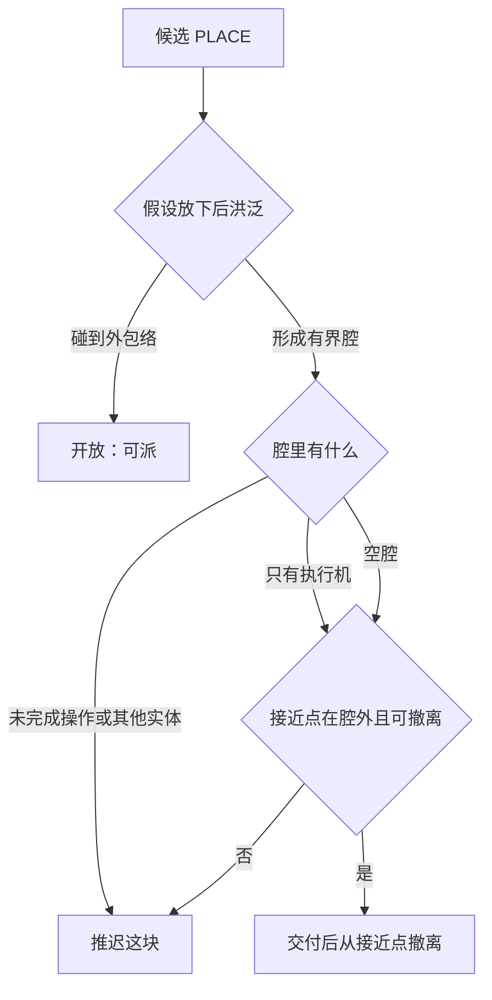

# 防自封：Smarter Construction 算法对照

> 来源：[dhultgren/rimworld-smarter-construction](https://github.com/dhultgren/rimworld-smarter-construction)（RimWorld 1.6）
> 目的：抽出可迁移算法，让建设悦灵交付假碰撞后仍能飞出结构，且不把其他悦灵、玩家或未完成操作封在腔内。
> 不是实现计划。落地应挂在现有 `ConstructionAssembler` / `chooseApproach` / `tryDeliver` 上，不要另起一套 Harmony 式作业补丁。

## 1. 对方实际在做什么

它**不是**全局施工排序器。原版小人本来就会就近砌墙，最后一块墙把人封进房间。这个 mod 只做三件事：

1. **硬否决**：放下一块不可通行物后，若会形成一个小于约 `100` 格的封闭口袋，且口袋里还有别人、未完成蓝图或框架，则拒绝接这个活。
2. **软启发**：不可通行邻居越多，优先级越高，先补墙缝、后封口。
3. **完工瞬间挪人**：只封住自己时允许完工，并把人瞬移到“新口袋外”的安全邻格。寻路卡在同一格 `300` tick 则强制失败重选。

Steam 说明里写得很直白：阻止小人把自己砌进墙里，或挡住还没建完的东西；右键强制建造可绕过；`50~100` 格以上的区域按开放处理（性能妥协）。

核心文件：

| 文件 | 职责 |
| --- | --- |
| `Core/ClosedRegionDetector.cs` | 假设加上障碍后洪泛，判定封闭口袋 |
| `Core/NeighborCounter.cs` | 四邻（洪泛）与八邻（优先级、安全点） |
| `Core/EncloseThingsCache.cs` | 三级结果 + 短缓存 |
| `Patches/WorkGiver_ConstructFinishFrames_JobOnThing.cs` | 派活前否决 |
| `Patches/Patch_JobDriver_MakeNewToils.cs` | 完工前再检一次，必要时瞬移 |
| `Patches/Patch_WorkGiver_Scanner_GetPriority.cs` | 不可通行邻居数加分 |
| `Patches/Patch_PawnsGettingStuck.cs` | 原地过久则放弃当前寻路 |

## 2. 封闭口袋算法（真正值钱的部分）

把“即将变成墙的格子”记为 `addedBlockers`，从它们的**四邻**出发做可行走洪泛：

```text
ClosedRegionCreatedByAddingImpassable(walkable, addedBlockers):
  closed = {}
  for start in cardinalNeighbors(addedBlockers):
    region = FloodFill(start, 把 addedBlockers 当墙)
    if 0 < |region| < MaxRegionSize:          # 默认 100
      closed ∪= region
  return closed
```

洪泛规则：

- 格子可行走，且不在 `addedBlockers` 里，才进入口袋。
- 超过 `MaxRegionSize` 立刻停，把这次洪泛当成“通到室外”。
- 特例：起点本身不可走，但它的四个邻居全是墙或 `addedBlockers`，则把这一格单独当成口袋（检查门洞、凹槽里有没有人或未完成物）。

然后分类：

| 标志 | 含义 | 对方处理 |
| --- | --- | --- |
| `EnclosesRegion` | 形成了有界口袋 | 准备找安全站位 |
| `EnclosesThings` | 口袋里有**其他**玩家小人，或未完成蓝图/框架 | **拒绝**这项建造 |
| `EnclosesSelf` | 只有当前施工者在口袋里 | **允许**，完工后瞬移出去 |

安全站位 = 障碍的八邻 − 新口袋 − 不可走格。找不到安全点则同样拒绝完工。

单测覆盖了：开口不封闭、四面已堵则无新口袋、补最后一块出现单格口袋、一次补两块封出两个口袋、安全点排除口袋内格子。见 `ClosedRegionDetectorTests.cs`。

邻居数启发只是排序，不是正确性来源。正确性来自“假设放下后再洪泛”。

## 3. 和我们现状的差距

设计文档 §3 已经要求：反向可拆解、派发前验证撤离、不能把执行机封在内部。当前实现只做到一半。

| 能力 | 我们 | 对方 | 结论 |
| --- | --- | --- | --- |
| 静态装配顺序 | `ConstructionAssembler.peelOrder`：外包络洪泛，拆除用正向，建造用逆序 | 无全局顺序 | 我们更强，应保留 |
| 运行时“放下后会不会封腔” | 无 | 每次派活/完工都做假设洪泛 | **要补** |
| 接近点 | 六邻能放下 `0.5³`、能触及、不是已预约 PLACE | 安全点 = 邻格 − 新口袋 | 接近点必须落在**新口袋外**且能通到外包络 |
| 撤离 | `leaveSiteThenLand` 只在整单结束后飞出包围盒 | 每块墙完工都保证人在口袋外 | 单次交付后也要能从接近点飞到外包络 |
| 占用 | `isOccupied` 等玩家/实体让开 | 不处理站在墙位上的几何重叠 | 保留我们的占用等待 |
| 自封救援 | 无瞬移（正确） | 瞬移到安全格 | **不要抄瞬移** |
| 维度 | 三维飞行，可越墙 | 二维步行，墙即封顶 | 二维“砌一圈墙”在我们这里通常**不封闭** |

当前具体缺口：

- `peelOrder` 只看“有碰撞的整格”，不看台阶、半砖、栅栏的真实 `VoxelShape`，也不在每次交付后重算连通。
- `chooseApproach` 不验证“这块放下后，接近点是否还属于外包络”。
- `nextAssignable` / `tryDeliver` 不拒绝“会把未完成 PLACE 或其他悦灵封进空腔”的候选。
- 多机同时补两个最后缺口时，静态 `order` 挡不住互封。这是 TODO 12 的硬约束，不是寻路细节。

## 4. 迁移成三维飞行版

不要复用二维四连通步行。悦灵可以飞过未封顶的墙，只有下面两类才算“被包住”：

1. 机身已经和即将出现的 `VoxelShape` 相交（站进墙里）。
2. 假设加上这块碰撞后，从接近点出发的可飞空间变成有界空腔，到不了蓝图外包络。

外包络已经有了：`peelOrder` 里对包围盒外扩一格的 `floodExterior`。运行时不要用对方的“超过 100 格就算开放”——一座 `20³` 的封闭大厅仍然是封闭的。开放的判据应是**洪泛碰到已知外包络**，预算只用于限时，超时则保守视为仍可能封闭并推迟这块。

建议的窄接口（名字可再定，逻辑应集中在一个小公共类里）：

```text
wouldEnclose(progress, op, worker):
  blockers = 已交付有碰撞格 ∪ {op 的有碰撞格}
  从 op 的六邻中当前可飞的格子做洪泛
    墙 = 真实碰撞 ∪ 已交付假碰撞 ∪ 假设中的 op
    可飞 = 0.35×0.6 放得下（与 fitsWorker 同一套）
  若洪泛碰到 peel 外包络或蓝图盒外一格 → 开放
  否则得到 closed[]

  EnclosesWork    = closed 里还有未交付 PLACE/ATTACHED
  EnclosesOthers  = closed 里有其他悦灵或玩家
  EnclosesSelf    = 只有执行悦灵在 closed 里
  approachSafe    = 接近点 ∉ closed，且从接近点能洪泛到外包络
```

派发与交付规则：

```text
EnclosesWork 或 EnclosesOthers     → 不派、不交付，换下一块
!approachSafe                      → 重选接近点；没有则推迟
EnclosesSelf 且接近点已在腔外     → 允许交付，交付后立刻飞回接近点再离场
机身与新 VoxelShape 相交           → 先飞到安全接近点，禁止就地交付
```



并发时同一安全前沿可以多只悦灵并行，但**同一空腔的最后若干封口必须串行**，并且每块封口都重新跑一遍假设洪泛。对方用“邻居最多的墙优先”自然把最后缺口留到后面；我们已有 `order`，邻居数只适合做同 `order` 的并列打分，不能替代封闭检测。

卡住救援可以学，但不要瞬移：同一接近点寻路失败或原地超过约定 tick，就取消租约、重算接近点。`AllayFlightPlanner.snapToFree` 已经处理“嵌进假方块”，应继续作为几何逃生，而不是逻辑逃生。

## 5. 明确不要抄的部分

- **瞬移出房间**。我们的假方块有真实碰撞，玩家也能站上去；悦灵必须先飞到腔外再封口。
- **“大于 N 格即开放”**。对方用它躲室外洪泛；我们有明确外包络，不需要这条错误近似。
- **只做二维墙圈检测**。未封顶的盒子、只有顶板的棚子、只有地板的平台，对飞行器都不是封闭。
- **用邻居数代替装配顺序**。`peelOrder` 已经给出由内向外的正确骨架。
- **Harmony 作业补丁、小人 Toil、强制建造绕过**。对应关系是 `nextAssignable` / `tryDeliver` / 租约超时。

## 6. 建议挂载点

| 时机 | 现有入口 | 应增加的检查 |
| --- | --- | --- |
| 规划 | `ConstructionAssembler.assignBuildOrder` | 保持 peel 逆序；不必改成邻居启发 |
| 派发 | `ConstructionJobController.nextAssignable` | `wouldEnclose` 为真则跳过该 op |
| 接近点 | `chooseApproach` / `isUsableApproach` | 候选必须 `approachSafe` |
| 交付 | `tryDeliver` | 再检一次；机身仍与新形状相交则失败并回接近点 |
| 拆除 | `nextAssignableDemolish` + 正向 peel | 已是由外向内，不必套封闭否决 |
| 多机 | TODO 12 | 封口串行 + 接近位/撤离段预约 |

最小验收（可做成 GameTest 窄接口，不要 `inflate(128)`）：

1. `3×3×3` 空心立方：内部 1 格先交付，最后 6 个面的中心最后封；封顶时悦灵接近点在盒外。
2. 只剩门洞：门作为有碰撞 PLACE 时，腔内未交付物会让门被推迟。
3. 两只悦灵同时盯着最后两个缺口：第二只必须等第一只交付并撤离后再封。
4. 半砖/台阶造成的“整格 peel 看不出来的口袋”：以 `VoxelShape` + `fitsWorker` 为准，不以整格占用为准。
5. 玩家站在目标格：继续走现有 `WAITING_OCCUPIED`，不和封闭检测混成一条失败原因。
