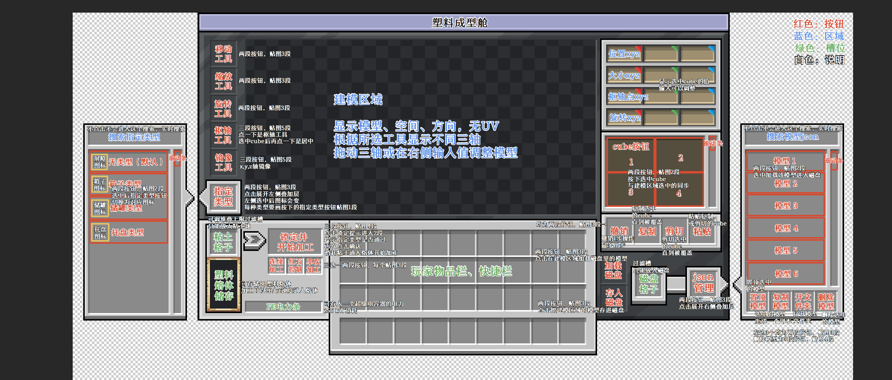

# 塑料成型舱功能规格与 TODO

> 状态：TODO-01 至 TODO-05 实现版；TODO-04/05 正在验收并进入统一塑料实体碰撞重构，详见第 13 节；未完成美术资源继续使用占位贴图和占位模型
>
> 适用项目：Plasticraft / AnvilCraft 附属模组，版本为 NeoForge 1.21.1
>
> 后续流程：继续按第 0 章补齐尚缺模型和控件图集；替换占位资源时必须保持本文已经固定的资源 ID、单帧尺寸、帧数和 GUI 坐标。
>
> GUI 说明：主背景和左右叠加层背景已经落库，第 3.3 至 3.5 节按这些 PNG 建立明确的像素坐标系。已确定按钮继续以紫黑占位图集满足单帧尺寸和帧数；TODO-02、TODO-03 的文件与生产功能已在这些固定矩形内接入，正式资源以后原位替换。

## 0. 资源清单

| 资源           | 状态       | 文件或规格 | 内容 |
|--------------|----------|---------|------|
| 塑料成型舱未锁定模型   | 占位实现     | 方块模型 JSON | 成型舱未锁定时暂用紫黑方块，后续原 ID 替换完整模型 |
| 塑料成型舱锁定模型    | 占位实现     | 方块模型 JSON | TODO-03 已接入独立锁定状态，后续沿用同一模型边界替换正式资源 |
| 塑料成型区边框      | 占位实现     | 方块模型 JSON | 成型舱后方 3x3x3 区域暂用紫黑方块，后续原 ID 替换边框模型 |
| 塑料成型舱物品模型    | 占位实现     | 物品模型 JSON | 背包、手持和掉落时暂用方块占位模型 |
| 成型舱 GUI 主背景  | 已完成      | `assets/anvilcraftplasticraft/textures/gui/background/plastic_molding_chamber.png`，`512x256` | 可见非透明范围为 `(0, 0)` 至 `(348, 225)`，主界面逻辑尺寸为 `349x226` |
| 类型选择叠加层      | 已完成      | `assets/anvilcraftplasticraft/textures/gui/background/plastic_molding_chamber_left.png`，`73x131` | 点击“指定类型”后从主界面左侧展开 |
| JSON 管理叠加层   | 已完成      | `assets/anvilcraftplasticraft/textures/gui/background/plastic_molding_chamber_right.png`，`73x131` | 点击“JSON 管理”后从主界面右侧展开 |
| 成型舱 GUI 控件图集 | 部分完成     | PNG 图集 | 移动、调整大小、旋转、枢轴、镜像、Cube、新建 Cube、撤销、复制、剪切、粘贴以及主界面和 JSON 管理滑块已使用正式贴图；其余按钮继续使用紫黑占位帧并保持单帧尺寸和帧数 |

## 1. 核心目标和已经确定的原则

1. 新增“塑料成型舱”，在其背面紧贴展开一个 `3x3x3` 成型区域。玩家在嵌入式建模程序中直接编辑这 27 个世界格对应的三维工作空间；每个方块边长细分为 16 个 `px` 单位。
2. 建模器只负责形状，不提供贴图、UV、绘画或手工上色。塑料材料和颜色完全继承加工时输入的塑料熔体。
3. 最小尺寸步进是 `1 px = 1/16` 方块，不是只能放置立方像素；元素允许某一维为 0，形成真正无厚度的面。
4. “普通制品/无功能”是默认类型且不受功能形状算法限制；本期完成箱子和储罐两种功能类型。托盘的既有形状约束保留为未来设计记录，但实际功能与实现 TODO 本期均留空，不由实现者自行推测。模型仍至少要包含一个有体积 cube 或一个零厚度 cube，完全空白的模型不能锁定或加工。
5. 建模界面不是普通 Minecraft `Screen` 上拼出的简化编辑器，而是嵌入游戏的独立建模程序，目标是在操作方式、三维显示和变换精度上完整模拟 Blockbench 的建模体验。
6. 成型舱额定耗电为 `256 kW`，接入 AnvilCraft 电网。没有有效供电时，粘土填充、从 8 B 暂存罐向成型区域泵送熔体和落砧加工暂停，但外部仍可随时向 8 B 暂存罐输入塑料熔体；已经保存的模型、预留粘土和已有熔体不丢失。
7. 新的自由塑料制品使用 **24 种离散朝向**：6 个朝向面乘以每个面内的 4 个四分之一转角。模型数据分别保存朝向面与 `0°/90°/180°/270°` 面内旋转，不能只保存 6 个方向而丢失滚转。
8. 新自由制品仍继承现有塑料实体的全部物理机制，包括重力、浮力、动态引力、碰撞与推动、滑轨搬运、磁化、粘合、实体持久化、锤子交互和回收等，并让全部机制正确处理这 24 种朝向。
9. 所有玩家模型、磁盘、动态制品和网络数据都使用版本化稳定格式，不能把客户端编辑器内存对象直接当作存档格式。

## 2. 成型舱、区域部件和世界表现

### 2.1 空间结构

1. 成型舱具有水平朝向，放下时正面面对玩家，背面连接成型区域。成型舱固定位于成型区域前表面的底部中央：它背后同高的第一格是区域的“前-下-中”格，区域再向机器背后延伸 3 格、向左右各延伸 1 格、从机器同高向上延伸 3 层，总共占据 27 格，不包括成型舱本体。
2. 以成型舱位置 `P`、机器背面方向 `B`、玩家面对机器正面时的右方 `R` 和世界上方 `U` 表示，27 个受控格的世界位置为 `P + dB + rR + uU`，其中 `d = 1..3`、`r = -1..1`、`u = 0..2`。建模视口不逐格绘制完整立体线框，而以 `Y=16` 的单层 `3x3` 参考平面标定下层九格的上表面；其上方保留两格、下方保留一格的可编辑空间。这套映射只负责确定结构和 `48³` 工作区的世界落点；工作区内部的模型、投影、成型、实体生成和顶部工作台结构共用固定世界轴锚点，不再按机器朝向旋转或镜像模型坐标。
3. 推荐使用“一个控制方块实体 + 27 个轻量区域部件”。全部模型、槽位、熔体、模式、电力和动画进度只由控制器保存；区域部件只保存控制器位置和当前显示/碰撞阶段。
4. 放置前一次性检查 27 格均可占用、相关区块已加载且未越过世界边界。任意一格失败则整次放置失败，不能覆盖已有方块、方块实体或只展开一部分。
5. 右击成型舱本体打开操作界面。区域部件不提供独立选取或菜单，避免空工作空间拦截玩家的方块交互。
6. 空区域和投影虽然没有碰撞，但 27 格仍是受控制器占用的区域，不能在其中放置其他方块。
7. 编辑阶段的区域部件 `getShape`、碰撞、遮挡和视觉形状均为空；工作空间参考平面和投影完全由控制器方块实体渲染，不依赖区域方块轮廓。
8. 破坏控制器时受控拆除全部区域部件且只掉落一个成型舱；区域部件不能被单独挖掉来绕过模具碰撞或复制掉落，可以阻止破坏，也可以把破坏转发为整机拆除。
9. 加载存档时校验部件与控制器关系，能够补回缺失部件，并清理找不到控制器的孤立部件。结构不完整期间立即停止粘土填充、向成型区域泵送熔体和落砧加工，但不关闭成型舱本体 8 B 暂存罐的外部流体输入能力。

### 2.2 世界显示和碰撞阶段

| 阶段          | 成型区域显示                           | 区域碰撞                             | 8 B 暂存罐的外部接口        | 向成型区域泵送                              |
|-------------|----------------------------------|----------------------------------|---------------------|--------------------------------------|
| 空模型         | 只显示 `Y=16` 单层 3x3 参考平面              | 无碰撞                              | 随时允许输入，按第 4.3 节允许抽出 | 不泵送                                  |
| 正在建模        | 单层参考平面上实时显示精确源几何投影                | 投影与区域均无碰撞                        | 随时允许输入和抽出           | 不泵送                                  |
| 等待区域清空      | 冻结本次模型；粘土动画尚未开始，GUI 显示“区域被阻塞”    | 无碰撞                              | 随时允许输入和抽出           | 不泵送                                  |
| 粘土填充动画      | 冻结的模型投影继续显示；每 `4 gt` 从 `-Y` 向 `+Y` 一次增加完整一层 3x3 粘土块纹理 | 动画开始的同一事务内立即变为完整 3x3x3 碰撞，暂停时仍保持 | 随时允许输入和抽出           | 不泵送，必须等粘土填充完毕                        |
| 模具完成/灌入熔体   | 27 格外观均为填满的粘土块纹理，内部熔体不穿透显示       | 完整 3x3x3 碰撞                      | 随时允许输入和抽出           | 有效供电且模型保持锁定时，以固定 `2 B/gt` 泵送至 `M(V)` |
| 落砧加工        | 内部塑料固化；27 格产生粘土块破坏粒子，粘土外观全部消失    | 事务提交时移除模具的完整碰撞                   | 随时允许输入和抽出           | 事务期间暂停，不把暂存熔体瞬间并入本批                  |
| 加工完成/等待下一周期 | 塑料制品与等量回收粘土球均在原 3x3x3 成型区域中产生    | 区域部件恢复无碰撞；只保留塑料实体自身碰撞，物品结果为掉落物   | 随时允许输入和抽出           | 下一副模具完成前不泵送                          |

1. 建模投影是空间投影，不参与任何碰撞、寻路或实体推动。模型每次有效修改后，世界内投影实时更新。
2. 点击锁定或自动锁定会先冻结模型，但只在粘土填充动画真正开始前检查一次 3x3x3 区域。只要玩家、掉落物、上一件塑料实体或其他实体与将启用的完整碰撞相交，就不开始动画、不扣取本周期第一份粘土，并在 GUI 显示“区域被阻塞”；条件清除后自动重试。
3. 粘土持续供应且供电正常时，填充总时长固定为 `12 gt`，分成三个各 `4 gt` 的离散阶段。第 4、8、12 gt 分别一次绘制下、中、上完整一层 3x3 共 9 个粘土块纹理，不做高度拉伸或阶段内插值；缺粘土或缺电的等待时间不计入这 12 gt。
4. 从等待态进入粘土填充动画的状态提交必须与“启用 27 格完整碰撞”原子完成。碰撞从动画第一帧起就阻止新实体进入，因此动画结束时不做第二次实体检查，也不存在“停在最后一层”的额外阶段；粘土填充完成后才允许从 8 B 暂存罐向成型区域泵送。
5. 模具完成后的外观始终是封闭的粘土块纹理，不把内部负模、已输入熔体或模型空腔直接显示出来；熔体量通过 GUI、Jade 和状态指示查看。
6. 加工成功时，已转入模具的粘土从机器内部计数中结算，并在后方成型区域中掉落完全相同数量的粘土球，使玩家可以回收再利用。例如本周期取用 108 球，成功加工必须总计掉回 108 球；不得因取整形成多余模具体积而少还。
7. 粘土块破坏粒子与回收物品同时生成，但两者相互独立。粒子数量按可见范围合并或限流，不能为 110592 个微小单元逐个发网络事件；粘土球掉落则按物品堆叠上限合并为尽量少的掉落物实体，总数仍必须精确。
8. 下一周期仍要从专用过滤槽重新取得粘土球；掉落的回收粘土不会凭空回到槽位。连续加工自动化可以用溜槽或其他物流收集并送回输入槽。

## 3. 嵌入式建模程序

### 3.1 产品形态和技术边界

1. 建模部分是嵌在成型舱 GUI 中的高精度三维显示与交互区域：内部拥有场景树、相机、选择、变换、撤销栈和随 Minecraft 帧循环执行的渲染调度，但屏幕上可见的建模按钮、属性栏、元素列表和相机按钮全部属于成型舱 GUI，不在嵌入区域内再做一套界面。嵌入区域负责不受普通 Minecraft `Screen` 像素级显示能力限制的模型显示、命中、操纵轴和直接拖拽，也不弹出脱离游戏的外部窗口。
2. 操作方式、选择高亮、变换操纵轴、相机手感和数值属性应完整模拟 Blockbench 的建模体验，但仅保留形状建模所需功能，不提供 UV、贴图、绘画、动画或手工上色工作区。
3. 最终技术选型固定为 **Blaze3D 离屏三维视口**，不引入 WebView、JCEF、JavaScript 编辑器或外部浏览器运行时。当前 1.21.1 后端使用 Blaze3D `RenderTarget`/`TextureTarget` 创建带颜色与深度附件的离屏目标，其底层虽然由 OpenGL FBO 实现，但产品架构不得依赖 OpenGL；视口只在 Minecraft 已有图形设备、渲染线程和帧循环内工作，不创建第二个窗口、OpenGL 上下文或独立渲染线程。
4. 成型舱 GUI 继续绘制全部按钮和面板，离屏视口只绘制精确源元素、选择高亮、操纵轴、方向标识和参考空间；制造体素结果只用于分析和加工，不覆盖源元素的连续斜面显示。Blockbench 只作为交互目标参考；直接复用其代码、资源、显示实现或快捷键定义前仍须完成许可证和再分发检查，否则自行实现相同工作流。
5. 成型舱 GUI 宿主建模工具按钮、相机按钮、数值属性、元素列表、机器槽位、能量、生产模式、磁盘和会话生命周期；离屏视口只负责三维显示、命中和直接模型交互。宿主、编辑器控制器和视口通过有明确类型的快照与语义命令通信；客户端到服务器的通信另行使用有 schema、字段和整体大小限制、会话 ID 与修订号的网络载荷：打开会话、载入快照、提交编辑命令、撤销/重做、导入/导出、请求分析、锁定和关闭会话。
6. 服务器仍是模型、世界投影、粘土计数、类型验证、锁定和加工的权威端。客户端只能提交可验证命令，不能直接写方块实体 NBT；服务端需重新检查坐标边界、类型、元素数、修订号和玩家操作权。
7. 同一成型舱同一时间只允许一个有效写会话。其他玩家只读查看，或在明确接管后取得编辑权；GUI 要显示当前操作者。断线、关闭界面和客户端崩溃都必须释放租约，过期命令不能覆盖较新修订。
8. 编辑器按命令增量提交，并定期保存服务端草稿。客户端渲染资源丢失、资源重载、界面异常关闭或客户端崩溃后，重新打开必须从最后已确认修订重建视口，不清空方块实体中的模型。

#### 3.1.1 Blaze3D 离屏视口和跨版本边界

1. 编辑器按以下四层隔离，依赖方向只能从外向内：

   - 通用模型层保存元素、分组、变换、版本化命令、撤销语义、制造烘焙和分析结果，不得 import `net.minecraft.client`、Blaze3D、LWJGL 或具体图形 API；
   - 客户端编辑层保存相机参数、选择、操纵轴状态、拖拽事务和由屏幕坐标生成的射线，只依赖通用模型与 JOML 数学类型，不持有纹理、framebuffer 或 GPU buffer；
   - 客户端场景层把编辑快照转换为与图形 API 无关的不可变 `EditorSceneMesh`、引用该网格的 `ViewportFrame`、顶点/索引数据和语义绘制阶段，例如网格、有厚度表面、零厚度 cube 双面、选择高亮和操纵轴；
   - 版本渲染后端独占 Blaze3D、NeoForge 客户端渲染事件和该版本的 GUI 合成 API，负责创建/缩放/释放离屏目标、上传网格、执行绘制并把颜色附件合成到主界面的视口矩形。

2. Blaze3D 只被视为当前 Minecraft 版本提供的图形抽象，不被视为跨版本稳定 API。版本渲染后端使用项目自己的粗粒度接口，至少表达“确保目标尺寸”“更新指定网格”“渲染一份 `ViewportFrame`”“合成到 GUI”“资源重载”和“关闭”六种操作。上层不得观察或缓存 framebuffer ID、纹理 ID、VAO、shader program、命令编码器、render pass 或具体附件对象；绘制状态使用不透明、双面、半透明叠加、始终可见操纵轴等语义枚举，不把 OpenGL 常量或 Blaze3D 资源类型冒充跨版本接口。
3. 1.21.1 后端优先使用 Blaze3D `TextureTarget`/`RenderTarget`、`PoseStack`/JOML、`BufferBuilder`、`VertexBuffer`、`MultiBufferSource` 和原版/NeoForge 公开 shader 注册入口。禁止在建模器代码中调用 `org.lwjgl.opengl.*`、`GlStateManager` 或手工创建/绑定/删除 FBO、纹理、VAO 和 shader program。若 1.21.1 的 GUI 合成入口不可避免地需要读取 `RenderTarget` 暴露的颜色纹理 ID，只能在一个可替换的 1.21.1 合成适配器中瞬时使用，不能保存、传给其他层或配合任何原生 OpenGL 调用。
4. 离屏目标按视口的实际 framebuffer 像素尺寸创建颜色和深度附件，只有尺寸或渲染配置改变时才重新分配，不能每帧创建。每帧依次清理目标、绘制成型舱方块模型、主/细网格和方向、绘制精确源元素、悬停与选择高亮和操纵轴，再恢复主渲染目标并合成到 GUI；切换目标、投影和 GUI 合成必须放在可保证恢复的作用域内，任何异常都不能污染 Minecraft 后续渲染。
5. 相机、命中和操纵轴数学全部在 CPU 侧完成。相机层保存位置、朝向、透视视野或正交范围、宽高比和近远面等语义参数；版本后端用这些参数生成实际渲染矩阵，并以纯 JOML 数据返回同一帧的 `ViewportTransform`，或由相机层直接按相同参数解析生成射线。鼠标位置经视口矩形和该变换转换为射线，再与有厚度 cube、零厚度 cube 和操纵轴代理求交；不得硬编码 OpenGL 的 NDC 深度范围，不得依赖 OpenGL 选择模式、颜色 ID picking 或同步读取深度/颜色附件。拖拽期间只更新客户端临时快照，释放按键时形成一个有边界检查的语义命令并提交服务器。
6. 网格、元素表面、边线、方向标识和操纵轴均使用显式三角形/四边形几何，不依赖 OpenGL 宽线、点精灵、固定功能管线、多边形线框模式或隐式全局状态。shader 优先复用原版公开 pipeline；确需自定义时只通过当前版本 NeoForge 的公开 shader/pipeline 注册入口声明，shader 资源和 pipeline 定义局限在版本渲染后端。
7. 迁移到 26.1.2 时不得在新 API 上模拟 1.21.1 的 `bindWrite`、整数纹理 ID 或全局 OpenGL 状态。应把 GUI 视口提交为不可变的自定义 `PictureInPictureRenderState`，其中只包含视口边界、相机、显示状态、模型修订和不可变场景数据，不引用活动的 `Screen`、菜单或方块实体；通过 NeoForge `RegisterPictureInPictureRenderersEvent` 注册对应 renderer，并使用 `GuiGraphicsExtractor.submitPictureInPictureRenderState`、`GpuTextureView`、`GpuBuffer`、`RenderPipeline`、`CommandEncoder` 与 `RenderPass` 重写版本后端。世界内实时投影另由版本化世界渲染适配器消费同一 `EditorSceneMesh`，不能依赖 GUI 离屏目标；通用模型层、客户端编辑层、场景层和网络格式不随此迁移改变。
8. 若后续版本把 Blaze3D 图形设备后端从 OpenGL 换为 Vulkan 或其他 API，只要仍保留等价的纹理、buffer、pipeline、render pass 和 GUI Picture-in-Picture 抽象，就只替换或调整版本渲染后端。实现不得假设纹理原点、Y 翻转、NDC 深度范围、附件布局、资源释放时机、隐式 barrier 或 shader 编译格式；投影矩阵、纹理方向、同步和资源生命周期一律以当时 Blaze3D/NeoForge 公开 API 为准。
9. 视口关闭、窗口和 GUI 缩放变化、资源包重载、客户端登出及图形设备资源重建都必须幂等释放并按最新已确认快照重建资源。静态网格按模型修订缓存，选择和操纵轴使用小型动态数据；禁止每帧回读 GPU、重新上传未变化的完整模型或重新分配离屏附件。
10. 自动检查至少应禁止建模器渲染包出现 `org.lwjgl.opengl` 与 `GlStateManager` 引用，并覆盖纯 CPU 的投影/反投影、六种正交相机、透视相机、视口边界、GUI 缩放换算、有厚度/零厚度 cube 与操纵轴命中、cube 在正尺寸、`0 px` 和负尺寸间双向跨越缩放及拖拽命令合并。Windows/Linux、窗口化/全屏、高 DPI、全部 GUI 缩放、资源重载及反复打开关闭后的视觉、焦点和 GPU 资源释放仍由游戏内原型和人工验收确认。

### 3.2 三维工作空间、坐标和建模能力

1. 中央区域是后方成型区域的可编辑三维镜像，而不是二维像素画布。视口只显示位于 `Y=16` 的单层 `3x3` 方块参考网格，它是 `3x3x3` 成型区域下层九格的上表面；参考面上方对应两格空间、下方对应一格空间。模型仍可使用每轴全部 48 个内部单位，`1 px = 1/16` 方块。
2. 模型源数据固定使用世界轴：`+X` 指向东、对应 W/E 红轴，`+Y` 指向上、对应 U/D 绿轴，`+Z` 指向南、对应 N/S 蓝轴。三轴边界均为 `0..48`，有体积单元索引为 `0..47`，零厚度 cube 可位于边界或内部格线上。这些数值是工作空间的内部制造单位，不把整个程序定义为像素画布。成型舱朝向只决定整个工作区相对控制器的世界落点以及控制器预览的位置和朝向，不能改变任一模型端点、尺寸符号、旋转轴、操纵器轴或内部计量顺序。
3. 所有 cube 顶点都必须留在这 3 格见方的三维工作空间内；移动、缩放尺寸、旋转、镜像、粘贴或数值输入产生越界结果时，视口立即显示越界部分并禁止提交，不得悄悄裁切或自动缩放模型。
4. 单层参考网格每 16 个内部单位使用明显的主网格线分隔；外围八格不绘制内部细线，中心格世界 `X/Z=16..32` 以 1 px 间距绘制细网格。参考网格和基准线在 GUI 与世界投影中都固定使用世界轴，不随成型舱朝向旋转：红色世界 X 基准线沿 W/E，为 `(16,16,16)..(32,16,16)`；蓝色世界 Z 基准线沿 N/S，为 `(16,16,16)..(16,16,32)`。两线只在中心格世界西北下角 `(16,16,16)` 相交，该交点永远是 GUI 位置与枢轴数值的 `(0,0,0)`，也是新建 cube 的 GUI 原点；GUI 三轴显示范围均为 `-16..32`。世界投影的中心格 1 px 间隔细网格保持 `0.5 px` 线宽，世界主网格为 `1.0 px`、最外层工作空间轮廓为 `1.1 px`、红蓝基准线为 `1.25 px`；这些世界专用线宽不改变 GUI 线宽。GUI 与世界均绘制 `0..48` 工作空间立方体在当前视角下的投影外轮廓，只保留可见面和背向面交界的最外圈：轴向正视时为 4 条边，斜视时为 6 条边，不绘制落在轮廓内部的立方体棱或任何内部立体分隔线。成型舱控制器在 GUI 中直接绘制位于前表面底部中央的实际方块模型，当前美术未完成时显示紫黑占位模型，且不参与元素选择。
5. 视口必须持续显示固定的世界方向。右上方向标记以中心为原点绘制随相机转动的红绿蓝三条线：红线永远连接 W/E 并表示世界 X 轴，蓝线永远连接 N/S 并表示世界 Z 轴，绿线连接 U/D 并表示世界 Y 轴；线端与字母之间保留清晰间距，不能相连或重叠。模型、参考线、数值、命中射线和全部操纵器必须直接使用同一世界 X/Y/Z，不得根据成型舱朝向交换轴、反转端点或补偿绕序。默认视角始终使世界北方位于左下；改变成型舱朝向不改变 GUI 中的模型观察方向，只改变控制器预览及世界工作区相对控制器的落点。
6. 相机支持透视、六面正交视图、轨道旋转、平移、缩放、聚焦选择、一键回到整个成型区域和网格/轴线显隐。默认透视中北方位于左下方向。视口内按住鼠标左键拖动轨道旋转，纵向旋转与鼠标拖动方向一致；按住鼠标右键拖动平移，滚轮缩放。左键短按仍执行元素选择，右键短按仍打开上下文菜单，操纵轴可编辑时优先接管左键拖动。切换视图不改变模型坐标，方向标记在所有视图中都必须可读。
7. 至少支持：元素与分组列表、新建 cube、选择/多选、移动、尺寸修改、枢轴点、三轴旋转、三轴镜像、复制、删除、隐藏、锁定元素、重命名、分组、居中、对齐、撤销/重做、剪切/复制/粘贴和精确数值输入。cube 的任一轴尺寸保留 `to - from` 的符号，允许为负值并以 `from` 为起点向对应负轴延伸，不得自动交换端点或取绝对值；任一轴也允许缩放到 `0 px` 成为零厚度 cube，并可从 `0 px` 沿正轴或负轴拉伸回有体积 cube。不得保存第二种平面元素类型，同时不得允许两个轴同时为 0 而退化成线或点。操纵轴与右侧数值属性双向同步并进入同一撤销历史；历史最多保留最近 10 个已经提交的语义命令，一次连续拖拽只占一步。操纵器轴长固定为 28 个视口逻辑像素，不随相机缩放：移动与枢轴使用正向三轴箭头，缩放使用正负六向轴和方形端柄，旋转在当前枢轴显示半径 2.8 px 的球心、半径 26 px 且只绘制朝向相机部分的三色环，以及半径 27.5 px、完整面向屏幕并紧贴三色环的白色外环，镜像使用正向三轴和菱形镜面柄；轴杆宽 0.75 px、旋转三色环宽 0.9 px、白色外环宽 1.1 px、命中半径 4.5 px，末端尺寸不随轴杆变细。鼠标指向源元素或任一操纵轴时，对应几何覆盖半透明白色悬停层，视觉与 CPU 命中代理必须使用同一屏幕尺度。
8. 不出现 UV、贴图、绘画和手工颜色编辑功能。材料/颜色显示只是基于目前舱内存储的熔体的加工结果预览，不写入蓝图替代最终熔体数据。
9. 每次有效编辑都立即更新世界内同坐标、无碰撞的空间投影，并重算实体积、最低熔体消耗、粘土需求、所选功能类型、验证结果和容量。TODO-01 的 cube 使用白色不透明材质基色，并在 GUI 与世界投影中按精确源表面的实际法线计算连续漫反射明暗；世界投影还按对应世界位置采样天空光和方块光，不得使用全亮渲染。视口与世界投影均显示精确源元素和正常连续斜面，不以体素边界拟合可见外轮廓。两者和最终实体共用第 2.1 节的锚点，模型 `+X` 始终指向世界东、`+Z` 始终指向世界南；整个工作区只按机器背面方向平移到 27 格区域，近边与成型舱背面贴合，不允许旋转、镜像、半格或另一套“渲染上看起来对齐”的隐式偏移。世界参考线和模型统一向上抬升 `0.05 px`，避免与地面深度冲突。建模页的网格、外轮廓、元素边线、操纵器圆环和方向轴均使用固定屏幕像素宽度的实色抗锯齿矢量几何，缩放时不得变成半透明虚线、断线或明显阶梯；相交线和折角必须连续、尖锐且没有线段间的层叠遮挡感，GUI 离屏目标使用高分辨率采样并线性缩小。
10. 编辑器保留精确源元素和变换，同时在后台实时生成版本化、确定性的 1 px 制造烘焙。非网格旋转按固定规则烘焙，用于最终体积、熔体消耗、成型比例和密封分析；该体素结果可通过数值分析提示反馈，但不能替换 GUI、世界投影、最终模型表面或动态实体凸碰撞。最终制品的连续表面与实体碰撞必须从源 cube 直接派生。
11. 原生和导入模型都把无厚度几何保存为某一轴尺寸为 0 的 cube。重叠有体积元素按并集计量；完全空白的模型禁止锁定，只有零厚度 cube 的模型不属于空模型，可按最低 250 mB 规则加工。
12. 蓝图保存、GUI 编辑、网络命令、世界投影、制造烘焙和成型比例计算全部使用同一固定世界 X/Y/Z 坐标系；位置、大小、枢轴、旋转和新建 cube 不经过任何朝向转换。蓝图载入任意朝向的成型舱时，模型端点、尺寸符号、欧拉轴和内部计量顺序保持不变，只重新计算整个工作区及控制器相对世界方块的平移落点。

### 3.3 GUI 像素坐标和主界面

下图是已经完成的主背景与两侧叠加层的定稿标注版，用于说明按钮、区域、槽位和交互含义。主界面与叠加层的唯一实现坐标基准仍是第 0 章已经落库的三张原生 PNG 和本节坐标表；标注图经过放大与排版，实现者不得按其展示比例取整。

#### 3.3.1 坐标、绘制范围和按钮帧术语

1. 主背景 PNG 的纹理画布是 `512x256`，但只有左上角 `(0, 0)` 至 `(348, 225)` 含有主界面像素。`Screen` 的主界面逻辑尺寸固定为 `349x226`，只绘制纹理中的 `[0, 0, 349, 226]`；右侧和下方透明留白既不参与居中，也不参与命中。
2. 令主背景可见范围左上角为屏幕坐标 `G = (leftPos, topPos)`，本文所有主界面坐标均相对 `G`。矩形统一写作 `[x, y, w, h]`，采用左闭右开范围 `[x, x+w) x [y, y+h)`；例如移动工具 `[9, 19, 16, 16]` 覆盖本地像素 `x=9..24`、`y=19..34`。独立按钮的矩形只取凹凸边框内的纯色区域，同时作为控件贴图单帧尺寸和鼠标命中范围；其外侧深色左/上线、浅色右/下线及阴影属于背景装饰，不计入按钮。元素列表、类型列表和 JSON 模型列表这类在整片凸起区域中划分行或格的控件是例外：保留完整框起区域并按表中行、格边界划分，不按纯色区域内缩。槽位矩形仍取完整物品格；表中另写“内容区”时，物品、液面或文字只画在内容区内。
3. GUI 缩放、窗口 DPI 和为防止叠加层出屏而做的整体平移只能改变从本地坐标到屏幕坐标的统一变换，不能改变任何本地矩形、元素间距或视口纵横比。绘制、鼠标命中、滚轮和离屏视口反投影必须复用同一变换。
4. 左叠加层以主界面本地坐标 `(-72, 72)` 绘制，右叠加层以 `(348, 72)` 绘制。两张叠加层都是 `73x131`；新增的 `1 px` 位于贴图底部，叠加层及其内部元素保持原坐标。连接尖角分别与“指定类型”和“JSON 管理”按钮中心对齐。关闭叠加层时完全不绘制也不接受命中。
5. 详细标注图中的红、蓝、绿、白文字分别表示按钮、区域、槽位和说明，不是要烘焙进背景的运行时文字。正式按钮名称、数值和提示由本地化文本或 Tooltip 绘制；背景 PNG 只提供边框、底色、槽位和轴色标记。

标注中的按钮帧术语固定解释如下：

| 标注术语 | 已确定的同尺寸帧顺序 | 悬浮行为 |
|---|---|---|
| 两段按钮、贴图 3 段 | 标准、鼠标悬浮、左键按压中 | 只有可用按钮才响应悬浮和按压；释放触发型按钮仅在按下后于同一按钮内松开时执行，移出后松开取消并恢复标准帧 |
| 三段按钮、贴图 5 段 | 未按下、未按下且鼠标悬浮、按下一段、按下一段且鼠标悬浮、按下二段 | 未按下和按下一段均必须随鼠标变化；按下二段没有单独悬浮帧 |
| 两段按钮、贴图 2 段 | 未按下、按下 | 鼠标悬浮不换帧 |
| 三段按钮、贴图 4 段 | 只确定存在三个逻辑状态和四张同尺寸帧 | 当前标注没有定义第四帧属于哪个状态；控件图集完成后必须在最终实现版补齐顺序，TODO 实现不得猜测 UV |
| 工具两段按钮、贴图 5 段 | 标准、标准悬浮、按压中、选中、选中悬浮 | 移动、调整大小和旋转在松开左键时切换；选中工具可再次点击回到无工具状态，按压期间统一显示第三帧 |
| 枢轴三段按钮、贴图 6 段 | 标准、标准悬浮、标准按压中、选中、选中悬浮、选中按压中 | 首次点击选择枢轴工具；选中后再次点击在松开左键时执行枢轴居中且不取消选择 |
| 镜像四段按钮、贴图 12 段 | 标准、X、Y、Z 各占连续三帧，依次为常态、悬浮、按压中 | 每次松开左键按标准、X、Y、Z、标准循环，当前轴状态与视口镜像轴同步 |

#### 3.3.2 主界面固定矩形

| 元素 | 本地矩形 `[x, y, w, h]` | 内容和绘制规则 |
|---|---:|---|
| 标题栏 | `[0, 0, 349, 13]` | 默认在 `[2, 2, 345, 9]` 内居中绘制“塑料成型舱”；操作拒绝、载入/存入覆盖确认和文件反馈在该区域限时改用红字显示，长文本等比缩小到区域内；当前背景没有独立关闭按钮，沿用容器界面的关闭键 |
| 移动工具 | `[9, 19, 16, 16]` | 使用 `move.png`，工具两段按钮、贴图 5 段 |
| 缩放工具 | `[9, 37, 16, 16]` | 使用 `resize.png` 调整所选元素三轴尺寸；工具两段按钮、贴图 5 段 |
| 旋转工具 | `[9, 55, 16, 16]` | 使用 `rotate.png` 调整所选元素三轴旋转；工具两段按钮、贴图 5 段 |
| 枢轴工具 | `[9, 73, 16, 16]` | 使用 `pivot_tool.png`，枢轴三段按钮、贴图 6 段；第一次点击进入枢轴工具，已有 cube 被选中时再次点击执行居中 |
| 镜像工具 | `[9, 91, 16, 16]` | 使用 `flip.png`，镜像四段按钮、贴图 12 段；对所选内容提供标准、X、Y、Z 四个循环状态 |
| 指定类型 | `[9, 114, 16, 16]` | 装饰外框为 `[5, 110, 24, 24]`；两段按钮、贴图 3 段；切换左叠加层，按下态图标显示当前指定类型 |
| Blaze3D 建模视口 | `[32, 18, 230, 115]` | 只在此矩形合成离屏颜色附件并处理三维命中；显示模型、空间、方向、网格、操纵轴和制造预览，不绘制 UV |
| 位置 `x/y/z` 输入框 | `x={270,294,318}, y=23, w=24, h=13` | 依次对应固定世界红色 X、绿色 Y、蓝色 Z；文本水平居中后作 `-2 px` 光学校正，显示并编辑所选 cube 忽略旋转后的有符号 `from` 锚点位置：直接从固定世界 `from` 减去固定世界原点 `(16,16,16)`，不能改取两个端点的最小值；尺寸为负时另一端自然落在锚点的相反方向，位置仍保持在 `from`；各框 Tooltip 依次为“位置 x/y/z” |
| 大小 `x/y/z` 输入框 | `x={270,294,318}, y=37, w=24, h=13` | 文本水平居中后作 `-2 px` 光学校正，按固定世界 X/Y/Z 显示并编辑所选 cube 的有符号尺寸；任一轴允许为负值或 0，并可从 0 向正轴或负轴拉伸；负尺寸按 Blockbench 语义保留面绕序，负尺寸轴为奇数个时显示 cube 内表面，逐面光照也跟随该有符号绕序反转，因此正形上表面最亮、负形内侧下表面最亮；各框 Tooltip 依次为“大小 x/y/z” |
| 枢轴点 `x/y/z` 输入框 | `x={270,294,318}, y=51, w=24, h=13` | 文本水平居中后作 `-2 px` 光学校正，按固定世界 X/Y/Z 显示并编辑所选元素枢轴点，并减去固定世界原点 `(16,16,16)`；各框 Tooltip 依次为“枢轴点 x/y/z” |
| 旋转 `x/y/z` 输入框 | `x={270,294,318}, y=65, w=24, h=13` | 文本水平居中后作 `-2 px` 光学校正，显示并编辑所选元素三轴旋转；各框 Tooltip 依次为“旋转 x/y/z” |
| 元素列表可视区 | `[268, 82, 64, 46]` | 以先行后列顺序显示 2x2 共四个按钮；列表只包含 cube 和分组，零厚度 cube 仍显示为 cube，并在全部实际对象后固定追加一个“新建 cube”按钮，选择与视口双向同步 |
| 元素按钮 1 至 4 | `[268+32c, 82+23r, 32, 23]`，`r,c=0..1` | 顺序为左上、右上、左下、右下；cube 使用 `cube.png` 的三段 `32x23` 贴图，依次为标准、悬浮、按下/选中，只显示 cube 名称且 Tooltip 也仅显示完整名称；分组继续使用两段按钮 |
| 新建 cube | 动态占用紧跟全部实际对象的下一个元素按钮矩形 | 始终作为列表最后一项；使用 `new_cube.png` 的三段 `32x23` 贴图，依次为标准、悬浮、左键按压中；只在左键松开时指针仍位于按钮内才于红蓝基准线交点新建固定世界边界为 `(16,16,16)..(18,18,18)` 的 `2x2x2 px` cube 并直接保存、选中，移出后松开则取消，初始位置和枢轴均显示 `(0,0,0)` |
| 元素列表滚动槽 | 背景外框 `[335, 81, 6, 49]` 不变，交互轨道 `[336, 82, 4, 46]` | 交互轨道相对旧实现向右移动 `1 px`，纵向长度保持 `46 px`，背景贴图不移动；实际对象和“新建 cube”按钮合计超过四项时纵向滚动；固定使用 `anvilcraftplasticraft:textures/gui/button/plastic_molding_chamber/slider.png`，该 `8x12` 贴图横向排列标准、悬浮两个 `4x12` 半幅，滑块按原尺寸绘制且不能越过轨道 |
| 撤销 | `[269, 136, 16, 16]` | 使用 `undo.png` 的三段 `16x16` 贴图；当前会话存在可撤销历史时才可用，每次撤销一步，历史最多 10 步 |
| 复制 | `[287, 136, 16, 16]` | 使用 `copy.png` 的三段 `16x16` 贴图；选中至少一个 cube 时才可用，复制所选内容，剪贴板保留到下一次复制或剪切覆盖 |
| 剪切 | `[305, 136, 16, 16]` | 使用 `cut.png` 的三段 `16x16` 贴图；选中至少一个 cube 且可编辑时才可用，Tooltip 为“剪切”；剪贴板保留到下一次复制或剪切覆盖 |
| 粘贴 | `[323, 136, 16, 16]` | 使用 `paste.png` 的三段 `16x16` 贴图；剪贴板中已有 cube 且可编辑时才可用，在原坐标粘贴且不自动偏移 |
| 粘土过滤槽 | 物品格 `[8, 142, 18, 18]`，装饰外框 `[5, 139, 24, 24]` | 固定过滤粘土球，复用溜槽的半透明粘土球虚影、红色半透明覆盖层、红色堆叠上限数字和滚轮行为；槽内有实际物品时正常绘制物品，上限数字仍保留 |
| 粘土流向箭头 | `[29, 144, 17, 13]` | 非按钮，只表示粘土进入锁定/成模流程；动画帧资源尚未完成时保持静态 |
| 锁定并开始加工 | `[47, 143, 34, 16]` | 三段按钮、贴图 4 段；状态依次为未请求、等待确认/显示本次粘土需求、已确认并锁定；第四帧顺序待控件图集确定 |
| 连续加工 | `[47, 162, 10, 10]` | 两段按钮、贴图 3 段 |
| 红石控制 | `[59, 162, 10, 10]` | 两段按钮、贴图 3 段；默认按下 |
| 单次加工 | `[71, 162, 10, 10]` | 两段按钮、贴图 3 段；正式文字固定为“单次加工” |
| 8 B 塑料熔体储量条 | 外框 `[5, 161, 24, 37]`，内容区 `[8, 163, 18, 32]` | 竖向显示本体暂存罐 `当前量 / 8000 mB`，从下向上填充；内容以原始 `16x16` 流体静态纹理平铺并叠加当前 `FluidStack` 的材料/颜色 Tint，不得拉伸或只画纯色。每 `4 B` 对应一张完整高度的纹理，`1 B` 只从底部裁出该纹理的 `1/4`，`8 B` 显示两张；同时是菜单光标所持流体容器的右击交互区 |
| FE 电力条 | 背景外框 `[30, 190, 52, 8]`，动态内容区 `[32, 191, 49, 6]` | 不修改背景图；动态内容左边界比原实现向右缩短 `1 px`、右边界不变，并复用 Jade FE 条的深红底、红色逐格分段和 `0xFFAA0000 -> 0xFF660000` 填充色，从左向右显示当前 FE 与最大 FE |
| 玩家背包 27 格 | `[93+18c, 143+18r, 18, 18]`，`c=0..8, r=0..2` | 每格内容锚点为视觉格左上角加 `(1,1)`，行为遵循原版容器 |
| 玩家快捷栏 9 格 | `[93+18c, 201, 18, 18]`，`c=0..8` | 与玩家当前快捷栏顺序一致 |
| 加载磁盘 | `[265, 162, 16, 16]` | 两段按钮、贴图 3 段；按第 10 节把当前磁盘中的模型载入建模区域 |
| 存入磁盘 | `[265, 180, 16, 16]` | 两段按钮、贴图 3 段；按第 10 节把当前模型存入磁盘 |
| 磁盘过滤槽 | 物品格 `[287, 170, 18, 18]`，装饰外框 `[284, 167, 24, 26]` | 只接受 AnvilCraft 磁盘，不接受其他物品，不对普通物流暴露 |
| 磁盘流向箭头 | `[308, 173, 12, 13]` | 非按钮，只表示磁盘与 JSON 管理之间的模型流向 |
| JSON 管理 | `[324, 171, 16, 16]`，装饰外框 `[320, 167, 24, 26]` | 两段按钮、贴图 3 段；只切换右叠加层，不等同于磁盘载入 |

#### 3.3.3 主界面交互和互斥关系

1. 移动、缩放、旋转、枢轴和镜像工具互斥；移动、缩放和旋转再次点击当前工具时回到不选择任何工具的标准状态，枢轴选中后不能用自身取消。按下任意工具会自动松开其余工具；视口操纵轴和右侧数值输入始终操作同一份选择快照。工具快捷键为移动 `V`、缩放 `S`、旋转 `R`、枢轴 `P`、镜像 `M`，其中移动和枢轴与 Blockbench 默认快捷键一致。
2. 枢轴按钮第一次点击选择枢轴工具；已有 cube 被选中时再次点击执行“枢轴居中”，形成一个可撤销命令。镜像按钮按标准、X、Y、Z 循环并与视口中实际选择的镜像轴保持一致，镜像结果越界时按第 3.2 节拒绝提交。所有工具按钮只在左键松开且指针仍位于原按钮内时执行状态或编辑操作。
3. cube 位置始终取忽略旋转后的固定世界有符号 `from` 锚点，即直接从 X、Y、Z 坐标减去固定世界原点 `(16,16,16)`；不能把位置改定义为两个端点的最小值。正尺寸、负尺寸、零尺寸、机器朝向以及缩放和移动的操作顺序均不得改变该定义，旋转不参与位置计算；负尺寸的另一端由 `from + size` 自然确定，尺寸变号时只要 `from` 未移动，位置就不得跳动。使用视口移动操纵轴时，元素位置与枢轴数值同步移动；使用缩放操纵轴时，仅当 `from` 锚点发生移动才同步改变位置；使用枢轴操纵轴时只改变枢轴，不改变位置。直接输入位置值只改变位置并保持枢轴数值，直接输入枢轴值只改变枢轴。
4. 四组数值输入只显示当前主要选中元素的值。多选值不一致时显示混合态；玩家提交一个轴值后对当前选择应用同一语义命令。输入框取得焦点时，建模快捷键和列表搜索不能吞掉其数字、负号、小数点、退格、方向键或确认/取消键。
5. 元素按钮按左上、右上、左下、右下排列，每屏四项；鼠标滚轮和右侧滚动条按行滚动。视口左击选择元素；视口右击 cube 时先选择该 cube 再打开上下文菜单，右击已在多选中的 cube 保留当前多选。视口选择元素时对应列表按钮进入按下态并自动滚到可见范围，点击列表项时视口选择和操纵轴同步更新。右击 cube 按钮时先单选对应 cube、刷新属性，再在建模区域最右侧打开与视口右击相同的上下文菜单；菜单提供重命名，零厚度 cube 使用相同逻辑。分组和“新建 cube”按钮不响应此右击操作。cube 按钮 Tooltip 仅显示完整名称，不重复显示类型、零厚度能力或操作说明；这些能力由本手册说明。
6. 撤销历史最多保存 10 个已经提交的语义命令；一次连续拖拽只占一步。撤销、复制、剪切和粘贴统一在左键按下后于原按钮内松开时执行，按住左键移出按钮再松开则取消；不可用时固定显示标准帧并叠加禁用灰层，不响应悬浮或按压。撤销只在服务端当前会话存在历史时可用；复制和剪切要求选择中包含 cube，粘贴要求剪贴板中包含 cube。复制、剪切和粘贴作用于完整选中元素/分组数据，粘贴保持复制内容的原坐标且不自动偏移，复制或剪切缓冲一直保留到被下一次同类操作覆盖。第 3.2 节要求的重做能力仍需保留，但当前背景没有独立重做按钮。
7. 锁定按钮未点击时 Tooltip 只有“锁定并开始加工”。第一次点击进入确认态并立即从当前模型计算粘土需求，Tooltip 才增加第二行“粘土：槽内 xx / 需要 xx”；再次点击才确认锁定，随后消耗粘土、等待供电并开始成模。验证失败时保留编辑状态和具体原因；锁定后属性输入与破坏性编辑禁用，但资源条、生产模式和合法解锁入口仍可见；区域被实体占用时明确显示“区域被阻塞”。
8. “连续加工”“红石控制”“单次加工”组成三选一互斥组，按下一个会自动松开另外两个，默认“红石控制”。周期中途修改只改变下一次加工完成后的模式，遵守第 5.3 节。
9. 粘土过滤槽固定过滤粘土球，不能插入其他物品，也不能改成其他过滤物。鼠标悬停槽位时沿用溜槽的滚轮交互调整本格堆叠上限，范围 `1..256`、默认 `256`，按住 Shift 时每格滚动 `5`；该槽明确绕过粘土球自身 `64` 的默认堆叠限制，以玩家设定值作为有效容量。滚轮只改变槽位允许值，不凭空增减已有物品；已有数量高于新上限时禁止继续插入，但不删除超出部分。
10. 8 B 塑料熔体条显示的是本体暂存罐，不是成型区域批次量。玩家在该条上用塑料熔体桶右击可把熔体倒入暂存罐，前提是有足够空间且与已有/本批熔体的流体、材料、颜色和组件完全一致；用空桶右击可按标准流体容器事务舀出。任何失败都保持桶和两处流体原状，不能混色、部分吞桶或客户端先行改数。
11. 塑料熔体条悬浮提示至少显示 `暂存量 / 8 B`、`成型区域批次量 / M(V)` 和当前 `2 B/gt` 泵送/暂停原因。FE 条悬浮提示显示精确 FE、最大 FE、`256 kW` 工作等级和暂停原因；最大容量引用当前版本超级电容器的同一常量，目标值为 `160 MFE = 160000000 FE`。
12. 加载/存入按钮与磁盘槽按第 10 节工作；无磁盘时二者禁用。“JSON 管理”不依赖磁盘，只切换右叠加层。磁盘模型、共享 JSON、当前草稿和 8 B 暂存熔体是彼此独立的数据，不得因打开叠加层或载入模型而清空熔体。
13. 打开成型舱界面时 JEI 的物品列表和书签侧栏都不显示；离开界面后由 JEI 按玩家原有全局显隐状态恢复，成型舱不能改写该设置。
14. Jade 只追加一行“状态：”，并把等待粘土球、等待供电、等待熔体、可以加工等当前原因合并写入该行；资源显示复用通用能力组件，只保留电网条、熔体条、FE 红色分格条以及粘土球图标和数量，不再额外显示 FE 精确值、工作等级、暂存/批次数值、泵送速度或粘土分项等文字行。

#### 3.3.4 屏幕边界和仍缺的 GUI 资源

1. 无论两侧叠加层当前是否显示，布局、居中位置与缩放始终按两侧同时展开的固定包围盒 `[-72, 0, 493, 226]` 计算；收起一侧或两侧只停止绘制对应叠加层，不得放大主界面或造成左右偏移。若 GUI 画布小于该固定包围盒，使用统一的最近邻适配缩放并让绘制、命中和离屏视口使用同一逆变换，不能单独挤压建模视口或让叠加层按钮出屏。
2. 当前三张背景已经固定本节全部现有矩形。TODO-01 已按已知帧规则提供紫黑占位控件图集；正式资源只能原位替换，不得改变单帧尺寸、帧数、排列方向或命中矩形。后续生产资源条和槽位前景仍由对应 TODO 固定 UV。
3. “三段按钮、贴图 4 段”的第四帧归属尚未说明，涉及锁定按钮和第 3.5 节删除按钮。最终实现版必须给出明确帧序，不能由实现者按代码方便程度决定。
4. TODO-01 中没有独立按钮的建模操作使用视口上下文菜单和既定键盘命令；当前操作者、制造分析与失败原因使用标题栏 Tooltip。后续若增加可见入口，必须先更新背景和本节坐标，不得占用既有矩形或塞入建模视口。
5. “重置模型”和三段四帧按钮的正式状态仍属于后续资源，不阻塞当前占位实现。JSON“上传模型”不是独立按钮，而是通过第 3.5 节既有的同一入口按住 Shift 打开模型文件夹、放入文件后再普通点击刷新完成。
6. 建模页 Tooltip 的每个语义段使用独立文本行，不在本地化字符串中嵌入换行控制符；绘制前按鼠标两侧的实际可用屏幕宽度折行，框体必须始终留在屏幕边界内。

### 3.4 类型选择叠加层

1. 背景使用 `plastic_molding_chamber_left.png`，尺寸 `73x131`，以主界面本地坐标 `(-72, 72)` 绘制。它占用主界面坐标 `x=-72..0`、`y=72..202`；右指尖像素与“指定类型”按钮中心连接，不额外留缝或平移按钮。
2. 叠加层内部继续使用左上角为 `(0,0)` 的半开矩形坐标：

   | 元素 | 叠加层本地矩形 `[x, y, w, h]` | 内容 |
   |---|---:|---|
   | 搜索输入框 | `[4, 4, 60, 11]` | 占位文字“搜索类型”，文字相对输入框下移 1 px，按类型本地化名称实时过滤 |
   | 类型列表可视区 | `[4, 18, 52, 108]` | 显示类型按钮；超出范围时按行纵向滚动 |
   | 类型滚动槽 | 外框 `[59, 17, 6, 110]`，轨道 `[60, 20, 4, 106]` | 滑块按注册类型总数计算 |
   | 普通制品/无类型 | `[4, 18, 52, 15]` | 默认选中；正式名称使用本地化文本 |
   | 箱子 | `[4, 33, 52, 15]` | 本期可选类型 |
   | 储罐 | `[4, 48, 52, 15]` | 本期可选类型 |
   | 托盘预留行 | `[4, 63, 52, 15]` | 只保留美术位置，本期不注册、不绘制按钮也不允许选择 |

   每行图标区为 `[5, 19+15r, 11, 13]`，名称区为 `[17, 19+15r, 39, 13]`，其中 `r=0..3` 对应表中四行。当前只实际填充 `r=0..2`；未来类型应继续由注册表生成并使用滚动列表，不能因为背景预留了托盘行就提前实现托盘。
3. 搜索框只有被鼠标点击并取得焦点后才接收键盘输入；未取得焦点时，玩家键入内容不得进入搜索。取得焦点后每次文本变化都实时更新可见类型，不需要按回车；关闭叠加层、按 Esc 或点击界面内任何不属于搜索框的位置都立即结束输入。
4. 每个类型行都是两段按钮、贴图 2 段，只有未选中和选中两帧，鼠标悬浮不换帧。类型选择是单选；点击一项会松开原选中项、按下新项，并把主界面“指定类型”按钮切换为该类型专用的按下态图标。控件图集必须为普通制品、箱子和储罐各提供一张“指定类型已按下”图标帧。
5. 选择类型只更新当前模型的指定类型并立即请求服务器重新验证，不会锁定或加工模型。普通制品始终有效；箱子或储罐验证失败时保留玩家选择和编辑状态，显示“这个形状好像不能做这件事”及具体原因，并在修正形状前禁止锁定。
6. “指定类型”按钮再次点击关闭叠加层。每次新打开成型舱 UI 时叠加层默认关闭，但当前指定类型继续保存在模型中；重新展开时应自动滚到并显示当前选中行。
7. 左侧类型叠加层和右侧 JSON 管理叠加层分别由各自按钮控制，打开或关闭任一侧都不会修改模型、选择、撤销历史或另一侧的开关状态。两侧可以同时打开，展开状态都不持久化。

### 3.5 JSON 管理叠加层

1. 背景使用 `plastic_molding_chamber_right.png`，尺寸 `73x131`，以主界面本地坐标 `(348, 72)` 绘制。它占用主界面坐标 `x=348..420`、`y=72..202`；左指尖像素与“JSON 管理”按钮中心连接。
2. 叠加层内部继续使用左上角为 `(0,0)` 的半开矩形坐标：

   | 元素 | 叠加层本地矩形 `[x, y, w, h]` | 内容 |
   |---|---:|---|
   | 搜索输入框 | `[9, 4, 60, 11]` | 占位文字“搜索模型”，文字相对输入框下移 1 px，按文件名、模型名和 owner 实时过滤 |
   | 模型列表可视区 | `[9, 18, 52, 90]` | 每屏一列最多显示六个实际模型按钮，数量不足时不补空按钮 |
   | 模型按钮 1 至 6 | `[9, 18+15r, 52, 15]`，`r=0..5` | 从上到下排列并保持原主界面坐标 `[357, 90+15r, 52, 15]`；只为实际存在的 JSON/蓝图文件逐项绘制，一个模型对应一个按钮，不绘制空白占位按钮 |
   | 模型滚动槽 | 背景外框 `[64, 17, 6, 93]` 不变，交互轨道 `[65, 18, 4, 89]` | 文件超过六个时纵向滚动；轨道相对旧实现向上延长 `2 px`、向右移动 `1 px`，滑块固定使用 `anvilcraftplasticraft:textures/gui/button/plastic_molding_chamber/overlay_slider.png`；该 `8x12` 贴图横向排列标准、悬浮两个 `4x12` 半幅且不拉伸，无法滚动时保持标准帧且不绘制禁用灰层 |
   | 置顶模型 | `[10, 112, 13, 13]` | 两段按钮、贴图 3 段 |
   | 复制模型 | `[25, 112, 13, 13]` | 两段按钮、贴图 3 段 |
   | 刷新模型/打开模型文件夹 | `[40, 112, 13, 13]` | 两段按钮、贴图 3 段；普通点击为“刷新模型”，按住 Shift 点击为“打开模型文件夹”，Tooltip 跟随当前按键状态 |
   | 删除模型 | `[55, 112, 13, 13]` | 三段按钮、贴图 4 段；第四帧顺序仍待控件图集确认 |

3. 搜索框只有被点击并取得焦点后才接收输入，未聚焦时键入内容不得进入搜索；聚焦后每次文本变化实时过滤，无需回车。点击界面内任何不属于搜索框的位置都立即取消焦点，不要求按 Escape。名称超过行内宽度时只在对应模型按钮内部水平滚动或跑马显示，不能扩展按钮、覆盖滚动条或改变行高。
4. 每个模型行都是两段按钮、贴图 2 段，只有未选中和选中两帧，鼠标悬浮不换帧。列表选择是单选；点击一项会选中该共享模型，并按第 10 节把它写入当前磁盘，但不修改成型舱中的模型。没有磁盘时仍允许保留列表选中态并提示先放入磁盘；磁盘已有不同模型时先显示覆盖确认，确认前不改磁盘。视图滚动后选中态不得丢失。
5. 置顶作用于当前选中模型。置顶顺序是当前玩家的界面偏好，不改变共享文件 owner 或其他玩家的排序；偏好按玩家和世界保存，多个置顶项保持稳定顺序。
6. 复制生成内容相同、名称不冲突的新副本。副本 owner 是点击复制的玩家，复制不覆盖原文件，也不立即写入磁盘或成型舱；成功后列表选中新副本并滚到可见范围。
7. 该入口没有选中模型时仍可使用。普通点击“刷新模型”只扫描一次安全目录，并立即把当时完整存在的白名单 JSON/`.bbmodel` 提交服务端导入，不打开文件管理器；按住 Shift 点击才打开模型文件夹，且只准备目录、不扫描、不导入。在单人游戏/本地主机中定位权威世界蓝图库；连接远程服务器时，Shift 打开前把所选模型的只读副本导出到客户端安全蓝图目录。玩家放入文件后必须再普通点击刷新，后台 Tick 不得自动扫描；远程只读导出副本不得被再次上传。服务端确认模型已经持久化后，客户端仅在源文件大小和修改时间仍与上传时一致时删除该源文件；导入失败或玩家已替换文件时保留。系统不支持打开文件管理器时，显示可复制的绝对路径和失败原因。
8. 删除按钮第一次点击只进入确认态并提示“按住 Shift 再次点击以确认”，不删除文件；玩家按住 Shift 再次点击后才提交删除。服务器再次检查 owner/管理员权限和文件修订号；删除 JSON 不清除已经写入磁盘的内嵌副本，也不影响已载入成型舱的模型。成功或取消后按钮回到初始态。
9. 没有选中模型时，置顶、复制和删除按钮禁用，打开模型文件夹保持可用。搜索、滚动、按钮确认和当前选中项只是界面状态，不得被伪造网络包用来绕过服务端文件权限。
10. 叠加层不替换建模会话。展开或关闭不会提交、回滚、锁定或清空当前模型；每次新打开成型舱 UI 时默认关闭，再次点击“JSON 管理”关闭，不记忆上次开关状态。
11. 文档中的“上传模型”统一指玩家按住 Shift 点击现有入口打开目录、放入本地 JSON/`.bbmodel`，再普通点击同一按钮“刷新模型”触发一次导入；不新增第五个底部按钮，也不需要补充入口坐标或贴图。

## 4. 模型、粘土和熔体计算

### 4.1 模型派生数据

每份模型保存可编辑源数据，并生成以下权威派生结果：

- `volumeMask`：最多 `48^3 = 110592` 个有体积单元；
- `barrierFaces`：零厚度 cube 烘焙出的阻隔格面集合，用于内腔阻隔，但不参与实体碰撞；
- `fillOrder`：以固定世界坐标 `(y, x, z)` 为比较键升序排列有效体积单元，只用于稳定计算本批已支付的成型单元数量；不属于模型的空白单元直接跳过，不能把该顺序显示成逐像素成品；
- `surfaceMesh`：完整成型时逐个保留每个可见源 cube 的连续表面；熔体不足时按全模型成型比例从底部水平裁切源几何，所有被切开的 cube 共用同一世界 Y 截面并生成平整上表面；
- `collisionHulls`：每个完整或被水平裁切的有体积源 cube 对应一个连续凸体，动态实体直接使用这些可含斜面的凸体；粘合方块态再把每个凸体转换为一个粗粒度 AABB 并组合为原版 `VoxelShape`；
- `cavities`：被有体积或零厚度 cube 封闭的内部空间；
- `analysis`：体积、内腔、功能资格、箱子格数和储罐容量；
- `modelHash`：规范化模型和制造烘焙版本的稳定哈希。

任意旋转的有体积 cube 和斜向零厚度 cube 都要经过版本化、确定性的制造烘焙。斜向阻隔面至少要阻断所有被其穿过的六邻接通路，不能因为它不落在轴对齐格面上就在箱子/储罐扫描中漏液；具体制造结果通过分析数值反馈并用固定样例锁定算法版本，不能把体素拟合轮廓覆盖到精确源表面上。

### 4.2 粘土计算和预留

1. 粘土填充整个 3x3x3 中不属于有体积塑料模型的空间，包括制品内腔。一粘土球等于 `1024` 立方像素，每次锁定需要：

   `ceil((110592 - 模型实体积) / 1024)` 个粘土球。

2. 零厚度 cube 体积为 0，因此既不减少粘土需求，也不增加按形状计算的熔体需求。公式按整球向上取整；不足一球的最后一段模具仍需取用一整球，加工成功后也回收这一整球，不生成碎片或小数粘土。
3. 粘土来自 GUI 中唯一的专用过滤槽。该槽永久只接受粘土球，渲染和鼠标滚轮调上限行为与溜槽槽位一致；堆叠上限可在 `1..256` 内调整，默认 `256`，容器、菜单槽和物品能力都绕过粘土球自身 `64` 的默认限制。槽位在锁定和填充期间仍允许物品能力插入，溜槽、漏斗等可以持续补料，并且自动化同样不能越过玩家设定上限。
4. 锁定时冻结模型并计算总需求，但不要求槽中一次装齐整批粘土。`MOLD_FILLING` 的第 4、8、12 个有效 gt 分别把累计目标结算到 `ceil(总需求/3)`、`ceil(2*总需求/3)` 和总需求；每次先检查并一次性从过滤槽扣除“本层累计目标 - 已成模数量”，成功后才新增一整层 3x3 共 9 个粘土块渲染。下一层所需数量不足时，进度停在该结算点之前，不扣部分粘土、不增加半层或抖动，补足后继续。
5. 一次理论最大需求仍为 108 球，默认 `256` 上限可以一次容纳完整批次；玩家主动把上限调到 108 以下时，机器仍按已有进度暂停并允许物流继续补料。GUI 状态信息显示“槽内数量 / 已成模数量 / 总需求”，锁定按钮确认态显示“槽内数量 / 总需求”；自动化测试必须覆盖自定义低上限时的填充中补料、256 球实际存取和区块重载。
6. 已转移到模具的粘土在加工成功前仍可退还。手动解锁时先填回过滤槽至玩家当前设定的堆叠上限；放不下的剩余粘土在成型区域内作为粘土球掉落物生成。
7. 成型舱被破坏时，过滤槽中的粘土在成型舱位置掉落；已经进入模具的粘土按原位置分散在后方 3x3x3 区域内掉落。总数必须与槽内和模具计数完全相等且只结算一次；磁盘也必须正常掉落，加工结果不储存在机器内部。
8. 加工成功时，把“本周期已成模粘土”计数清零，同时在后方 3x3x3 成型区域的包围盒内生成完全等量的粘土球作为回收物。掉落物按正常堆叠上限合并，优先分布在不与新塑料实体体积重叠的位置；制品占满区域时也必须先在区域内产生，再由正常的物品推出/逃逸处理离开碰撞，不能改送成型舱槽位、区域上方或其他隐藏缓冲，更不能少还。
9. 回收粘土不直接回填专用输入槽。玩家可以手动拾取，或用溜槽等世界物流从成型区域收集并送回过滤槽；因此连续模式在没有回收物流时仍会因区域被掉落物阻塞或缺粘土而等待。

### 4.3 熔体容量、最低消耗和部分加工

1. 模型实体积记为 `V` 立方像素。成型区域本周期可容纳的熔体上限为：

   `M(V) = max(ceil(V / 4), 250) mB`。

   制造换算固定为 `1 mB = 4` 立方像素，除法结果向上取整。最大实心模型的 `V = 110592`，因此成型区域最多需要 `27648 mB = 27.648 B`。

2. 成型舱本体另有固定 `8 B = 8000 mB` 暂存罐。它和成型区域是两个独立容量：暂存罐最多 8000 mB，成型区域最多 `M(V)`，两者同时装有熔体时允许总量达到 `8000 + M(V)` mB；最大实心模型对应的总量为 `35648 mB`。不得用 `M(V)` 限制暂存罐，也不得把暂存量算作已经填入模型。
3. 顶面和底面固定暴露同一个双向流体能力，水平四面不暴露流体能力。只要流体属于 Plasticraft 的塑料熔体且暂存罐尚有兼容空间，外部就能从任一垂直面向 8 B 暂存罐输入；空模型、正在编辑、未锁定、结构不完整、断电、加工事务和等待下一周期都不能仅因机器阶段拒绝输入。外部抽取同样不依赖供电，并可从任一垂直面按能力视图优先排空尚未加工的成型区域熔体、再排空暂存罐。“随时允许”不绕过容量、流体身份兼容和服务器事务一致性检查。GUI 中右击第 3.3 节熔体条时使用菜单光标栈执行独立的服务端事务，只操作该条对应的 8 B 暂存罐：塑料熔体桶只能向兼容暂存罐倒入，空桶只能从暂存罐舀出，且必须完整校验流体 ID、材料、颜色和组件；失败时光标容器和流体都不改变，也不得读取或改写玩家主手。
4. 机器只有在模型已锁定、粘土模具全部填充、结构完整且有效供电时，才把暂存罐中的熔体泵入成型区域。泵送速率固定为每游戏刻 `2 B/gt = 2000 mB/gt`，每刻实际转移量为 2000 mB、暂存量和成型区域剩余容量三者的最小值；暂存空间一释放，外部管道即可继续补入。
5. 成型区域第一次收到熔体时锁定本批的完整 `FluidStack` 身份，包括流体 ID、材料、颜色和组件。区域中仍有本批熔体时，暂存罐只能接收与其完全一致的熔体；两种不同塑料熔体不得混合或静默覆盖。区域清空后，非空暂存罐中的流体可成为下一批身份。
6. 每次加工至少要求并消耗成型区域内的 `250 mB` 塑料熔体。暂存罐中的数量不参与 250 mB 门槛；即使暂存罐已满，只要成型区域不足 250 mB 就不能加工。
7. 设落砧加工快照中成型区域已有 `F` mB 熔体。通过 250 mB 最低门槛后，本批已支付的成型单元数为 `N = min(V, 4F)`，成型比例为 `P = N / V`。`volumeMask` 和 `fillOrder` 只稳定记录这 `N` 个计量单元，不直接生成成品外观或碰撞。
8. 当 `V > 1000` 且 `F < ceil(V / 4)` 时得到部分结果。设全部可见源 cube 顶点的最低和最高世界 Y 坐标为 `Ymin`、`Ymax`，统一裁切高度为 `Ycut = Ymin + P * (Ymax - Ymin)`：完整位于截面下方的 cube 原样保留，穿过截面的 cube 保留连续斜面并在 `Ycut` 生成平整上表面，完全位于截面上方的部分移除。最大模型可在外部管道持续补充暂存罐时累计泵入 `27648 mB` 并完整成型。
9. 当 `0 < V <= 1000` 时，成型区域只有达到 250 mB 才能加工，并直接得到完整有体积形状；未用于实体积的材料属于最低批次损耗。若 `V` 不能被 4 整除，完整成型所需最后 1 mB 中未对应到完整立方像素的部分同样作为换算取整损耗，不跨批次保留。
10. 纯零厚度 cube 模型在成型区域达到 250 mB 后可单独加工；这 250 mB 同时提供成品的材料类型和颜色。
11. 普通模型中的零厚度 cube 使用同一个 `Ycut` 做平面裁切，但不生成封顶或物理碰撞；没有任何体积单元的纯零厚度 cube 模型在满足 250 mB 后包含全部元素。
12. 部分结果在加工前重新运行功能类型算法。若不再满足箱子或储罐条件，则允许加工，但自动降级为普通制品；GUI、Jade 和铁砧锤浮窗要提前显示“本次结果将降级”。托盘本期不参与选择或降级判定。
13. 成品继承成型区域本批实际熔体的类型、颜色和相关材料组件，而不是读取加工时仍留在 8 B 暂存罐中的流体。
14. 收到落砧加工事件后立即暂停泵送，并以事务开始时已经位于成型区域中的熔体冻结加工快照；不得绕过 `2 B/gt`，把暂存罐余量瞬间提交到本批。加工成功只消耗并清空成型区域熔体，8 B 暂存罐中的剩余熔体数量和身份完全保留，可供以后批次继续使用。
15. 暂存罐中有熔体不妨碍编辑、重置模型、手动解锁或从磁盘载入模型。只有成型区域内已经存在批次熔体时，才拒绝解锁、重置或覆盖模型，并在 GUI 标题栏用红字提示先从顶部或底部接口抽空成型区域；这些操作不得自动删除任何一处熔体。
16. 破坏成型舱时，8 B 暂存罐中的熔体不生成掉落物，也不写入掉落的成型舱物品或其他容器，随被破坏的方块实体直接舍弃。粘土球和磁盘仍分别按第 4.2 节与第 10 节的物品规则掉落。

## 5. 电力、物品能力、红石和生产模式

### 5.1 电力

1. 成型舱同时实现 AnvilCraft `IPowerConsumer` 和持久化内部 FE 储能，额定充电/工作功率等级为 `256 kW`。
2. 内部 FE 最大容量等于一个超级电容器，当前本体目标版本为 `160 MFE = 160000000 FE`。容量常量应从兼容层集中取得；若未来本体调整超级电容器容量，数据迁移和 UI 上限同步调整，已有能量按不超新上限的规则保留。
3. FE 缓冲未满时可从 AnvilCraft 电网以 256 kW 等级充电，工作阶段从缓冲扣除等价 FE；功率到 FE 的速率直接复用本体电力转换配置，不能在成型舱里另写一套固定换算。缓冲满且机器空闲时不继续申报无意义负载。
4. 粘土填充动画、从 8 B 暂存罐向成型区域泵送、准备加工和加工事务都要求 FE 缓冲能维持 256 kW 工作等级。电网断开后可继续使用已储 FE；FE 耗尽时动画与泵送冻结、落砧加工拒绝，恢复供能后从原进度继续，不重新扣粘土。无论是否有 FE，顶部和底部接口都继续接受符合条件的熔体进入 8 B 暂存罐。
5. 模具是物理存在的，因此断电后从粘土动画开始时就已启用的 3x3x3 完整碰撞仍保留。已有熔体可从顶部或底部接口抽出，已有 FE、动画进度、两处熔体和粘土计数在区块重载后保持。
6. `256 kW` 与 FE 储量是两个维度：前者是瞬时功率等级，后者是累计能量。GUI、Jade 和测试必须同时显示/验证，不能把 256 错写成 256 FE/t，也不能只画一根没有服务端储能的装饰条。

### 5.2 物品能力

1. 成型舱暴露分面的标准物品能力，包含：

   - 固定只接受粘土球、堆叠上限可由 GUI 滚轮在 `1..256` 内调整并允许物流在该上限内正常插入/抽取的单个过滤槽；
   - GUI 专用磁盘格，不默认暴露给普通物流，避免自动化误取蓝图。

2. 顶面和底面只暴露熔体能力，不暴露物品能力；四个水平面只暴露经过过滤的粘土槽能力，不暴露流体能力。溜槽、漏斗及其他兼容物流可以在模具填充期间持续补充该槽，也可以抽走尚未转入模具的粘土，不能超过玩家设定的 `1..256` 上限或插入其他物品。调整上限只修改槽位约束，不删除已有物品，也不把过滤物从粘土球改成其他物品。
3. 成型舱不设置任何加工结果槽位或内部结果库存。合成得到的塑料制品物品和回收粘土球都是成型区域中的世界掉落物，转化得到的塑料制品是同一区域中的动态实体；玩家应使用能从世界收集掉落物/实体的物流处理它们，不能从成型舱物品能力中抽取加工结果。

### 5.3 三种生产模式

GUI 使用三段模式选择，默认值为“红石控制”：

| 模式       | 加工完成后的状态                                                                 | 红石行为          |
|----------|--------------------------------------------------------------------------|---------------|
| 连续加工     | 保留模型和类型，只清空成型区域熔体与本周期模具计数，保留 8 B 暂存熔体并等量掉落回收粘土；制品、粘土掉落物和其他实体离开区域后自动尝试下一批 | 忽略红石锁定控制      |
| 红石控制（默认） | 保留模型和类型但返回可编辑/未锁定状态，只清空成型区域熔体与本周期模具计数，保留 8 B 暂存熔体并等量掉落回收粘土               | 只在红石上升沿发起自动锁定 |
| 单次加工     | 保留模型和类型但返回可编辑/未锁定状态，只清空成型区域熔体与本周期模具计数，保留 8 B 暂存熔体并等量掉落回收粘土               | 忽略红石锁定控制      |

1. 红石上升沿只在模型未锁定时创建一次自动锁定请求，不因持续高电平反复触发。请求成功锁存后，即使信号随后回落也不会自动解锁；一次加工结束时若信号仍保持高电平，同样不视为新的上升沿。
2. 上升沿先冻结当时的模型修订。区域内有玩家、制品、掉落物或其他实体时，请求保持在粘土动画开始前并显示“区域被阻塞”；FE 与第一份粘土可用且区域清空后，单次检查通过并原子启用完整碰撞。动画开始后若继续缺粘土或缺电，则在保持完整碰撞的状态下暂停，等待溜槽补充或供电恢复。只有玩家在 GUI 中明确取消/解锁才撤销已锁存但尚未完成的请求，并按第 4.2 节退还已进入模具的粘土。
3. 连续模式在区域仍有上一件制品、回收粘土掉落物或其他实体时不开始下一次粘土动画；区域清空后自动重试。缺粘土或缺电时同样进入可恢复等待，不需要新的红石边沿。
4. 模式在当前周期中途被修改时不破坏现有模具或返还资源，新模式从本次加工结束后生效。
5. 手动锁定在三种模式下都可用。手动解锁只在非加工事务执行，并按第 4.2 节退还预留粘土。成型区域有批次熔体时先模拟把整批原子移回同种同组件的 8 B 暂存罐；暂存罐剩余空间能够完整容纳时自动回抽后解锁，空间不足时才拒绝并提示玩家从顶部或底部接口抽取。不得部分回抽、混液或提供“确认后销毁熔体”。
6. “连续加工”只代表每次完成后自动重新锁定和填充粘土，不会凭空模拟巨型铁砧；每一批仍必须收到一次合法的巨型铁砧落地加工事件。

## 6. 巨型铁砧加工

1. 在成型区域最上层的正上方紧贴放置 3x3 工作台平面，由巨型铁砧落地事件触发动态加工。结构坐标始终由成型舱朝向和区域锚点推导，不能用附近任意 3x3 工作台误匹配。
2. 外围 8 个工作台、中心为空间超压器时执行“多方块合成”，结果是物品形式，并作为世界掉落物在原 3x3x3 成型区域内产生，不进入成型舱。
3. 完整 3x3 都是工作台、中心没有空间超压器时执行“多方块转化”，结果是实体形式并生成在原 3x3x3 成型区域。
4. 动态处理器必须从相邻成型舱读取模型、实际熔体、材料、颜色、功能类型和生产模式，不能只使用 AnvilCraft 静态多方块配方的 `BlockState` 输入。
5. 加工顺序为：验证巨型铁砧结构、机器供电和完整模具 -> 停止泵送 -> 验证成型区域至少有 250 mB -> 冻结模型、成型区域熔体、材料和类型快照 -> 计算本次部分形状、模型哈希和类型降级 -> 预检区域部件、目标区块和结果数据可创建 -> 在成型区域创建物品制品或实体制品及等量粘土球 -> 只扣除成型区域当前熔体并清零本周期模具计数 -> 播放固化/粘土破坏效果 -> 进入下一模式状态。加工事件不得从 8 B 暂存罐额外抽取熔体。
6. 整个流程是服务器原子事务。任意预检失败时不消耗粘土或成型区域熔体、不生成制品或回收粘土掉落物、不改变 8 B 暂存罐、工作台、空间超压器或模型。事务成功时制品、成型区域熔体扣除、模具清零和粘土回收必须只结算一次，暂存罐余量保持原值。
7. 工作台、空间超压器、成型舱和区域部件都是可复用设备，不随加工消耗。
8. 必须避免与 AnvilCraft 原有静态多方块监听器重复命中或重复产出。
9. 物品结果、实体结果和粘土球掉落物都使用与建模投影完全相同的区域坐标锚点，初始生成位置必须位于 27 格成型区域的包围盒内。提交时先撤销区域部件的完整碰撞，再原地产生结果；不得把物品送到成型舱、区域外的备用位置或隐藏缓冲。连续模式必须等这些结果及其他实体离开区域后才能开始下一副模具。

## 7. 动态制品、碰撞、Tooltip 和 24 朝向

### 7.1 动态物品和实体

1. 使用一个动态塑料制品物品 ID 和一个动态塑料制品实体 ID 承载所有玩家模型，不能为每个模型注册新 ID。
2. 制品数据至少保存：格式版本、实际成型形状、模型哈希、材料、颜色、功能类型、容量、名称、箱子物品或储罐流体内容；实体另行保存朝向面和面内四分之一转角，物品中的朝向字段固定规范化为默认方向。
3. 物品放置后生成模型、材料和内容相同的实体，放置朝向完全沿用现有通用塑料块的规则；实体被铁砧锤回收、破坏掉落或鼠标中键选取时恢复为同一默认方向物品。内容、材料和模型在存档重载、区块卸载、跨维度及物品/实体转换中都不能丢失。
4. 自由制品实体共有 24 个离散姿态：先选择 6 个朝向面之一，再选择该面内 `0°/90°/180°/270°`。实体状态、存档和网络同步必须保留两部分，不能把四个滚转姿态合并；手持成型制品不绘制额外放置预览，也不把实体当前姿态写回物品。
5. 24 朝向只限定模型姿态；实体所受的有效重力向量仍可连续变化，储罐液面据此产生任意倾角。
6. 物品堆叠必须比较完整制品数据。带箱子物品、储罐流体或其他可变内容的制品不可堆叠；无内容制品也只有在实际形状、材料、颜色、功能和格式版本完全一致时才能堆叠，实体旋转不能制造仅方向不同的新物品堆。
7. 模型坐标原点、制造区域锚点和实体枢轴必须稳定保存。未显式声明特制枢轴时，默认使用物理碰撞与交互轮廓并集 AABB 的中心；物品放置、实体旋转、默认方向回收再放置和区块重载都不能使模型相对碰撞发生半格或整格漂移。

### 7.2 自动碰撞

1. 只有完整或被水平裁切的有体积源 cube 形成实体物理碰撞。零厚度 cube 只正常双面渲染，永远不形成站立、阻挡、推动或落地碰撞。
2. 动态实体按每个源 cube 保存一个连续凸碰撞体，端点、旋转、斜面与水平裁切面都必须和实际成品一致，并使用连续凸体窄相位处理移动碰撞；F3+B 应直接显示这些斜棱，不能显示 1 px 小盒阵列。最多 256 个源 cube，因此不能在最坏情况下创建 110592 个碰撞盒，也不能静默简化为整个外包围盒。
3. 粘合方块态受原版 `VoxelShape` 限制，不要求表达斜面；它按每个实际凸体生成一个外包围 AABB，再组合、优化为少量粗粒度盒。不能退回逐像素拟合，也不能把彼此断开的全部部件合成一个总外包围盒。
4. 碰撞使用实际水平裁切后的部分形状，不使用完整蓝图；24 朝向下的放置检查、玩家站立、移动、推动、滑轨和粘合都使用同一份正确旋转后的几何。渲染边界则覆盖全部可见面，不能因零厚度 cube 无碰撞而被提前剔除。
5. 射线选取和铁砧锤交互使用独立的交互轮廓：有体积部分沿用粗粒度轮廓，纯零厚度或外露的零厚度 cube 使用极薄且只参与选取的代理。该代理不能进入物理碰撞，因此纯零厚度制品仍可被玩家选中、查看和回收，但会按零碰撞规则穿过实体或地形。
6. 最大 3x3x3 的实体要求现有塑料物理、载具碰撞、路径规划和宽阶段检索全部取消固定 1x1x1 假设。
7. 极端长薄结构、断开部件、纯零厚度 cube、256 cube 模型和最大实心模型都要有性能预算；若确实需要复杂度上限，应在导入/锁定前拒绝并说明，不能改变已经生产的形状。

### 7.3 类型驱动的物品 Tooltip

1. 成型制品的物品 Tooltip 只根据成品最终保存的功能类型和派生总容量选择，不由客户端重新扫描形状，也不使用加工前的类型选择。明确选择普通制品、没有指定功能类型以及部分加工后降级为普通制品的结果都使用普通文案。
2. `zh_cn` 的非 Shift 单行 Tooltip 固定如下；其他语言提供语义对应的本地化文本，不能在代码中硬编码中文：

   | 成品最终类型 | Tooltip |
   |---|---|
   | 未指定或普通制品 | `一块普普通通的塑料` |
   | 箱子 | `一个塑料箱，能储存 %s 组物品` |
   | 储罐 | `一个塑料罐，能储存 %s B 流体` |
   | 托盘（未来实现） | `一个塑料托盘，能放入一些合适的红石元件` |

3. 文案中的 `%s` 是本地化格式参数，不是需要原样显示的字符。箱子传入第 8.3 节派生的物品格数，储罐传入第 8.4 节派生的整数 `B` 容量；两者都显示制品的总容量，不随当前已存内容变化。现有未指定类型的通用塑料块继续使用同一句 `一块普普通通的塑料`，不得另造普通制品文案。
4. 托盘一行只是未来类型的已确定文案，不改变第 8.5 节的预留状态，也不使托盘出现在本期类型列表中。箱子或储罐的当前内容仍由 Jade 和铁砧锤浮窗展示，不追加到这句基础物品 Tooltip 中。

## 8. 制品类型、容量和无 GUI 存储

### 8.1 可扩展类型框架

1. 类型系统使用注册表/策略接口，每个已实现类型提供稳定 ID、形状验证器、失败原因、容量派生、物品 Tooltip、物品/流体能力、Jade/铁砧锤浮窗内容和数据迁移。接口必须允许未来加入新类型，但不得为未定义功能提供猜测性默认实现。
2. 普通制品永远通过。本期的箱子和储罐在选择、锁定和实际部分加工时均由服务器重新验证。托盘不属于本期可选类型。
3. 验证失败统一提示“这个形状好像不能做这件事”，并附加具体原因。

### 8.2 通用外壳和内腔扫描

1. 使用模型外一圈 padding 的六邻接洪水填充。实体单元和零厚度 cube 都可以阻断洪水；只在边/角接触不算六方向连通。
2. 从外部不可到达的空单元为内腔。多个封闭内腔的体积求和，并在功能上视为同一个逻辑存储空间。
3. 与内腔和外界之间边界相连的有体积或零厚度 cube 属于外壳。完全悬在内腔中的孤立元素、从内壁伸入内腔的装饰或其他不承担密封作用的内部元素会使“内部为空”验证失败；模型外侧装饰允许保留。
4. “内部空间占总体积至少 50%”的分母定义为：全部有效封闭内腔 `C` + 与这些内腔相邻并形成外壳的实体积 `S`，即验证 `C / (C + S) >= 0.5`。包围盒外部空角和外部装饰不进入分母；外部装饰仍保留在制品上。
5. 零厚度 cube 可作为箱子/储罐密封边界，即使其不产生碰撞或塑料体积；它对上式的 `S` 贡献为 0。这允许纯零厚度 cube 密封外壳，最低加工成本仍由 250 mB 规则保证。

### 8.3 箱子

1. 形状不限，只要外壳完整、内部为空、内腔比例至少 50%，且内部空间不少于 64 立方像素。
2. 原版箱子标定为外部 `14x14x14 px`、1 px 板材、内部 `12x12x12 = 1728`，对应 27 格。
3. 箱子格数为 `floor(内部空间 / 64)`；不足 64 的余数舍弃，低于 64 时类型验证失败。容量不设置额外上限。
4. 塑料实体箱子没有 GUI。它只暴露标准物品能力供溜槽、漏斗和其他自动化存取，并通过 Jade 和铁砧锤浮窗显示内部物品、数量和总容量。
5. 大容量浮窗必须分页/滚动或按相同物品汇总，不能一次发送/绘制全部空槽。实体回收为物品时保留库存，并防止递归容器数据造成无限嵌套或超大 NBT。
6. 箱子被正常锤回物品时保留内容；若因伤害、爆炸或损坏流程真正销毁，则先按服务端规则安全掉出内容，不能连同动态实体一起静默删除。

### 8.4 储罐

1. 使用与箱子相同的完整外壳、内腔和 50% 比例规则，内部空间至少 171 立方像素。
2. 铁砧工艺 16 B 储罐标定为外部 `16x16x16 px`、1 px 板材、内部 `14x14x14 = 2744`。
3. 容量为 `floor(内部空间 / 171) B`；不足 171 时类型验证失败，余数舍弃，容量不设置额外上限。
4. 塑料实体储罐没有 GUI。它像 AnvilCraft 大型流体储罐一样，在同一个共享总容量中保存多种完整 `FluidStack`，支持按流体及组件精确输入/抽出，并通过 Jade 和铁砧锤浮窗显示流体列表、各自数量和总容量。
5. 储罐实体回收为物品后保留全部流体；放回世界后恢复相同顺序、数量和组件。
6. 对外能力、手持流体容器交互、输入选择和抽取顺序尽量直接复用本体大型流体储罐语义；不能让渲染层顺序反过来修改服务端保存顺序。真正销毁且无法保留为物品时，按本体约定安全排出或丢弃并给出明确反馈，不得数据无声消失。

### 8.5 托盘预留设计（本期不实现）

> 本小节只保留已经确认的形状设想，防止后续设计时丢失。托盘的承载、吸附、搬运、显示、与其他系统交互等实际功能尚未定义，因此本期 TODO 不实现托盘选项、验证器、容量或行为。

1. 未来算法检查六个可能的底面朝向，只要一个方向满足就通过，没有除 3 格见方建模工作空间之外的大小限制。
2. 必须存在一个共面、四邻接连续且没有孔洞的底面区域；底可以由有体积 cube 或零厚度 cube 构成。底面厚度属于底本身，不算“另一侧的其他元素”。
3. 在底面的同一侧，边缘必须覆盖底面外轮廓的每一段、首尾闭合且连续，从底面朝这一侧的每个边缘位置都至少达到 `2 px` 高；`2 px` 只指高度，不要求边缘有 2 px 厚。
4. 外轮廓由底面区域与外部相邻的全部边界段组成，凹形轮廓也必须逐段围合。任何断边、只有角接触的边段或局部仅 1 px 高都失败。
5. 边缘围成的内部半空间除底本身外不能有横梁、立柱、装饰或其他元素；底面没有边缘的另一侧除底本身外也不能有任何元素。
6. 零厚度 cube 可以作为底或边，并继续遵守不产生碰撞的全局规则。
7. 未来续写托盘规格时，必须先明确实际玩法与数据行为，再决定是否使用上述形状规则。本期实现者只保证类型框架可扩展，不为托盘注册可用功能，不把它当成箱子或储罐。

## 9. 任意重力方向下的多流体渲染

1. 储罐的权威容量和流体列表沿用大型流体储罐的多流体语义；渲染只消费该数据，不能反向改变容量。
2. 从内腔单元和阻隔面生成密闭的“可装液体空间”网格。渲染网格要向内做极小偏移防止 Z-fighting，但不能越过实体或无厚度边界。
3. 每帧或重力变化时取得实体的有效重力向量。自由液面所在平面的法线与重力方向平行；重力可为斜向，因此液面必须能以任意角度倾斜，而不是只支持六个水平面。
4. 根据 `当前总流体量 / 总容量` 求应占内腔体积，再沿重力方向二分求自由液面平面，使平面“下方”与内腔相交的体积恰好等于目标体积。
5. 多种流体按照储罐保存的稳定顺序分层。为每种流体计算相邻两个等体积平面，把内腔网格裁切成对应斜向薄层；各层不能重叠，也不能在应填充区域留下孔洞。
6. 凹形、带细管、多个独立内腔、零厚度密封面和任意复杂合法储罐都使用同一半空间裁切算法。满罐时必须填满全部内腔，不穿模；未满时只允许自由液面以上存在预期空区。
7. 多个内腔按第 8.2 节视为一个连通逻辑储罐，统一受同一组重力平面切割。
8. 重力方向连续变化时先对有效重力方向做短时间插值，再用插值后的方向重新求满足目标体积的液面位置；不能直接插值两个裁切平面而造成液体体积忽多忽少。重力接近 0 时保持最后一个稳定方向。
9. 半透明流体层需要按相机和各层几何正确排序，或使用项目可承受的顺序无关透明方案；从罐体任何一侧观察都不能出现后层覆盖前层、层间闪烁或把流体画到外壳前面。
10. 缓存内腔拓扑和裁切中间数据，只在模型、流体数量层级或重力方向超过阈值变化时重建网格。必须为 0°、30°、45°、90°、连续旋转和最大复杂内腔建立渲染验证样例。

## 10. 磁盘、JSON 和共享蓝图库

1. 复用 AnvilCraft 本体 `DiskItem`/`DISK_DATA`，成型舱实现磁盘兼容接口，不新增重复蓝图物品。
2. GUI 按第 3.3 节固定坐标包含本体磁盘专用格、格子左侧上半的“加载磁盘”、左侧下半的“存入磁盘”，以及格子右侧的“JSON 管理”按钮。无磁盘时存入/加载禁用；只要槽内有磁盘，“存入磁盘”就可点击，不要求模型先锁定。“JSON 管理”不依赖磁盘，只负责切换第 3.5 节叠加层。
3. 任意机器阶段都可点击“存入”，把当前模型和所选功能类型写入磁盘，并把标准 JSON 保存到世界共享蓝图库。空磁盘一次点击直接完成；非空磁盘第一次点击只在 GUI 标题栏红字显示“磁盘已有数据，再次点击确认存入”，第二次点击才原子替换磁盘并写入共享副本。文件所有者是实际点击“存入”的玩家，不是机器放置者。
4. 蓝图库对所有玩家可见和可载入。文件记录 owner UUID/名称；所有者和管理员可以覆盖、重命名或删除，其他玩家默认只能读取并写出自己的副本。
5. JSON 叠加层只能由“JSON 管理”按钮展开或关闭。玩家在叠加层搜索并点击共享模型行时，该行进入选中态，并把规范化蓝图写入当前磁盘；没有磁盘时只保留本次 UI 会话的选中项并提示先放入磁盘，不修改成型舱。磁盘已有不同数据时必须先显示名称/哈希差异和覆盖确认，取消或写入失败均保持磁盘原数据。
6. 主界面“加载磁盘”只负责把当前磁盘模型加载到成型舱的可编辑状态，不承担从共享列表写磁盘的第一段操作，也不自动展开 JSON 叠加层。建模区域已有至少一个 cube 时，第一次点击只在 GUI 标题栏红字显示“有正在编辑的模型，再次点击确认载入”，第二次点击才清空建模区域并导入磁盘模型。关闭叠加层不清除本次 UI 会话中的列表选中项；无磁盘或磁盘没有有效蓝图时按钮禁用并说明原因。
7. 从磁盘载入只加载模型和可选类型建议，不直接锁定；玩家可以继续修改模型、重新选择类型，再手动或由生产模式锁定并消耗粘土。
8. 磁盘自身嵌入规范化蓝图和哈希，JSON 是共享副本而不是唯一数据源；共享文件丢失时磁盘仍可使用。
9. 原生 JSON 使用 UTF-8、版本字段、稳定字段顺序、原子写入和安全文件名。至少保存名称、owner、工作空间坐标约定、元素/分组/变换、类型建议、时间、制造烘焙版本和模型哈希，不保存熔体、颜色、当前粘土或容器内容。
10. 支持 Minecraft Java 模型 JSON 的 `elements/from/to/rotation/origin`，以及 Blockbench `.bbmodel` 中与本编辑器形状域对应的 cube、分组、轴心和旋转；Blockbench 的 cube 端点、元素轴心和分组轴心统一映射到第 3.2 节 GUI 原点，使 Blockbench 的 `(0,0,0)` 导入后仍显示为成型舱 `(0,0,0)`，尺寸和旋转不变。Blockbench 平面在导入时转换为对应轴尺寸为 0 的 cube，不保留独立平面类型。忽略 UV、贴图、颜色、动画和显示变换。网格、定位器或插件私有元素若首版不能无损转换，必须列出具体不支持项并拒绝导入，不能静默丢形状后仍声称成功。
11. 支持零厚度、重叠、隐藏状态、负坐标和不从 0 开始的模型。任意受支持模型只要三轴外接尺寸都不超过 3 个方块（即每轴 48 个 1 px 制造单位），就允许玩家预览并确认整体平移到 3x3x3 工作空间内，不自动缩放；Blockbench 中从 `(0,0,0)` 开始、大小恰为 `48x48x48` 的模型必须自动以保持 `(0,0,0)` 数值的根变换贴合整个工作空间并直接识别。任一轴超出 3 个方块时明确拒绝。导入后的源形状和锁定制造预览都要有往返样例验证。
12. 把已有数据磁盘载入成型舱时，只有 `EDITABLE`、成型区域批次熔体为 0 且没有预留粘土时才允许覆盖。8 B 暂存罐可以非空，载入模型不得清空或改写其中的熔体。当前建模区域非空时按第 6 条用标题栏红字二次确认；机器已成模、正在加工或成型区域仍有熔体时直接在标题栏说明如何解锁/抽空，不能静默吞资源。
13. 向已有数据磁盘“存入”、从共享模型行向已有数据磁盘写入或用同名文件保存时必须显示覆盖确认，默认生成不冲突文件名。失败的文件写入不能改变磁盘原数据；磁盘写入和 JSON 原子替换要么都成功，要么保留可恢复的一致状态。
14. 服务器蓝图库位于 `<world>/anvilcraftplasticraft/blueprints/`；客户端只在玩家普通点击“刷新模型”时，从 Shift 打开模型文件夹所对应的安全目录上传白名单扩展名、受限大小和深度的文本。禁止路径穿越、符号链接逃逸、任意服务器路径读取和外部父模型解析；允许的父模型只能来自明确白名单并在导入时展开为自包含蓝图。
15. 手动刷新导入、成功回执后删除未变化的源文件、置顶、复制、Shift 打开模型文件夹和 Shift 二次确认删除的完整交互按第 3.5 节执行。复制和导入产生的新文件归操作者所有；置顶只改变操作者自己的排序；打开文件夹不能泄露远程服务器路径；删除始终由服务端复核权限。

## 11. 状态机和失败回滚

| 状态                   | 模型可编辑          | 预留粘土            | 区域碰撞     | 8 B 暂存罐外部输入 | 向成型区域泵送                   | 可落砧加工       |
|----------------------|----------------|-----------------|----------|-------------|---------------------------|-------------|
| `EDITABLE`           | 是              | 0               | 无        | 是           | 否                         | 否           |
| `WAITING_TO_LOCK`    | 否，等待区域/首份粘土/供电 | 0               | 无        | 是           | 否                         | 否           |
| `MOLD_FILLING`       | 否              | 第 4/8/12 gt 按三层累计目标增加 | 完整 3x3x3 | 是           | 否                         | 否           |
| `MOLD_READY`         | 否              | 已达到总需求          | 完整 3x3x3 | 是           | 有效供电时固定 `2 B/gt`，至 `M(V)` | 否，成型区域熔体不足  |
| `PROCESS_READY`      | 否              | 已达到总需求          | 完整 3x3x3 | 是           | 有效供电时固定 `2 B/gt`，至 `M(V)` | 有效供电且结构合法时是 |
| `PROCESSING`         | 否              | 待清零并等量回收        | 事务提交时移除  | 是           | 否                         | 事务进行中       |
| `WAITING_NEXT_CYCLE` | 否，连续模式保留冻结蓝图   | 0               | 无        | 是           | 否                         | 否           |

1. `WAITING_TO_LOCK -> MOLD_FILLING` 是唯一的启动边界：服务端在该边界检查一次区域实体，并在同一提交中启动粘土动画和启用完整 3x3x3 碰撞。检查失败则保持 `WAITING_TO_LOCK`，GUI 显示“区域被阻塞”且不扣第一份粘土；检查成功后，动画末层不再检查区域实体。冻结模型的世界投影在 `MOLD_FILLING` 全程继续显示，并与已完成的整层粘土渲染叠加。
2. `MOLD_FILLING` 可以在下一层粘土不足或失电时长期暂停，但完整碰撞始终保留。补料/供电后从已保存的粘土计数和动画进度继续；渲染进度只允许 `0/3`、`1/3`、`2/3`、`3/3` 四档，等待时不使用 partial tick 插值。只有第三层一次性取得剩余总需求后才能进入 `MOLD_READY`，不存在“64 球用完就把剩余模具免费补齐”的路径。
3. `MOLD_READY` 与 `PROCESS_READY` 只由成型区域熔体是否达到 250 mB 自动切换，8 B 暂存量不计入门槛。抽出成型区域熔体后可以从后者退回前者；每个正常游戏刻最多按 `2 B/gt` 从暂存罐泵入，落砧事件不能触发额外转移。
4. 加工完成后，三种模式都保留模型、类型和 8 B 暂存熔体，只清空成型区域批次熔体与已成模粘土计数，并按清零前的数量在成型区域等量产生粘土球。连续模式进入 `WAITING_NEXT_CYCLE`，在区域内的物品制品、塑料实体、回收粘土和其他实体全部移走且供电/过滤槽条件满足后自动开始下一次锁定；红石控制和单次模式回到 `EDITABLE`，区别只在是否接受下一次红石上升沿。
5. 模型、互斥模式、红石上次电平、待锁定请求、动画进度、粘土槽当前堆叠上限、槽内/已成模粘土、8 B 暂存熔体、成型区域批次熔体、内部 FE、磁盘和等待原因都要分别持久化。加工结果不进入机器持久化数据，粘土动画结束后也没有额外等待状态。类型选择和 JSON 管理两个叠加层的开关都不持久化，每次打开 UI 都从关闭开始。
6. 所有编辑和按钮包携带成型舱位置与客户端修订号；服务器检查玩家距离、权限、菜单会话、区块和修订号。
7. 锁定、解锁、加工、粘土回收掉落、文件写入和物品/流体转移都执行“先模拟、后提交”。任何异常恢复到提交前状态，并记录可定位的错误日志；区块重载不得重复掉落回收粘土。
8. 区块卸载时不推进动画或事务；重新加载后从保存的阶段继续，不重复扣料、泵送或生成结果。`MOLD_FILLING`、`MOLD_READY` 和 `PROCESS_READY` 的区域部件必须在实体开始活动前恢复完整碰撞，这是既有碰撞状态的恢复，不再执行第二次实体阻塞检查。

## 12. TODO

> **实现状态**：TODO-01 至 TODO-05 已按固定背景、坐标和占位资源进入实现与验收；正式模型和按钮美术以后保持现有资源 ID、尺寸与帧规则原位替换。TODO-06 仍按其依赖和资源条件执行。

执行任一 TODO 时，将整份文档、该任务所需资源和当前仓库一并交给 AI，并明确指定 TODO 编号；必须遵守以下规则：

1. 先阅读该 TODO 标出的规格章节和项目内 `AGENTS.md`，再检查当前代码与前置 TODO 是否已完成；不得用与现有项目重复的平行框架绕开已有实现。
2. “完成 TODO”指实现生产代码、注册/数据生成、存档与网络格式、失败回滚、自动测试和必要的玩家可见反馈；只新增接口、空方法、伪数据、调研文档或“以后再接”的占位不算完成。
3. 每个 TODO 的验收清单是完成定义，不是可选建议。应运行与风险匹配的构建、单元测试和 GameTest，并明确列出仍需用户手动在游戏内确认的渲染项。
4. 依赖关系为：TODO-01 是成型舱其余任务的基础；TODO-03 和 TODO-04 可在 TODO-01 后实现；TODO-02 依赖 TODO-03 提供的真实锁定状态；TODO-05 依赖 TODO-03 和 TODO-04；TODO-06 依赖 TODO-04 和 TODO-05。TODO-02 不是生产链的硬依赖，但最终发布前必须完成。

### TODO-01 成型舱、嵌入式建模器和实时世界投影

**玩家可见结果**：玩家可以放下成型舱，看到后方正确展开的 3x3x3 无碰撞区域，打开与第 3.3 至 3.5 节像素规格相符的嵌入式建模程序，创建/编辑 cube，并可让任一轴在正尺寸、`0 px` 和负尺寸之间连续缩放，在世界中实时看到与建模网格精确对齐的无碰撞投影。

**前置依赖**：无。

**规格范围**：第 1 节、第 2.1 节、第 3 节、第 4.1 节，以及第 11 节中与 `EDITABLE` 和编辑会话相关的规则。

**必须交付**：

1. 成型舱方块/物品/方块实体、27 个轻量区域部件、四个水平朝向、第 2.1 节的前-下-中锚点公式、原子展开/拆除/自愈、区域占用防放置和空态无物理碰撞。
2. 可编辑模型数据、统一的 cube/分组/变换、版本化 Codec、规范化哈希、按命令的网络编辑、1 px 制造烘焙、`volumeMask`、`barrierFaces`、`fillOrder`、表面/碰撞/内腔派生数据和存档迁移；零厚度几何只由 cube 的零尺寸轴表达，不设置独立平面类型。这些内部类是本 TODO 的实现手段，不是可以单独交付的空壳。
3. 按第 3.1.1 节交付基于 Blaze3D 离屏目标、真正嵌入成型舱界面的建模程序及版本隔离渲染后端；当前 1.21.1 后端使用 `RenderTarget`/`TextureTarget` 而不直接调用 OpenGL，不引入 WebView/JCEF。实现第 3.2 节的全部建模、相机、撤销/重做和方向显示功能，不得以简化 Minecraft 模型小窗替代。
4. 按第 3.3 至 3.5 节的 `349x226` 主界面、两个 `73x131` 叠加层、固定锚点和逐项矩形完成布局；交付玩家物品栏、右侧属性/元素栏、五个互斥且允许标准空选状态的工具按钮、资源与磁盘控件宿主、左侧“指定类型”宿主，以及可打开/关闭但尚未连接共享文件数据的 JSON 叠加层容器。第 3.3.4 节尚缺入口必须先在最终资源修订中取得坐标再实现；类型注册与验证归 TODO-06，具体磁盘/文件功能归 TODO-02。
5. 实现单写者编辑租约、服务端修订校验、崩溃/断线恢复和增量世界投影同步。投影、视口网格和存档重载使用同一锚点，并在视口中持续显示当前世界的东/西/南/北/上/下。
6. 为编解码往返、旋转烘焙、重叠并集、零厚度 cube、cube 在正尺寸、`0 px` 与负尺寸间双向跨越缩放、空模型、三格边界、过期命令、四个机器朝向锚点、投影/反投影与命中、拖拽命令合并、离屏目标缩放/释放和 110592 单元极限数据建立自动测试与性能预算，并加入禁止建模器渲染包直接引用 OpenGL/LWJGL 的架构检查。

**验收清单**：放置失败不留部分区域；控制器在区域前表面底部中央，GUI 视口在正确位置直接显示其方块模型；GUI 与世界均以灰色线标出 `48³` 在当前视角下的最外圈投影轮廓，轴向正视为 4 条、斜视为 6 条且不绘制轮廓内部棱，二者都只绘制 `Y=16` 的单层 `3x3` 参考网格，中心格为 1 px 实色细网格、外围八格无细分，并与世界 27 格使用同一非镜像坐标映射，蓝色参考轴从交点沿中心格边界朝 `+Z` 显示；全部建模线条在任意缩放下保持连续、平滑、固定屏幕宽度，交点与尖角没有缺口或层叠遮挡感，右上方向轴使用细线；世界线条和模型统一上移 `0.05 px`；白色不透明材质基色的精确源 Cube 旋转后在 GUI 和世界中保持连续斜面和逐面光照，四个机器朝向均保持相同正负绕序与上下表面明暗，世界投影响应局部方块光、天空光、遮挡与昼夜变化，制造体素只参与分析；主背景只使用 `349x226` 可见范围，左右 `73x131` 叠加层分别准确锚定在 `(-72,72)` 与 `(348,72)`，右侧底部四个操作按钮下移 `1 px`，其余叠加层元素及实际存在的 JSON 模型按钮保持原位，不为缺失模型绘制空按钮；默认北向左下，右上红/绿/蓝方向线和 W/E、U/D、N/S 标签只随相机正确变化，红色 X/WE、绿色 Y/UD、蓝色 Z/NS 以及六个缩放端点不随机器朝向换轴或反向，线端与字母保留间距；左拖旋转的纵向手感与鼠标方向一致，右拖平移、左键短按选择、右键短按先选择命中的 cube 再打开上下文菜单，四者互不冲突；移动和枢轴工具快捷键分别为 `V` 和 `P`；cube 不能移出 3x3x3 工作空间；五张正式工具贴图及其按压、悬浮、选中与循环帧正确，五个工具互斥并允许标准空选状态，操纵器外观互异、保持固定屏幕尺寸并与命中代理一致，轴杆变细但末端不变，旋转三色环位于枢轴且隐藏背向相机部分并具有紧贴其外侧的完整白色外环；鼠标指向 Cube 或操纵轴时显示半透明白色反馈；四格元素列表与视口选择同步，Cube 按钮使用 `cube.png` 的标准、悬浮、按下三帧，以带黑色阴影的白色文字显示名称且 Tooltip 仅显示完整名称，右击 Cube 按钮先单选并在视口最右侧打开含重命名的同一上下文菜单；新建按钮使用 `new_cube.png` 的标准、悬浮、按压中三帧，只有松开时指针仍在按钮内才新建 Cube，移出后松开取消；撤销、复制、剪切、粘贴分别使用对应 `16x48` 正式贴图；主界面滚动柄只绘制 `slider.png` 中对应的 `4x12` 标准或悬浮半幅且不拉伸，交互轨道相对旧实现向右移动 `1 px` 并保持 `46 px` 长度，背景贴图不移动；末尾新建按钮在 `(16,16,16)` 交点产生 `(16,16,16)..(18,18,18)` 的 `2x2x2 px` cube，位置与枢轴均从 `(0,0,0)` 开始；Tooltip 不显示换行控制符方框且靠近屏幕边界时自动折行；四行十二个数值框分别显示“位置/大小/枢轴点/旋转 x/y/z”的简洁 Tooltip，数值属性居中并左移 2 px，最多 10 步撤销栈可用；搜索框文本和焦点规则符合第 3.4、3.5 节；打开界面时 JEI 隐藏且离开后不改变原设置；两段三帧与两段两帧按钮的悬浮行为符合第 3.3 节；无 UV/绘画页；区域 `getShape` 和碰撞均为空，投影近边贴合成型舱且进入区域后不被剔除；保存重开不丢元素；小窗口不发生控件覆盖；窗口化/全屏、高 DPI 和全部 GUI 缩放下视口清晰且命中一致；资源重载和反复打开关闭后不丢草稿、不残留 GPU 资源；发布物不包含浏览器运行时且建模器没有直接 OpenGL 调用。

**本项不包含**：粘土锁定、熔体、供电与生产；共享蓝图文件操作；动态成品或功能箱罐。

### TODO-02 磁盘、JSON 叠加层和多人共享蓝图库

**玩家可见结果**：玩家可以随时把当前模型存入本体磁盘，在默认收起的 JSON 管理叠加层中按住 Shift 打开模型文件夹、放入文件并普通点击刷新完成导入，也可搜索、置顶、复制、定位或删除共享模型，再通过磁盘把模型载入成型舱继续编辑。

**前置依赖**：TODO-01 和 TODO-03。本 TODO 使用 TODO-03 的真实机器状态保护载入覆盖，但“存入磁盘”不以锁定状态为前置。

**规格范围**：第 3.3、3.5 节和第 10 节。

**必须交付**：复用 `DiskItem`/`DISK_DATA`；第 3.3 节坐标中的磁盘专用槽、左上“加载磁盘”/左下“存入磁盘”按钮、共享模型行写入磁盘与加载按钮送入建模区的分离流程；磁盘内嵌蓝图与哈希；服务端共享 JSON 目录、owner/管理员权限与原子写入；第 3.5 节右叠加层最多六行且只按实际模型数绘制的列表、独立 `overlay_slider.png` 滑块、滚动和按钮帧交互；以同一个“刷新模型/打开模型文件夹”按钮作为既有坐标内的导入入口，并完成搜索、置顶、复制、远程只读导出、显式刷新、成功后删除源文件和 Shift 二次点击删除；Minecraft Java JSON 与受支持 Blockbench `.bbmodel` 导入；路径穿越、符号链接逃逸、超大/过深文件和非法元素防护。

**验收清单**：无磁盘时加载/存入按钮禁用，点击共享模型行只保留选中态并提示放入磁盘；放入磁盘后点击模型行只写磁盘、不改成型舱，点击“加载磁盘”才把磁盘模型送入成型舱；空磁盘一次点击存入，非空磁盘标题栏提示后再次点击覆盖，未锁定或锁定状态都可存入且失败不损坏原数据；建模区有 cube 时加载先在标题栏提示、再次点击清空并导入；载入后不锁定且可编辑；8 B 暂存罐非空时仍可载入且流体不变，只有成型区域有批次熔体时才拒绝覆盖；叠加层每次打开 UI 默认关闭并且只由 JSON 管理按钮切换；列表只绘制实际模型按钮，长名水平滚动、长列表纵向滚动，右侧滑块使用 `overlay_slider.png` 的标准/悬浮两个 `4x12` 半幅且轨道按规定调整，列表不足七项时保持标准帧且没有禁用灰层；没有选中模型时仍能按住 Shift 打开目录，放入白名单文件后不会后台自动导入，普通点击刷新才扫描；服务端导入成功后删除未变化的源文件，失败或源文件已变化时保留；需要整体平移时再次普通点击刷新确认；Blockbench `(0,0,0)` 映射到成型舱 `(0,0,0)` 且 `48x48x48` 模型可识别；置顶不改其他玩家排序；存入/导入/复制的 owner 正确；远程服务器只打开本地只读导出副本且该副本不回传；删除与重名复核权限和修订号；磁盘在 JSON 丢失后仍可载入；不支持的模型元素列出具体错误而不静默丢形状。

**本项不包含**：生产锁定、塑料加工和托盘功能。

### TODO-03 供电、粘土模具、熔体缓冲和自动化状态机

**玩家可见结果**：玩家可以在任何机器阶段从顶部或底部管道向 8 B 暂存罐输入塑料熔体，给成型舱供电并投入粘土球，手动或用红石锁定模型；区域无实体时，粘土逐层动画与完整碰撞同时开始，模具完成后机器再以固定 `2 B/gt` 把暂存熔体泵入成型区域，使单批累计量可以超过 8 B。

**前置依赖**：TODO-01。

**规格范围**：第 2.2 节、第 3.3 节的机器控件、第 4.2、4.3 节、第 5 节和第 11 节。

**必须交付**：`256 kW` AnvilCraft 用电接入、等同一个超级电容器的内部 FE 储能和第 3.3 节 Jade 同款红色分格 FE 条；固定只收粘土球、按溜槽样式渲染并用滚轮在 `1..256` 调整和持久化堆叠上限的单过滤槽与物品能力，客户端菜单同步同样不得截断到 64；粘土需求计算、三层整批收料成模、暂停/恢复/解锁退还/破坏掉落；`12 gt` 填充动画每 `4 gt` 一次完成整层、暂停时冻结、填充期间保留模型投影、动画启动前一次实体占用检查、阻塞 GUI 提示、启动事务内立即启用的 3x3x3 完整碰撞和完整粘土纹理；顶面与底面固定共用的双向流体能力、GUI 中菜单光标所持塑料熔体桶/空桶右击带 Tint 且按 `4 B/16 px` 原尺寸裁剪平铺的纹理储量条服务端事务、任何阶段均可外部输入的独立 8 B 暂存罐、锁定且模具完成后固定 `2 B/gt` 向按 `1 mB = 4` 立方像素计算的独立 `M(V)` 成型区域泵送、反向抽出、解锁时空间足够则整批自动回抽、流体身份/颜色一致性和成型区域最少 250 mB；三种互斥模式、红石上升沿锁存、持续高电平去重、区域/缺料/供电阻塞恢复；8 B 暂存与成型区域熔体的独立持久化及破坏时舍弃暂存熔体；为 TODO-05 提供只结算成型区域熔体的原子加工快照和成功/失败状态转移。

**验收清单**：粘土槽使用溜槽同款虚影、红色覆盖和上限数字，滚轮上限不能小于 1 或大于 256、默认 256、手动左键放入、Shift 快捷放入、菜单同步、重开与区块重载均实际保留最多 256 球，设为 1 时物流不能插入第 2 球且过滤始终不能换成其他物品；玩家主动设为 64 时可由溜槽分批补到理论最多 108 球；实体阻塞时动画不开始且 GUI 明确提示，移走后只检查一次并在动画第一帧启用完整碰撞，动画末层不做第二次占用检查；模型投影在填充期间继续显示，第 4/8/12 gt 仅在本层所需粘土可一次性扣足时各出现完整 3x3 一层，缺料/失电时碰撞、进度和整层渲染都冻结且不插值抖动；顶部与底部流体能力在空模型、编辑、断电、未成模、加工和等待状态均可向 8 B 暂存罐输入并按既定顺序输出，水平面不暴露该能力；菜单光标持同色同种塑料熔体桶可从 GUI 倒入、空桶可舀出，主手不参与，异色/异种或容量不足时桶与流体均不变；GUI 熔体按 `4 B` 一张完整 `16x16` Tint 流体纹理裁剪平铺，`1 B` 只显示底部 `1/4`，FE 内容区左端缩短 1 px 并按 Jade 红色分格样式绘制；泵送只有锁定且模具完成并有电时发生，实测速率每 gt 不超过且能达到 2000 mB；暂存罐和成型区域可同时达到 `8000 mB + M(V)`，最大模型区域可累计 `27648 mB`，两处合计 `35648 mB`；批次熔体能够完整放回暂存罐时解锁自动回抽，空间不足时拒绝且两边数量不变；破坏机器不掉落或保留 8 B 暂存熔体；默认红石模式只响应一次上升沿；单次模式忽略红石；区块重载不重复取粘土、泵送或丢熔体。

**本项不包含**：巨型铁砧产出成品、成品渲染/碰撞和功能箱罐；加工成功后的粘土实际掉落事务在 TODO-05 与制品产出一起接入。

### TODO-04 24 朝向动态制品、自动碰撞和物理机制

**玩家可见结果**：任意已制造形状都能成为可持有、放置、回收和参与现有 Plasticraft 物理的动态塑料制品；它与原有 `16x16x14` 通用塑料块的行为完全一致，只替换为模型实际包含的源 cube 外观和对应碰撞。实体可处于 24 种姿态，但物品始终使用默认方向且不显示额外放置预览。

**前置依赖**：TODO-01。贴图接入必须直接复用仓库现有的 `dev.anvilcraft.plasticraft.api.texture` 公共 API，不得在本 TODO 内另做一套自由制品专用生成器。

**规格范围**：第 7 节，并复用第 4.1 节的派生形状；第 7.3 节在本 TODO 只交付共用 Tooltip 入口和未指定/普通制品映射，箱子与储罐映射归 TODO-06，托盘映射留给未来托盘 TODO。

**必须交付**：

1. 实现单一动态制品物品 ID、数据组件、单一动态实体 ID、物品/实体渲染、放置/锤回/存档/同步/跨维度往返、完整数据堆叠规则，以及第 7.3 节未指定/普通制品的基础 Tooltip。
2. 把实际完整或按比例水平裁切的 `surfaceMesh`、模型哈希、双面标记、材料和颜色转换为现有的 `PlasticSurface` 与 `PlasticTextureInput`，通过 `PlasticTextureGenerator` 生成贴图并遵循 `PlasticTextureCache` 的既有缓存生命周期；物品、动态实体和粘合方块态必须共用同一生成结果，不能手写 UV、上传服务端 PNG 或按具体功能类型分叉渲染。完整和欠料制品都必须逐个保留模型中的源 cube 及其连续斜面，禁止用 `volumeMask` 的 1 px 方块重新拟合可见模型；欠料时只允许在统一世界 Y 高度截断并补平整上表面。
3. 实现 6 个朝向面乘 4 个面内四分之一转角的 24 种实体姿态，统一模型原点、实体枢轴、渲染变换、射线选取和碰撞变换；物品放置、破坏掉落和鼠标中键选取沿用原有通用塑料块流程，回收结果统一为默认方向物品。
4. 每个完整或被水平裁切的有体积源 cube 生成一个连续凸碰撞体，动态实体和粘合方块态的最终移动裁剪都必须保留真实斜面并使用连续 SAT；粘合方块态另按每个凸体生成一个粗粒度 AABB 作为原版方块 API、宽相位和选取候选的兼容轮廓。零厚度 cube 只双面渲染并通过独立交互轮廓选取。极端模型不得生成 110592 个 AABB，也不得退化成整个外包围盒。
5. 让最大 3x3x3 制品继承现有塑料实体的重力、浮力、动态引力、推动、滑轨、磁化、粘合、持久化、铁砧锤和回收机制，并移除这些系统中的固定 1x1x1 假设。

**验收清单**：完整制品的 cube 数量、端点、旋转和连续斜面与源模型逐项一致，不出现 1 px 台阶拟合；欠料制品按成型百分比在统一高度水平截断，截面上方整体移除、截面平整，原有斜 cube 的剩余侧面仍连续倾斜；部分、凹形、断开和纯零厚度 cube 模型均通过仓库现有的公共贴图生成接口正确显示且不丢面；动态实体的 F3+B 碰撞逐 cube 显示真实斜棱，不出现体素小盒，粘合方块态每个源 cube 最多使用一个粗略外包围盒作兼容轮廓且最终移动仍使用真实斜凸体 SAT；物品、实体和粘合状态没有纹理方向或锚点跳变；手持物品没有额外放置预览；未指定、普通和降级后的物品均显示 Tooltip `一块普普通通的塑料`，并按精确可见表面显示三轴格数；不同实际大小的成型制品在物品栏中按最长边归一化为一致占幅且保持表面中心对齐；小型或偏置制品落在不透明地面上不会因错误光照采样发黑；实体 24 个姿态逐一存档往返且不丢失面内旋转，任意姿态破坏、锤回或鼠标中键选取均得到模型相同的默认方向物品；动态实体和粘合方块态的中键结果分别与各自破坏掉落完全一致；零厚度 cube 可选取/锤回但无物理碰撞；凹形与断开模型碰撞不变成实心外框；全部现有塑料物理机制在大模型和全部姿态下有自动回归测试。

**本项不包含**：重新实现或改写现有程序化贴图生成算法及其缓存生命周期、巨型铁砧触发生产和箱子/储罐容器能力；本 TODO 只负责动态制品到公共贴图 API 的适配与渲染接入。

### TODO-05 巨型铁砧加工、成品产出和粘土回收回环

**玩家可见结果**：填好粘土并注入熔体的成型舱可被巨型铁砧实际加工；中心有空间超压器时产出物品，没有时原位转化为塑料实体，同时破坏粘土外观并把本周期用过的粘土球全部掉回供玩家再利用。

**前置依赖**：TODO-03 和 TODO-04。

**规格范围**：第 4.3 节、第 5.3 节、第 6 节和第 11 节的完整事务。

**必须交付**：由成型舱锚点推导的顶层 3x3 工作台/空间超压器两种结构；与 AnvilCraft 巨型铁砧落地事件的动态处理桥；服务器原子预检和提交；按 `1 mB = 4` 立方像素计算成型比例，并按该比例从模型底部水平裁切全部源 cube、补统一平整上表面的部分成型；材料/颜色/实际形状快照；在成型区域原地产生物品掉落或动态实体，机器内部不保存加工结果；水平与斜面元素的部分结果；只消耗成型区域熔体并保留 8 B 暂存余量；三种生产模式回环；固化与粘土块破坏粒子；清零已成模计数并在同一区域按加工前精确数量生成可回收粘土球掉落物；防止与本体静态多方块配方重复命中；成型舱、两种顶层结构、最低熔体和三种模式的 Ageratum/游戏内手册与 JEI 说明。

**验收清单**：中心有空间超压器只在 3x3x3 成型区域产出物品掉落，完整 3x3 工作台只在同一区域产出实体，完整和欠料结果都保留源模型 cube 而不是显示制造体素拟合外形；工作台、空间超压器、成型舱和区域部件不被消耗；熔体不满时 250 mB 计为最多 1000 个成型单元，下一 1 mB 再增加最多 4 个，以“已成型单元数 / 模型总单元数”得到高度百分比并生成统一水平截面，不显示单元填充顺序；冲击不会把 8 B 暂存熔体瞬间并入加工，成功后只清空成型区域且暂存量逐 mB 不变；任意预检失败不吞熔体/粘土或产生半件成品；输入 1、64、108 球的测试必须分别在成型区域掉回 1、64、108 球，不因堆叠合并、与满体积制品相交或区块重载而重复/减少；物品制品、实体制品或回收粘土未移走时，连续模式显示区域阻塞且不开始下一副模具，全部移走并把粘土经物流送回后可继续；红石和单次模式加工后回到规定状态；四个成型舱朝向的顶层结构均准确命中。

**本项不包含**：箱子、储罐或托盘的专用功能；普通制品完整生产链必须在本 TODO 结束时已可用。

### TODO-06 功能类型、无 GUI 箱子/多流体储罐和动态液面

**玩家可见结果**：玩家可点击主界面左侧“指定类型”打开类型选择叠加层，选择箱子或储罐，由服务器根据实际形状判定是否合格并计算不设上限的容量。加工后的箱子/储罐没有自己的 GUI，但可被物流或流体系统存取，并在 Jade/铁砧锤浮窗显示内容；复杂储罐中的多种流体随动态重力形成体积正确的斜液面。

**前置依赖**：TODO-04 和 TODO-05。

**规格范围**：第 3.4 节、第 7.3 节的箱子/储罐映射、第 8.1 至 8.4 节和第 9 节；第 7.3 节的托盘映射与第 8.5 节的托盘预留设计明确不在范围内。

**必须交付**：可扩展类型注册表、普通/箱子/储罐稳定 ID、左侧“指定类型”按钮与可搜索滚动的类型叠加层、当前选择与失败提示；带 padding 的六邻接外壳/内腔洪水扫描、零厚度 cube 阻隔面、多腔求和、内部装饰拒绝和 `C/(C+S) >= 0.5`；箱子每 64 内腔单元一格、储罐每 171 内腔单元 1 B 的容量派生；第 7.3 节由最终类型和派生容量驱动的普通/箱子/储罐 Tooltip；部分成型重新验证和降级普通制品；无菜单任意容量物品能力；与 AnvilCraft 大型流体储罐同语义的无菜单共享容量多流体能力；内容随物品/实体往返保存与安全破坏排出；Jade/铁砧锤浮窗分页/汇总；任意重力向量下的内腔网格、等体积半空间裁切、多流体分层、透明排序、重力插值和拓扑缓存。

**验收清单**：类型叠加层默认关闭且只由“指定类型”按钮切换，搜索、滚动和选中态正确，选择无效箱子/储罐时保留编辑并禁止锁定；零厚度 cube 可密封但无碰撞；多腔求和且内部装饰导致验证失败；箱子 `1728 -> 27`、`63 -> 失败`、`64 -> 1`，对应物品分别显示容量参数 `27` 和 `1` 的箱子 Tooltip；储罐 `2744 -> 16 B`、`170 -> 失败`、`171 -> 1 B`，对应物品分别显示容量参数 `16` 和 `1` 的储罐 Tooltip；容量不设额外上限且 Tooltip 不随当前内容变化；大容量浮窗不爆包；多种流体的 ID、组件、数量和顺序完整往返；0°/30°/45°/90° 和连续变化的重力下液体体积不变；凹形、细管、多腔和零厚度 cube 密封模型不穿模、不留非预期空洞、流体层不重叠；托盘不出现可用选项或猜测行为。

**本项不包含**：托盘的验证器、容量、承载或搬运功能。

## 13. 统一塑料实体碰撞重构进程

> **最后更新**：2026-08-04
>
> **Goal 状态**：任务 `019fcbd9-6130-7e11-96f4-9c423e50139e` 已完成斜 Cube 推动系统重构和最终自动化验收
>
> **最终目标**：全部 `AbstractPlasticEntity` 子类均由各自真实模型 Cube 派生连续凸碰撞，并通过统一的 SAT 窄相位完成移动、支撑、承载、侧推和接触判定；玩家与其他实体共享同一推动路径，玩家网络校验和边缘防滑不得再使用兼容外接盒，当前已有回归测试不得修改、删除或放宽断言且必须全部通过

### 13.1 范围变更和强制约束

1. 连续凸碰撞不再是成型舱动态制品的特例。`UniversalPlasticEntity` 的默认 `16x16x14` 模型、`ResinAnvilEntity`、`HardenedResinAnvilEntity`、`HardenedResinCauldronEntity`、`CatalyticPressLidEntity` 以及以后新增的全部塑料实体都必须走同一套模型 Cube、朝向缓存、宽相位和 SAT 窄相位逻辑。
2. 统一入口放在 `AbstractPlasticEntity`：抽象基类负责取得不可变局部模型几何、按当前姿态取得世界碰撞、刷新宽相位边界，并向移动、支撑、承载、侧推、粘合和调试显示暴露同一份几何。SAT 数学、空间索引和几何构建仍拆在 `entity.collision` 的小型公共类中，子类不得各自复制碰撞流程。
3. 服务端物理不能读取客户端烘焙模型。每种内置塑料实体必须有位于公共代码的源 Cube 描述；成型制品继续使用持久化的实际裁切 Cube/凸包。渲染、实体碰撞、选取轮廓和粘合方块兼容轮廓都从同一源几何派生，不能维护彼此不一致的手写形状。
4. 原版 `VoxelShape` 只能作为方块 API、宽相位、选取或粘合方块态的兼容表示。实体之间和实体对方块的实际移动裁剪、斜面支撑与侧面接触必须使用连续凸体，不能在任意重试分支退回凸体外接 AABB。
5. 现有回归测试是兼容基线。后续实现不得通过改测试、删除测试、扩大 epsilon、改变既有期望或给旧测试增加特例来取得通过；只允许新增覆盖本次统一重构和已报告缺陷的测试。

### 13.2 早期迁移检查点

> 本节保留首轮 334 项回归阶段的排障背景。方块态 SAT、专项回归和性能优化的最新状态以第 13.8 节为准；不得把本节中已经被后续实现解决的断点重新当作待办。

1. TODO-04/05 的动态制品、水平欠料裁切、默认方向掉落/中键结果、动态贴图和制造流程已有大量未提交改动，工作树很脏；后续任务必须保留并在其上继续，禁止回退无关改动。
2. `MoldingModelBaker` 已能从成型模型的源 Cube 生成 `MoldingConvexHull`，`MoldedPlasticData` 已持久化 `collisionHulls`，`MoldedPlasticGeometry` 已把每个实际 Cube 转换为 `PlasticConvexShape`。动态成型制品因此已有连续凸体数据来源。
3. `PlasticEntityGeometry` 和 `PlasticEntityCollisionBox` 已增加凸体列表及 24 姿态变换缓存；`EntityRenderDispatcherMixin` 已能在 F3+B 中绘制凸体斜棱；`ShapedCollisionEntity.collideBoundingBox` 已开始把带凸体实体送入 `PlasticConvexCollisionResolver`。
4. 已新增服务端公共描述 `PlasticModelCube`，统一保存 Cube 的 `from/to`、单轴旋转、角度和枢轴，并可直接生成 `PlasticConvexShape`；`PlasticConvexShape` 已支持任意 X/Y/Z 单轴旋转。`BuiltInPlasticEntityModels` 已用该描述镜像五种内置模型并生成真实凸体，既有 `VoxelShape` 只保留为方块 API、选取候选和旧行为兼容轮廓。`PlasticEntityGeometry` 的宽相位范围也已改为包含真实凸体边界，不再只取兼容 `VoxelShape`；`PlasticConvexShapeOptimizer` 目前仍只去除完全重复以及被单个凸体完整包含的凸体。
5. `ShapedCollisionEntity` 已新增按移动者和请求位移取碰撞盒的 `plasticraft$getCollisionBox(Entity, Vec3)`，并会把塑料移动者的凸体平移到调用方传入的重试 AABB。`EntityGetterMixin` 现保留真实凸碰撞实体的兼容 `VoxelShape`，供原版枚举跨步高度候选；`EntityCarrierCollisionMixin` 再把原版 `collideWithShapes` 的候选位移重定向到 SAT。`PlasticConvexCollisionResolver` 自行查询实体障碍，普通实体转换为 AABB、塑料实体使用真实凸体，不再把同一塑料实体的粗略 `VoxelShape` 和真实凸体重复计入。硬化树脂锅的树脂砧入锅开口也已建立 `RESIN_ENTRY_GEOMETRY`，不再只返回粗略 `VoxelShape`。
6. `PlasticEntityPhysics` 的精确凸体补丁已经进入当前验证基线：`findSupport`、`hasImmediateEntityContact`、方块支撑、`sidePushMovement` 和 `isSideContact` 改用 SAT 探针或真实凸体接触；任意被塑料实体真实支撑的实体都跳过该支撑体的侧推，不再只处理玩家。这仍是解决玩家悬空、掉落物乱飞和塑料实体颤动的当前方向，但尚缺专门覆盖这些斜面场景的新回归。
7. `PlasticConvexCollisionResolver.collidePair` 已改为按最小分离法向处理初始浅穿插：继续深入时阻挡，沿接触面或退出方向允许移动。精确支撑也不再把任意凸体穿插直接当作重力支撑，避免侧面浅重叠错误取消侧推。
8. 精确实体障碍查询已在 `PlasticConvexCollisionResolver`、`PlasticEntityCollisionBox` 和 `ShapedCollisionEntity` 增加 `Predicate<Entity>` 过滤；`PlasticPushChain` 与 `EntityBondManager` 只把调用方筛选后的实体送入 SAT，避免同一移动组件的成员被重新查询后阻挡自身。热路径临时方向数组、正文全限定 `ArrayList` 和无用的 `RESIN_ENTRY_COLLISIONS` 已清理。
9. 当前检查点已通过 `./gradlew compileJava compileGameTestJava --no-daemon`。五种内置实体完成首轮真实 Cube 迁移后又运行了 `./gradlew runGameTestServer --no-daemon`，结果为 **334/334 全部通过**，耗时 `22.99 s`；日志保存在 `run/gameTestServer/logs/latest.log`，完成时间为 2026-08-03 09:47:03。后续任务必须从这一行为基线继续，不再按旧的 328/334 或迁移前 334/334 检查点排查已经修复的问题。
10. `AdhesivePathPlanner.isSweptSegmentClear` 的 block-only 路径检查已经改为显式拒绝查询任何实体，避免凸碰撞解析器把待粘合目标本身当作障碍；两个 `rotating...` 回归及相关粘合路径已恢复。
11. `CarrierMoveContext` 已新增“与任一已记录目标共同移动”的统一判断；粘合组件成员、锅内承载物等同一移动单元不再被 SAT 重新查询后阻挡自身，碰撞重试也按完整移动单元恢复碰撞。`PlasticConvexCollisionResolver` 已使用该判断，先前的混合组方块化、对角接缝、侧置砧和短轴承载等 6 项失败均已恢复，现无确定性 GameTest 失败。
12. 为定位上述失败加入的临时诊断日志已经全部删除；`AdhesiveBondingService`、`AdhesiveGroupTransform`、`PlasticEntityPhysics`、`PlasticPushChain`、`CarrierMoveContext` 和 `EntityCarrierCollisionMixin` 均不再保留本轮诊断输出。
13. 既有回归文件 `PlasticAnvilGameTests.java` 没有 tracked diff，当前 SHA-256 为 `69B1B8CB1E2CBE757D27F20F4C89E9793D95FE7B9416F0D65FF511C87DC891FA`；本工作树新增的 `PlasticMoldingProductionGameTests.java` SHA-256 为 `0E5EBB001FE2B8478071E9747FD968CC3B59DAD0DDB7592BAEB4F1A80C94529B`。334/334 检查点取得后两份哈希仍未变化，后续修复不得修改这两份基线文件。
14. 当前 5 个 `AbstractPlasticEntity` 子类已经全部显式返回真实模型几何：默认 `UniversalPlasticEntity` 为 1 Cube，`ResinAnvilEntity` 为 8 Cube，`HardenedResinAnvilEntity` 为 5 Cube，`HardenedResinCauldronEntity` 为 13 Cube，`CatalyticPressLidEntity` 为 19 Cube且保留 `±45°`、`±22.5°` 旋转；动态成型制品继续使用持久化的 `MoldingConvexHull`。`AbstractPlasticEntity.getLocalGeometry()` 已改为抽象方法并删除完整方块兜底，锅的树脂砧入锅判定也改为选取同一真实 Cube 集合的底部子集。迁移时暴露的枢轴、混合组旋转、压盖反弹和支撑回归均已修复并包含在第 9 项的 334/334 检查点内。
15. `BuiltInPlasticEntityModels` 的数值目前是从 `resin_anvil.json`、`hardend_resin_anvil.json`、`hardend_resin_cauldron.json` 和 `catalytic_press_lid.json` 手工镜像到服务端公共代码；尚未建立模型 JSON 与公共 Cube 的静态一致性测试，因此资源修改后仍有几何漂移风险。下一任务不得退回客户端烘焙模型或手写粗碰撞，应新增构建期校验来锁定 element 数量、端点、枢轴和旋转。
16. 当前实现断点位于方块化/粘合态。`BondedPlasticShapeIndex` 仍只接受带成型数据的 `UniversalPlasticEntity`，`Entry` 只保存兼容 `VoxelShape` 和其世界边界，尚未保存真实世界凸体；因此内置塑料方块态以及锚点格内的斜面仍没有统一进入 SAT。对应代码尚未开始修改，后续任务应直接从该索引和 `PlasticConvexCollisionResolver` 接续。

### 13.3 完成审计结论

> 真实 Cube、实体态与方块态 SAT、斜面专项回归、内部 Cube 剔除、候选索引、采光、物品缩放和尺寸 Tooltip 均已实现并通过当前允许执行的静态与自动化验证，没有已知确定性回归失败。

1. 五种现有 `AbstractPlasticEntity` 子类均显式返回真实模型几何；动态制品从持久化的实际裁切 Cube 凸包生成同一种 `PlasticEntityGeometry`。移动、跨步、支撑、接触、侧推、承载和粘合后的方块态均进入统一 SAT 解析器，专用锅口规则也只筛选同一源 Cube 的允许区域。
2. 内置模型公共 Cube 与四份模型 JSON 的 element 数量、端点、旋转轴、角度和枢轴已有一致性回归；方块态测试确认五种内置实体均保留源 Cube 凸体，催化压盖仍含真实斜法线。
3. 玩家、苦力怕、掉落物和塑料实体均已覆盖斜 Cube 外接盒空角穿越及真实斜面稳定落地；最新完整 351 项回归于 2026-08-04 21:01:30 +08:00 全部通过，没有修改、删除或放宽既有行为基线。
4. 重复、单体包含和可证明被轴对齐 Cube 并集完全包裹的内部 Cube 会在构建期剔除；平移、投影和分离轴使用共享缓存，障碍索引按请求轴与方向懒排序并对小列表直接扫描。性能回归覆盖正负三轴、256 障碍、实心、棋盘格、长薄斜体和断开结构，并锁定与源顺序 SAT 相同的位移结果。
5. `UniversalPlasticItemRenderer` 已缓存表面中心，并在归一化前拒绝零、负数、NaN 或无穷最大边长；正常制品仍严格按真实表面最大边长归一化。实体采光从真实 AABB 中心和六个外表面取方块光、天空光最大值，Tooltip 使用同一真实表面边界并最多保留四位必要小数。
6. `runData`、`build`、`runGameTestServer` 和 `git diff --check` 均已通过，两份锁定测试文件哈希保持不变。仓库规范禁止启动或控制 Minecraft 客户端，因此未进行游戏内视觉验收；F3+B 斜凸体、实际采光和物品栏外观由用户验收，这不是代码任务可执行的剩余步骤。
7. 工作树仍包含 TODO-04/05 及本次重构的大量未提交改动；完成 Goal 不代表可以回退、清理或覆盖这些改动。

### 13.4 目标架构

1. 建立服务端可用的不可变源 Cube/凸体描述，统一表达端点、枢轴、旋转、裁切面、面法线、边和局部 AABB。内置实体的现有形状先逐项转换为该描述；斜 Cube 保留真实八顶点几何，轴对齐 Cube 也转换为同一种凸体，而不是走另一套物理。
2. `PlasticEntityGeometry` 的有效实例必须始终同时包含：真实连续凸体、由这些凸体派生的宽相位总边界、方块化兼容轮廓、独立交互轮廓、旋转枢轴和实体原点。禁止出现“有实体物理形状但凸体列表为空”的塑料实体。
3. `AbstractPlasticEntity` 统一缓存局部几何和当前姿态的世界几何；姿态或动态制品数据改变时只失效相关缓存。所有子类只提供模型数据和必要的专用玩法能力，不覆盖移动碰撞算法。
4. 实体移动统一执行：总 AABB 宽相位查询 -> 凸体 AABB 候选筛选 -> 连续 SAT 逐轴裁剪。玩家跨步、承载重试、塑料推链和普通实体对塑料实体的移动都必须调用同一解析器，不允许 Mixin 的某条分支重新注入粗略实体盒。
5. 支撑、直接接触和侧推统一复用同一组凸体。支撑使用沿有效重力方向的短距离 SAT 探针；侧推先排除真实受支撑关系，再只传递最早接触的切向轴法向分量；已经轻微嵌入时使用一致的接触容差，不能在“相交”和“即将接触”之间每刻切换。
6. 粘合后的方块态同时保留真实凸体和原版兼容 `VoxelShape`：前者继续供玩家、掉落物及其他实体的 SAT 窄相位使用并保留斜面，后者只用于方块 API、宽相位和选取候选。兼容轮廓可把每个保留凸体转换为一个粗粒度外接 AABB 并做结构化合并，但不能逐像素拆盒、把断开结构合成总外包围盒，或让该近似轮廓覆盖真实凸体的最终碰撞结果。

### 13.5 性能方案和预算

1. 构建几何时先规范化并去重完全相同的 Cube/凸体。一个凸体被另一个凸体完整包含时直接剔除；被多个 Cube 的并集完全覆盖时只在能够精确证明覆盖的情况下剔除，不能用采样近似改变凹槽、薄缝或断开结构。
2. 相交 Cube 保留对外轮廓，但内部共享面和永远不可成为分离轴的重复平行轴只存一份；渲染仍可保留源 Cube 语义，物理不必为不可接触的内部面重复计算。
3. 局部凸体、各凸体 AABB、去重后的面法线/边方向、方块化兼容轮廓和 24 姿态结果按模型数据缓存。实体每刻只平移已经旋转好的不可变结果，不重新烘焙 Cube、创建面列表或计算相同叉积。
4. 在总 AABB 宽相位之后，为多 Cube 模型建立轻量空间索引或按移动轴排序的候选表；SAT 只处理扫掠 AABB 真正相交的凸体对。块碰撞也先按扫掠范围筛选 `VoxelShape` 子盒，不能把区块查询出的全部盒与 256 个 Cube 做无条件笛卡尔积。
5. 热路径避免 `stream().toList()`、临时 `Vec3` 列表和每对凸体重新分配分离轴集合；优先使用构建期不可变数组和循环。优化前后必须以结果等价测试为前提，不能通过粗化斜面或减少可见 Cube 换取性能。
6. 新增性能回归至少记录：输入 Cube 数、剔除后凸体数、宽相位候选对数和实际 SAT 对数。覆盖 256 Cube、全部重叠、层层包含、最大实心、棋盘格、长薄斜体和断开结构，确保完全包裹 Cube 不进入运行时碰撞列表且候选筛选有效。

### 13.6 最终执行记录

1. 审计全部 `AbstractPlasticEntity` 子类、动态制造几何、方块态索引、碰撞 Mixin、物理支撑与侧推路径，没有发现生产实体回退到旧粗略 `VoxelShape` 窄相位的入口。
2. 完成 `UniversalPlasticItemRenderer` 的最后健壮性修正：表面中心只计算一次，归一化分母必须为有限正数，退化数据不会产生无穷缩放或泄漏 `PoseStack`。
3. 使用 JDK 21 执行 `./gradlew build --console=plain`，结果为 `BUILD SUCCESSFUL`，并通过 `verifyMoldingRendererArchitecture`。
4. 执行 `./gradlew runGameTestServer --console=plain`，结果为 **351/351 全部通过**，于 2026-08-04 21:01:30 +08:00 结束，服务端记录耗时 `17.10 s`。
5. 再次执行 `./gradlew runData --no-daemon`，结果为 `BUILD SUCCESSFUL`；生成器报告 `written: 0`，证明生成资源与当前 DataGen 源一致。
6. `git diff --check` 通过；`PlasticAnvilGameTests.java` 与 `PlasticMoldingProductionGameTests.java` 的锁定 SHA-256 均未改变。

### 13.7 完成判据

1. 全部塑料实体的 `PlasticEntityGeometry` 都含由真实模型 Cube 产生的凸体，调试碰撞显示与实际模型一致；内置轴对齐模型的既有物理行为逐项不变，动态斜 Cube 的玩家、生物、掉落物和塑料实体接触均稳定。
2. 任意移动、跨步、支撑、承载、侧推、粘合、方块化或重试路径都不能把凸体窄相位替换为总外包围盒或逐像素 AABB；方块态的实际碰撞仍使用真实斜凸体，兼容轮廓保持断开结构且盒数受控。
3. 所有当前已有回归测试文件保持内容不变并全部通过；新增测试覆盖统一迁移、斜面缺陷、24 姿态和性能裁剪。
4. 小实体落在不透明方块上不再发黑；所有成型制品在物品栏中具有一致视觉占幅；Tooltip 正确显示默认与动态制品的三轴格数。

### 13.8 最新交接检查点

> **完成边界**：统一碰撞与推动 Goal 的代码、资源、性能和自动化验证均已完成。后续任务若继续 TODO-04/05 或其他功能，必须保留本节记录的同源真实凸体与 351 项行为基线，不得重新引入逐像素碰撞、AABB 窄相位回退或玩家专用推动分支。

#### 13.8.1 已完成实现

1. 五种内置塑料实体和成型制品都已从真实模型 Cube 生成 `PlasticEntityGeometry`：默认通用塑料为 1 Cube，树脂砧为 8 Cube，硬化树脂砧为 5 Cube，硬化树脂锅为 13 Cube，催化压盖为 19 Cube且保留 `±45°`、`±22.5°` 旋转；`AbstractPlasticEntity.getLocalGeometry()` 已为抽象方法，不再允许完整方块回退。
2. `BondedPlasticShapeIndex` 已索引全部 `AbstractPlasticEntityBlock` 方块态，`Entry` 保存世界空间真实凸体、真实边界和兼容轮廓，并区分全部碰撞条目与越出锚点格的补扫条目。`PlasticConvexCollisionResolver` 已注入方块态真实凸体并排除同一方块的兼容 `VoxelShape`，玩家、掉落物、生物和塑料实体都可把方块态斜面作为 SAT 障碍；`BlockCollisionsMixin` 与 `BlockGetterMixin` 只补扫越出锚点格的兼容轮廓。
3. 已新增独立回归文件 `PlasticConvexCollisionGameTests.java`，没有修改两份既有行为基线。当前 12 项专项测试覆盖玩家、苦力怕、掉落物和塑料实体穿过斜 Cube 外接盒空角、在动态与方块态真实斜面稳定落地、玩家跨越斜面顶点、服务端移动包接受真实斜面位置、潜行遵循真实支撑边缘、玩家与生物沿旋转 Cube 的真实法线推动，以及内置方块态凸体、模型一致性、优化计数和宽相位结果等价。
4. `PlasticConvexShape` 已使用共享不可变几何的轻量平移视图；`move()` 不再重建顶点、边和法线，平移后的顶点与边按需生成，SAT 投影按基础几何缓存并只叠加平移偏移，两种凸体的分离轴集合也按几何缓存。面法线、边方向和边叉积分离轴会统一去重，并可识别轴对齐盒。
5. `PlasticConvexShapeOptimizer.optimizeWithStats(...)` 已实现重复与单体包含剔除，并能精确证明轴对齐 Cube 的六个面均被其他轴对齐 Cube 的矩形并集封闭时剔除内部 Cube；斜 Cube 不做近似剔除。`8x8x4` 实心阵列的固定结果为输入 256、内部剔除 72、保留外壳 184，棋盘格和缺一面的开放包裹结构均不会被误删。
6. `PlasticConvexCollisionResolver.ObstacleIndex` 已改为少于 8 个障碍时直接扫描，达到阈值后只按实际请求的轴和移动方向懒排序；主三轴移动复用同一索引。`move(...)` 中多余的 `List.copyOf` 二次复制已经删除。
7. 性能与结果等价回归已覆盖正负 X/Y/Z、256 个障碍、长薄旋转体和断开结构，并把索引后的裁剪位移与源顺序逐对 SAT 结果比较；计数同时验证宽相位候选和实际 SAT 对数得到有效裁剪，未通过粗化斜面换取性能。
8. `MoldedPlasticData.surfaceBounds()` 已缓存以格为单位的真实可见表面边界，并新增 `1/16 x 1/8 x 1/4` 精确边界回归。`UniversalPlasticItemRenderer` 按最大可见边长归一化并按可见中心对齐，使不同实际尺寸制品具有一致物品栏占幅；中心只计算一次，退化或非有限尺寸不会产生无穷缩放。
9. `UniversalPlasticEntityRenderer` 已在真实 AABB 的中心和六个外侧面分别采样方块光与天空光并取最大值，避免小制品的实体原点落入不透明地面后整体发黑。
10. 通用塑料 Tooltip 已显示三轴实际尺寸：默认方块为 `1 x 0.875 x 1`，动态制品使用真实表面尺寸并最多保留四位必要小数。英文 DataGen 源、英文生成语言、中文语言和中英文 Ageratum 手册均已同步，`runData` 已成功执行。

#### 13.8.2 已验证基线

1. 最新一次完整执行于 2026-08-04 21:01:30 +08:00 结束，结果为 **351/351 全部通过**，服务端记录耗时 `17.10 s`，日志位于 `run/gameTestServer/logs/latest.log`。
2. 351 项包含新增的凸碰撞、方块态、模型一致性、优化计数、候选索引结果等价、真实表面边界、玩家网络校验、潜行边缘、统一侧推、倒置锅换向承载和 F3+B 轮廓回归；当前没有已知确定性失败。
3. `PlasticAnvilGameTests.java` 的 SHA-256 为 `69B1B8CB1E2CBE757D27F20F4C89E9793D95FE7B9416F0D65FF511C87DC891FA`，`PlasticMoldingProductionGameTests.java` 的 SHA-256 为 `0E5EBB001FE2B8478071E9747FD968CC3B59DAD0DDB7592BAEB4F1A80C94529B`，与锁定基线一致。
4. `./gradlew build --console=plain` 已成功执行，并通过 `verifyMoldingRendererArchitecture`。
5. `./gradlew runData --no-daemon` 已再次成功执行，生成器报告 `written: 0`，生成语言包含 `tooltip.anvilcraftplasticraft.size`。
6. `git diff --check` 已通过；本轮严格遵守仓库限制，没有启动或控制 Minecraft 客户端。

#### 13.8.3 完成结论

1. 第 13.7 节四项完成判据均有当前代码、专项回归、全量回归、构建和资源生成结果支撑，没有缺失的代码或自动化交付项。
2. 两份锁定行为基线内容未变且 351 项全部通过；新增测试没有替代或放宽旧测试。
3. 性能优化保留真实斜 Cube 和断开结构，只剔除可证明不可接触的几何并裁剪无关候选，不以粗化碰撞换取速度。
4. 客户端视觉只能由用户在游戏内验收；仓库明确禁止代码任务启动客户端，因此该限制已记录但不构成实现未完成。
5. 旧 Goal `019fc461-c99e-7f61-a3e1-38f7d32a9405` 的真实凸体迁移结论继续成立；本轮推动重构已由 Goal `019fcbd9-6130-7e11-96f4-9c423e50139e` 完成验收。

### 13.9 斜 Cube 推动系统重构

#### 13.9.1 重构前行为审计

1. 普通实体通过 `Entity.move` 进入 `EntityCarrierCollisionMixin`。Mixin 在移动开始建立 `CarrierMoveContext`，`EntityGetterMixin` 枚举到实现 `CarrierMovableEntity` 的塑料目标后调用 `plasticraft$canMoveWithCarrier`；目标能随动时暂时从原版实体碰撞列表移除，移动返回前再由 `plasticraft$clampCarrierMovement` 把推动者裁剪到目标和整条推链能完成的距离，最后执行目标位移。这条框架能够表达承载和连续推动，但旧几何判断没有覆盖旋转 Cube。
2. 旧 `PlasticEntityPhysics` 把双方碰撞拆成一组 AABB，以有效重力轴上的面间距和另外两轴的投影重叠判断支撑；侧推则遍历与重力轴垂直的四个世界方向，按 AABB 面距选择最先接触方向。该算法只能得到世界 X/Y/Z 法线，无法表达绕 Y 旋转后的对角侧面，也无法让支撑、侧推和实际 SAT 移动共享同一个接触结果。
3. 玩家曾有两套专用分支：侧推前只对 `Player` 排除“仍站在目标顶面”的情况，`AbstractPlasticEntity.push` 又直接忽略玩家，避免原版互推冲量干扰玩家输入。其他实体继续接受原版静止互推，因此玩家与生物在同一塑料表面上的接触所有权不同；加入斜 Cube 后，这种分叉会在 AABB 顶面、真实斜面和互推回调之间反复切换。
4. 塑料推链沿旧的世界轴侧推结果继续递归，并按投影排序执行。旋转 Cube 的真实接触法线在进入推链前已经丢失，推动者的反向裁剪只能逐坐标轴近似，斜向输入容易被压到单一世界轴或把沿面滑动错误传给目标。
5. `Entity.collide` 的首次移动已经可以进入真实凸体 SAT，但原版跨步候选仍会从兼容 `VoxelShape` 取得高度，并且 Y 优先轴序只会先落到当前脚点再执行水平移动。上坡会尝试兼容外接盒高度，下坡则可能保留上一脚点的 Y，无法连续贴住真实斜面。
6. 玩家还存在普通实体没有的两个碰撞入口。服务端 `ServerGamePacketListenerImpl.isPlayerCollidingWithAnythingNew` 使用 `Level.getCollisions` 检查客户端目标位置，`Player.canFallAtLeast` 使用 `Level.noCollision` 处理潜行边缘防滑；二者都会读到动态或方块态塑料的兼容外接轮廓，而不是最终 SAT 凸体。
7. 已报告颤动由第 6 项直接触发：玩家本地和服务端 `Entity.move` 先正确落到斜面，脚部 AABB 合法进入 Cube 外接盒的空区域；随后服务端移动包校验把这段合法位置视为“新增外接盒碰撞”并传送回兼容轮廓边缘，下一次移动又落回真实斜面。其他实体不经过玩家数据包校验，因此能稳定停在真实表面。

#### 13.9.2 新接触与推动模型

1. 新增 `PlasticEntityContactResolver` 作为支撑和侧推的唯一接触语义层。它不生成另一套几何，而是从 `PlasticConvexCollisionResolver.collisionShapes` 取得双方当前真实凸体，并调用同一个连续 `sweep`；动态制品、内置塑料、普通实体 AABB和粘合方块态因此共享 SAT 容差与法线方向。
2. 支撑由沿实体有效重力方向的短扫掠解析。`SupportContact` 保存接触距离、抗重力法线分量和真实法线；`findSupport`、直接接触、表面支撑、承载资格与侧推前的顶面排除都复用这份结果，不再用凸体外接盒的面重叠推测。
3. 侧推先从请求位移中移除目标重力法向分量，再取整段位移中最早的真实凸体接触。接触法线投影到重力切面后得到目标推动方向；只把推动者越过接触点的法向距离传给塑料，沿接触面的位移保留给推动者。`PushContact` 同时保存接触前距离和完整请求距离，可把目标被墙体或下一件塑料裁剪后的结果精确反推回推动者位移。
4. `AbstractPlasticEntity` 用同一个 `CarrierTransfer` 表达“受支撑承载”和“侧面推动”，玩家、生物、掉落物及其他可推动实体只按碰撞能力、真实支撑和本次位移判断，不再按实体类型分叉。静止接触由连续移动路径负责，禁止额外原版互推制造间隙；塑料自身确实请求切向移动时仍显式执行原版侧面冲量，使它可以主动推开非承载目标。
5. `PlasticPushChain` 递归传递真实法线推导出的目标位移，以实体 ID 固定候选顺序，并按依赖后序执行目标移动。每个成员的阻挡预检继续调用同一凸体解析器；任一目标或粘合组件受阻时，二分得到整条链可完成的最大位移前缀，再通过 `PushContact` 裁剪推动者而不丢失沿面分量。
6. 原版首次移动与跨步候选现在都进入 `ShapedCollisionEntity.collideBoundingBox`。遇到非轴对齐真实障碍时，跨步重新执行“抬升、水平前进、沿真实表面回落”；已着地实体下坡则在水平位移后增加极短向下余量，处理恰好落在 45° 端点的共面接触，避免悬在上一脚点高度。
7. `ServerGamePacketListenerMixin` 仅在目标区域包含真实塑料障碍时接管“新增碰撞”查询，排除兼容轮廓后同时检查普通方块、世界边界、普通实体与真实塑料凸体。`PlayerEdgeCollisionMixin` 将潜行防滑的布尔查询转到相同解析器；这两个 Mixin 只补齐玩家专属原版入口，不再定义玩家专属推动物理。
8. 重构边界保持为：凸体数学和接触解析位于 `entity.collision`，公共重力、支撑与推动资格位于 `entity.physics`，实体生命周期和能力适配位于 `AbstractPlasticEntity`，NeoForge/原版注入隔离在 `mixin`。以后迁移版本时只需重新核对两个玩家入口和 `Entity.collide` 注入点，不能把玩家行为重新塞回实体类型判断。

#### 13.9.3 缺陷回归

1. 动态斜 Cube 测试让玩家、苦力怕、掉落物和另一件塑料分别落到外接盒内部的真实斜面，并连续四次施加向下位移，要求位置不变且真实支撑持续存在。
2. 玩家网络测试完成虚拟客户端的初始传送确认后，通过真实 `ServerboundMovePlayerPacket` 请求外接盒内部但凸体外部的斜面站立位置，要求服务端接受而不回退到兼容边缘。
3. 潜行测试先证明完整请求位置只受兼容外接盒“支撑”、不受真实斜面支撑，再要求玩家停在真实支撑边缘而不是完全不动或走到外接盒边缘。
4. 水平旋转 Cube 测试分别使用玩家和苦力怕贴住同一类对角真实侧面：静止三刻双方均不得被互推，连续移动后制品必须同时沿 X/Z 的真实斜法线移动，沿面残差保持受限。
5. 方块态斜面跨越测试覆盖上坡、越过顶点和下坡，逐步限制高度变化、禁止凸体穿透并要求每一步保持真实支撑；它锁定跨步不再读取兼容外接盒高度以及下坡必须回落两项行为。
6. 2026-08-04 21:01:30 +08:00 的最终完整验证为 **351/351 全部通过**，服务端记录耗时 `17.10 s`；`PlasticAnvilGameTests.java` 与 `PlasticMoldingProductionGameTests.java` 的锁定 SHA-256 均未改变。

#### 13.9.4 头顶承载同刻传递修复

1. 倒置硬化树脂锅由玩家头顶支撑时的落后并非单纯渲染插值。原版 `Entity.collide` 只用本次扫掠 AABB 查询实体碰撞候选；玩家与锅保持纯切向头顶接触时，锅不进入该候选集，因而不会登记为本次 `CarrierMoveContext` 的承载目标。锅只能等自己的实体刻根据前后支撑观测补走玩家上一刻的位移，真实碰撞中的锅沿会在这段偏移期间压低玩家姿态。
2. 玩家水平行走请求还会包含向下的重力分量。旧承载预检把该法向分量视为整次承载无效，即使玩家与锅仍有真实支撑，切向位移也会一起丢失；这解释了停步后锅才缓慢追上，以及头伸入倒置锅内移动一段后被锅沿压下的现象。
3. `EntityCarrierCollisionMixin` 现在只把原有 `Level.getEntityCollisions` 的候选 AABB 向外扩张 `SUPPORT_PROBE_DEPTH + FACE_EPSILON`，不增加第二次世界实体查询。相邻目标进入宽相位后仍必须通过共用的真实凸体支撑或侧推接触解析，附近但未接触的实体不会被误判为承载目标。
4. `PlasticEntityPhysics.carriedMovement(Vec3, Direction)` 统一拆分承载位移：保留全部切向分量和支撑者朝制品移动的法向分量，删除支撑者离开制品的法向分量。`AbstractPlasticEntity.CarrierTransfer` 在预检、推动者反向裁剪和实际目标移动三个阶段复用同一结果，玩家、生物和其他实体不再有头顶承载专用分支。
5. 新增 `upsideDownCauldronImmediatelyFollowsPlayerHead` 服务端回归：倒置锅在锅沿位置直接落到玩家头顶，跨 6 个真实服务端刻逐步移动玩家；每刻要求玩家与锅位移完全一致、相对位置固定、真实头顶支撑持续存在，并且玩家 `Pose` 始终为 `STANDING`。
6. 2026-08-04 21:01:30 +08:00 的完整服务端验证为 **351/351 全部通过**，记录耗时 `17.10 s`。新增换向、内底承载和并集轮廓测试后，仍保留所有斜面、侧推、推链和玩家移动校验回归。
7. `./gradlew build --console=plain` 已通过并执行 `verifyMoldingRendererArchitecture`，`git diff --check` 无错误。`PlasticAnvilGameTests.java` 与 `PlasticMoldingProductionGameTests.java` 的 SHA-256 仍分别为 `69B1B8CB1E2CBE757D27F20F4C89E9793D95FE7B9416F0D65FF511C87DC891FA` 和 `0E5EBB001FE2B8478071E9747FD968CC3B59DAD0DDB7592BAEB4F1A80C94529B`。

#### 13.9.5 换向预测与锅内回归

1. `PlasticCarrierPrediction` 按 X、Y、Z 三轴保存有序的未确认承载位移段，而不是只保存抵消后的净向量。客户端先向前再反向时，迟到的正向服务端快照会消费路径前缀，反向段仍留在预测目标中；若服务端位移无法落在待确认路径上，则清空对应轴预测并以服务端位置为准。
2. 预测同时限制剩余净位移平方不超过 `4` 格平方、剩余三轴绝对行程不超过 `4` 格，并在 `10` 个游戏刻没有确认时清除，避免网络中断导致碰撞预测无限积累。预测仅用于客户端实体快照归并，服务端真实位置和 SAT 碰撞不依赖该状态。
3. 倒置锅专项回归分为锅沿横跨和内底贴头两种布局。两种布局都连续执行 `+X、-X、+Z、-Z` 两轮，每刻要求玩家保持 `STANDING`、支撑资格和承载资格有效、锅与玩家位移相同且头部相对偏移不变；另有纯逻辑回归验证 `0.12` 格前进和反向段在快照分离到达时不会提前抵消。

#### 13.9.6 F3+B 并集轮廓

1. `PlasticConvexShape` 现在同时保存带外法线的真实面拓扑、顶点和棱线；旋转、平移和成型凸包转换会同步变换面，构建时按顶点质心校正外法线方向。面平面约束只用于调试几何，不改变 SAT 分离轴结果。
2. `PlasticConvexCollisionOutline` 收集源棱线与非共面面相交线，沿所有凸体边界切分线段，并在并集外侧采样暴露面法线。共享面、共面接缝和内部棱线被删除，非共线暴露面交线被保留，同一直线上的相邻段最后合并；旋转 Cube 和真实斜面不会转换为 `VoxelShape` 或总外接盒。
3. `PlasticEntityCollisionBox.convexOutline()` 对当前不可变碰撞箱懒缓存结果，`EntityRenderDispatcherMixin` 只消费缓存线段和实体相对坐标。两个相邻单位 Cube 的并集固定为长方体 `12` 条棱线，其中 `4` 条长度为 `2` 格；单个旋转 Cube 仍为 `12` 条斜棱。
