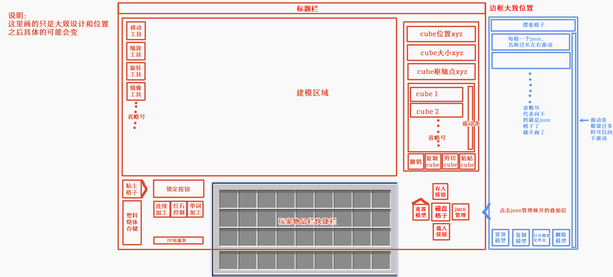

# 塑料成型舱功能规格与 TODO

> 状态：设计稿已定稿，尚未进入 TODO 实现阶段，也不是最终实现与验收基准
>
> 适用项目：Plasticraft / AnvilCraft 附属模组，当前目标版本为 NeoForge 1.21.1
>
> 后续流程：下一阶段先创建本功能所需的完整资源文件，包括方块/物品模型、贴图和 GUI 资源等；资源齐全后再修订并发布最终实现版文档。只有最终实现版和届时已经落库的资源文件共同构成 TODO 的实现与验收基准。
>
> GUI 说明：第 3 节目前插入的是用户提供的设计草图，只确定功能分区、相对位置和叠加层交互。最终实现版会重新修订第 3.3 节，建立明确的像素坐标系并逐项写明所有 GUI 元素的像素坐标位置。

## 1. 核心目标和已经确定的原则

1. 新增“塑料成型舱”，在其背面紧贴展开一个 `3x3x3` 成型区域。玩家在嵌入式建模程序中直接编辑这 27 个世界格对应的三维工作空间；每个方块边长细分为 16 个 `px` 单位。
2. 建模器只负责形状，不提供贴图、UV、绘画或手工上色。塑料材料和颜色完全继承加工时输入的塑料熔体。
3. 最小尺寸步进是 `1 px = 1/16` 方块，不是只能放置立方像素；元素允许某一维为 0，形成真正无厚度的面。
4. “普通制品/无功能”是默认类型且不受功能形状算法限制；本期完成箱子和储罐两种功能类型。托盘的既有形状约束保留为未来设计记录，但实际功能与实现 TODO 本期均留空，不由实现者自行推测。模型仍至少要包含一个有体积元素或一个无厚度面，完全空白的模型不能锁定或加工。
5. 建模界面不是普通 Minecraft `Screen` 上拼出的简化编辑器，而是嵌入游戏的独立建模程序，目标是在操作方式、三维显示和变换精度上完整模拟 Blockbench 的建模体验。
6. 成型舱额定耗电为 `256 kW`，接入 AnvilCraft 电网。没有有效供电时，粘土填充、从 8 B 暂存罐向成型区域泵送熔体和落砧加工暂停，但外部仍可随时向 8 B 暂存罐输入塑料熔体；已经保存的模型、预留粘土和已有熔体不丢失。
7. 新的自由塑料制品使用 **24 种离散朝向**：6 个朝向面乘以每个面内的 4 个四分之一转角。模型数据分别保存朝向面与 `0°/90°/180°/270°` 面内旋转，不能只保存 6 个方向而丢失滚转。
8. 新自由制品仍继承现有塑料实体的全部物理机制，包括重力、浮力、动态引力、碰撞与推动、滑轨搬运、磁化、粘合、实体持久化、锤子交互和回收等，并让全部机制正确处理这 24 种朝向。
9. 程序化灰度贴图生成器必须先于自由制品自动碰撞实现完成，随后再进入现有塑料色板流程。
10. 所有玩家模型、磁盘、动态制品和网络数据都使用版本化稳定格式，不能把客户端编辑器内存对象直接当作存档格式。

## 2. 成型舱、区域部件和世界表现

### 2.1 空间结构

1. 成型舱具有水平朝向，放下时正面面对玩家，背面连接成型区域。成型舱固定位于成型区域前表面的底部中央：它背后同高的第一格是区域的“前-下-中”格，区域再向机器背后延伸 3 格、向左右各延伸 1 格、从机器同高向上延伸 3 层，总共占据 27 格，不包括成型舱本体。
2. 以成型舱位置 `P`、机器背面方向 `B`、玩家面对机器正面时的右方 `R` 和世界上方 `U` 表示，27 个受控格的世界位置为 `P + dB + rR + uU`，其中 `d = 1..3`、`r = -1..1`、`u = 0..2`。建模视口中的 27 个大网格与这 27 个世界格一一对应，这套映射就是投影、成型、实体生成和顶部工作台结构的唯一锚点。
3. 推荐使用“一个控制方块实体 + 27 个轻量区域部件”。全部模型、槽位、熔体、模式、电力和动画进度只由控制器保存；区域部件只保存控制器位置和当前显示/碰撞阶段。
4. 放置前一次性检查 27 格均可占用、相关区块已加载且未越过世界边界。任意一格失败则整次放置失败，不能覆盖已有方块、方块实体或只展开一部分。
5. 右击成型舱本体打开操作界面。右击任一区域部件只转发到控制器，不产生 27 份独立菜单或数据。
6. 空区域和投影虽然没有碰撞，但 27 格仍是受控制器占用的区域，不能在其中放置其他方块。
7. 无碰撞不等于无法操作：区域部件保留仅用于选取、右击和显示边框的轮廓形状，但该轮廓不参与实体物理碰撞。
8. 破坏控制器时受控拆除全部区域部件且只掉落一个成型舱；区域部件不能被单独挖掉来绕过模具碰撞或复制掉落，可以阻止破坏，也可以把破坏转发为整机拆除。
9. 加载存档时校验部件与控制器关系，能够补回缺失部件，并清理找不到控制器的孤立部件。结构不完整期间立即停止粘土填充、向成型区域泵送熔体和落砧加工，但不关闭成型舱本体 8 B 暂存罐的外部流体输入能力。

### 2.2 世界显示和碰撞阶段

| 阶段 | 成型区域显示 | 区域碰撞 | 8 B 暂存罐的外部接口 | 向成型区域泵送 |
| --- | --- | --- | --- | --- |
| 空模型 | 只显示 3x3x3 边框 | 无碰撞 | 随时允许输入，按第 4.3 节允许抽出 | 不泵送 |
| 正在建模 | 边框中心实时显示空间投影模型 | 投影与区域均无碰撞 | 随时允许输入和抽出 | 不泵送 |
| 等待区域清空 | 冻结本次模型；粘土动画尚未开始，GUI 显示“区域被阻塞” | 无碰撞 | 随时允许输入和抽出 | 不泵送 |
| 粘土填充动画 | 模型投影隐藏，粘土块纹理从 `-Y` 向 `+Y` 逐层快速升起 | 动画开始的同一事务内立即变为完整 3x3x3 碰撞，暂停时仍保持 | 随时允许输入和抽出 | 不泵送，必须等粘土填充完毕 |
| 模具完成/灌入熔体 | 27 格外观均为填满的粘土块纹理，内部熔体不穿透显示 | 完整 3x3x3 碰撞 | 随时允许输入和抽出 | 有效供电且模型保持锁定时，以固定 `2 B/gt` 泵送至 `M(V)` |
| 落砧加工 | 内部塑料固化；27 格产生粘土块破坏粒子，粘土外观全部消失 | 事务提交时移除模具的完整碰撞 | 随时允许输入和抽出 | 事务期间暂停，不把暂存熔体瞬间并入本批 |
| 加工完成/等待下一周期 | 塑料制品与等量回收粘土球均在原 3x3x3 成型区域中产生 | 区域部件恢复无碰撞；只保留塑料实体自身碰撞，物品结果为掉落物 | 随时允许输入和抽出 | 下一副模具完成前不泵送 |

1. 建模投影是空间投影，不参与任何碰撞、寻路或实体推动。模型每次有效修改后，世界内投影实时更新。
2. 点击锁定或自动锁定会先冻结模型，但只在粘土填充动画真正开始前检查一次 3x3x3 区域。只要玩家、掉落物、上一件塑料实体或其他实体与将启用的完整碰撞相交，就不开始动画、不扣取本周期第一份粘土，并在 GUI 显示“区域被阻塞”；条件清除后自动重试。
3. 粘土持续供应且供电正常时，填充建议首版总时长为 `12 gt`，并做成常量以便游戏内体验后微调。视觉上按 48 个像素层分12份每份 1 gt 平滑上升，而不是用 48 次离散方块更新刷屏；缺粘土或缺电的等待时间不计入这 12 gt。
4. 从等待态进入粘土填充动画的状态提交必须与“启用 27 格完整碰撞”原子完成。碰撞从动画第一帧起就阻止新实体进入，因此动画结束时不做第二次实体检查，也不存在“停在最后一层”的额外阶段；粘土填充完成后才允许从 8 B 暂存罐向成型区域泵送。
5. 模具完成后的外观始终是封闭的粘土块纹理，不把内部负模、已输入熔体或模型空腔直接显示出来；熔体量通过 GUI、Jade 和状态指示查看。
6. 加工成功时，已转入模具的粘土从机器内部计数中结算，并在后方成型区域中掉落完全相同数量的粘土球，使玩家可以回收再利用。例如本周期取用 108 球，成功加工必须总计掉回 108 球；不得因取整形成多余模具体积而少还。
7. 粘土块破坏粒子与回收物品同时生成，但两者相互独立。粒子数量按可见范围合并或限流，不能为 110592 个微小单元逐个发网络事件；粘土球掉落则按物品堆叠上限合并为尽量少的掉落物实体，总数仍必须精确。
8. 下一周期仍要从专用过滤槽重新取得粘土球；掉落的回收粘土不会凭空回到槽位。连续加工自动化可以用溜槽或其他物流收集并送回输入槽。

## 3. 嵌入式建模程序

### 3.1 产品形态和技术边界

1. 建模部分是一个完整的嵌入式三维建模程序：它拥有自己的场景树、相机、选择、变换工具、撤销栈和渲染循环，并嵌在成型舱主界面中。它不是在普通 Minecraft `Screen` 上放一个可旋转模型就算完成，也不弹出脱离游戏的外部窗口。
2. 操作方式、选择高亮、变换操纵轴、相机手感和数值属性应完整模拟 Blockbench 的建模体验，但仅保留形状建模所需功能，不提供 UV、贴图、绘画、动画或手工上色工作区。
3. 实现前先做可运行原型，比较可随模组分发的 WebView/JCEF 实现与原生 OpenGL 嵌入实现。选型必须实际验证 Windows/Linux、全屏/窗口化、Minecraft GUI 缩放、高 DPI、输入法、剪贴板、键鼠焦点切换、显卡资源释放、模组包体和许可兼容；不能只交付技术调研文档而没有游戏内原型。
4. 若采用嵌入式网页运行时，只加载模组内打包的本地 HTML/JavaScript/字体/图标和三维库，不访问互联网、不执行外部脚本，也不向页面暴露任意系统文件权限。Blockbench 的代码、图标、布局或快捷键若被直接复用，必须先完成许可证和再分发检查；否则自行实现相同工作流。
5. Minecraft 主界面宿主机器槽位、能量、生产模式、磁盘和会话生命周期；嵌入程序负责建模交互与预览。两者通过有 schema、字段和整体大小限制、会话 ID 与修订号的窄桥接通信：打开会话、载入快照、提交编辑命令、撤销/重做、导入/导出、请求分析、锁定和关闭会话。
6. 服务器仍是模型、世界投影、粘土计数、类型验证、锁定和加工的权威端。客户端只能提交可验证命令，不能直接写方块实体 NBT；服务端需重新检查坐标边界、类型、元素数、修订号和玩家操作权。
7. 同一成型舱同一时间只允许一个有效写会话。其他玩家只读查看，或在明确接管后取得编辑权；GUI 要显示当前操作者。断线、关闭界面和客户端崩溃都必须释放租约，过期命令不能覆盖较新修订。
8. 编辑器按命令增量提交，并定期保存服务端草稿。嵌入运行时崩溃、界面异常关闭或被操作系统回收后，重新打开必须恢复最后已确认修订，不清空方块实体中的模型。

### 3.2 三维工作空间、坐标和建模能力

1. 中央区域是后方成型区域的可编辑三维镜像，而不是二维像素画布。视口中显示 `3x3x3` 个方块大网格，与第 2.1 节的 27 个世界格一一对应；每个大网格内部以 `1 px = 1/16` 方块为最小数值步进，因此每轴共有 48 个内部单位。
2. 模型源数据使用机器局部轴：`+X` 是面向成型舱正面时的右方，`+Y` 是世界上方，`+Z` 是从成型舱向后深入成型区域的方向。三轴边界均为 `0..48`，有体积单元索引为 `0..47`，无厚度面可位于边界或内部格线上。这些数值是工作空间的内部制造单位，不把整个程序定义为像素画布。
3. cube 和平面的所有顶点都必须留在这 3 格见方的三维工作空间内；移动、缩放尺寸、旋转、镜像、粘贴或数值输入产生越界结果时，视口立即显示越界部分并禁止提交，不得悄悄裁切或自动缩放模型。
4. 大网格的每一格表示一个世界方块，每 16 个内部单位使用明显的主网格线分隔。视口还要标出成型舱控制器连接在前表面底部中央的位置，让玩家能直接看出模型哪一面靠近机器。细分网格可以根据缩放级别淡入淡出，但主网格边界不能消失。
5. 视口必须持续显示世界方向。水平轴两端使用“E/W”和“S/N”标记，垂直轴显示“U/D”；可辅以角落方向立方或指南针。相机旋转后标记与对应的世界轴一起移动，不能固定在屏幕左右造成方向误导。成型舱朝向改变时，局部 `X/Z` 轴映射到的东西南北标记随之更新。
6. 相机支持透视、六面正交视图、轨道旋转、平移、缩放、聚焦选择、一键回到整个成型区域和网格/轴线显隐。切换视图不改变模型坐标，方向标记在所有视图中都必须可读。
7. 至少支持：元素与分组列表、新建cube、选择/多选、移动、尺寸修改、枢轴点、三轴旋转、三轴镜像、复制、删除、隐藏、锁定元素、重命名、分组、居中、对齐、撤销/重做、剪切/复制/粘贴和精确数值输入。操纵轴与右侧数值属性双向同步并进入同一撤销历史。
8. 不出现 UV、贴图、绘画和手工颜色编辑功能。材料/颜色显示只是基于目前舱内存储的熔体的加工结果预览，不写入蓝图替代最终熔体数据。
9. 每次有效编辑都立即更新世界内同坐标、无碰撞的空间投影，并重算实体积、最低熔体消耗、粘土需求、所选功能类型、验证结果和容量。视口、世界投影和最终实体共用第 2.1 节的锚点，不允许存在另一套“渲染上看起来对齐”的隐式偏移。
10. 编辑器保留精确源元素和变换，同时实时生成版本化、确定性的 1 px 制造预览。非网格旋转按固定规则烘焙；玩家锁定前看到的制造预览必须与最终体积、部分填充、贴图、密封分析和碰撞使用同一派生数据。
11. 原生和导入模型都完整保存无厚度面。重叠有体积元素按并集计量；完全空白的模型禁止锁定，只有无厚度面的模型不属于空模型，可按最低 250 mB 规则加工。
12. 编辑坐标、世界投影和部分填充使用同一机器局部坐标系。蓝图载入不同朝向的成型舱时，整个局部坐标系跟随机器旋转，视口东西南北标记展示旋转后的真实世界方向，但蓝图内的局部填充顺序不变。

### 3.3 GUI 设计草图和主界面

下图是当前已经确定的 GUI 设计稿。红框为常驻主界面，蓝框为点击“JSON 管理”后才展开的右侧叠加层。草图中的文字只说明功能和大致位置，不是最终美术稿，也不是可直接照图实现的像素坐标规格；资源制作与最终版修订期间可以调整具体间距和比例，但不得遗漏本节已经确定的控件、状态或红/蓝两层关系。

当前设计稿阶段不提供元素坐标清单。所有模型、贴图及其他 GUI 资源完成后，最终实现版必须在本节定义统一的 GUI 像素坐标原点，并逐项列出常驻主界面、建模程序宿主区域、玩家物品栏和 JSON 管理叠加层中每一个元素的像素坐标位置。TODO 实现只能使用该最终坐标规格，不能测量本草图或凭视觉比例反推坐标。

| 大致位置 | 区域 | 必须包含的内容 |
| --- | --- | --- |
| 顶部整行 | 标题栏 | “塑料成型舱”标题、关闭入口，以及不遮挡建模的宿主窗口区域 |
| 左侧竖栏 | 建模工具 | 草图指定的移动、缩放尺寸、旋转、镜像，以及新建 cube/平面、选择等必要扩展工具；当前工具有明确选中态和悬浮提示 |
| 中央主体 | 嵌入式三维建模程序 | 与世界成型区域一一对应的 3x3x3 大网格、东西南北/上下标识、机器连接位置、透视/正交相机、选择高亮、操纵轴和制造预览 |
| 主体右栏上部 | 选中元素属性 | 当前 cube/平面的位置 `x/y/z`、大小 `x/y/z`、枢轴点 `x/y/z` 和旋转；数值可直接输入并参与撤销/重做 |
| 主体右栏中下部 | 元素列表与编辑 | 可滚动的 cube/平面/分组树，以及撤销、重做、复制、剪切和粘贴；列表选择与视口选择双向同步 |
| 右栏属性区内 | 制造分析 | 普通制品/箱子/储罐选择、验证结果、容量、实体积、粘土总需求、当前可成型体积和部分加工降级警告；托盘本期不出现在类型选择器中 |
| 左下机器区 | 原料与运行控制 | 单个粘土球过滤槽、塑料熔体竖向储量条、锁定/解锁按钮、三种生产模式和 FE 电量条 |
| 下方中央 | 玩家物品栏 | 完整玩家背包和快捷栏，槽位行为遵循原版容器界面 |
| 右下蓝图区 | 磁盘与模型管理 | 重置模型、磁盘格、磁盘“存入”“载入”按钮和“JSON 管理”开关；机器运行提示在不遮挡这些控件的位置显示 |

1. “连续加工”“红石控制”“单次加工”是一个三选一互斥控件，默认为“红石控制”。草图中的“单词加工”是错别字，正式文字统一为“单次加工”。
2. 粘土格是有正常堆叠上限的过滤槽，只接受粘土球。槽位上限取物品与槽位允许值的较小者，当前通常为 64；不得实现为无堆叠限制的 108 球数字仓。
3. 塑料熔体竖条显示成型舱本体暂存罐的 `当前量 / 8 B`。制造分析区把 `暂存量 / 8 B` 与 `成型区域批次量 / M(V)` 分开显示，并显示“暂停泵送”或固定 `2 B/gt` 泵送状态；不得把两处数值相加后误称为模型上限。8 B 暂存罐在空模型、编辑、锁定、断电、加工和等待阶段都接受外部输入，腾出的空间可由管道继续补充。
4. FE 条显示当前 FE 与最大 FE，悬浮时显示精确数字、`256 kW` 工作等级和暂停原因。最大容量等于当前版本一个超级电容器，目标依赖当前为 `160 MFE = 160000000 FE`；实现引用与本体相同的常量/配置来源。
5. 锁定按钮根据编辑、区域被阻塞、等待粘土、正在填充、模具完成和正在加工状态切换文字与可用性。锁定后模型属性和破坏性编辑禁用，但资源条、模式状态与合法的解锁入口仍可见；区域阻止粘土动画启动时必须直接显示“区域被阻塞”，不能笼统显示为缺料或断电。
6. 点击“重置模型”第一次只显示“按住 Shift 再次点击以确认”，不清空数据；玩家按住 Shift 再次点击后才删除当前工作空间中的全部元素、分组和选择，并重算投影与分析结果。它只在可编辑状态可用，不删除磁盘或 JSON 文件。
7. 磁盘格上方为“存入”、下方为“载入”，遵守第 10 节的空磁盘与二次载入流程。“JSON 管理”只切换右侧叠加层，不等同于磁盘载入。
8. 主界面和右侧叠加层必须适配小窗口、高 GUI 缩放和超宽屏。属性栏与玩家物品栏可按预定断点重排，但不得让按钮、文字、槽位、方向标识或建模视口互相覆盖。建模视口必须保留可实际操作的最小尺寸，不能被物品栏压成只能预览的小窗。

### 3.4 JSON 管理叠加层

1. 草图中的蓝色框是从主界面右侧展开的 JSON 管理叠加层。每次新打开成型舱 UI 时它都默认关闭；点击“JSON 管理”展开，再点击同一按钮关闭，不记忆上次开关状态。
2. 叠加层不替换建模会话。展开或关闭不会提交、回滚、锁定或清空当前模型；空间不足时可以覆盖主界面右侧的一部分，但必须保持明确层级并允许一键关闭。
3. 顶部搜索框按文件名、模型名和 owner 过滤共享蓝图库。下方列表每行代表一个 JSON/蓝图文件并显示选中态；名称过长时在行内水平滚动或跑马显示，文件数量超过可视范围时使用右侧纵向滚动条。
4. 列表保留“上传模型”入口，用于选择本地 JSON/`.bbmodel` 并按第 10 节上传到共享库。草图未单独标出时，将它放在搜索框旁的导入图标或列表工具栏中，不得删除上传功能。
5. “置顶模型”作用于当前选中模型。置顶顺序是当前玩家的界面偏好，不改变共享文件 owner 或其他玩家的排序；偏好按玩家和世界保存，多个置顶项保持稳定顺序。
6. “复制模型”复制当前选中模型并生成一个内容相同、名称不冲突的新副本。副本 owner 是点击复制的玩家，复制不覆盖原文件，也不立即写入磁盘或成型舱。
7. “打开模型文件夹”使用系统文件资源管理器定位模型所在文件夹。单人游戏/本地主机直接定位权威世界蓝图库；连接远程服务器时，先把所选模型的只读副本导出到客户端安全蓝图目录，再打开并定位本地副本。系统不支持打开文件管理器时，显示可复制的绝对路径和失败原因。
8. 点击“删除模型”第一次只提示“按住 Shift 再次点击以确认”；玩家按住 Shift 再次点击后才删除当前选中的共享模型。服务器再次检查 owner/管理员权限和文件修订号；删除 JSON 不清除已经写入磁盘的内嵌副本，也不影响已载入成型舱的模型。
9. 没有选中模型时，置顶、复制、打开文件夹和删除按钮全部禁用。搜索、滚动、按钮确认和当前选中项是界面状态，不得被伪造网络包用来绕过服务端文件权限。

## 4. 模型、粘土和熔体计算

### 4.1 模型派生数据

每份模型保存可编辑源数据，并生成以下权威派生结果：

- `volumeMask`：最多 `48^3 = 110592` 个有体积单元；
- `barrierFaces`：无厚度面集合，用于渲染和内腔阻隔，但不参与实体碰撞；
- `fillOrder`：以局部坐标 `(y, x, z)` 为比较键升序排列有效体积单元，优先从 `-Y` 向 `+Y`，同层再从 `-X` 向 `+X`，最后从 `-Z` 向 `+Z`；不属于模型的空白单元直接跳过；
- `surfaceMesh`：完整或部分成型形状的可见表面；
- `collisionShape`：只从有体积单元生成的合并碰撞；
- `cavities`：被实体或无厚度面封闭的内部空间；
- `analysis`：体积、内腔、功能资格、箱子格数和储罐容量；
- `modelHash`：规范化模型和生成器版本的稳定哈希。

任意旋转的有体积元素和斜向无厚度面都要经过版本化、确定性的制造烘焙。斜向阻隔面至少要阻断所有被其穿过的六邻接通路，不能因为它不落在轴对齐格面上就在箱子/储罐扫描中漏液；具体结果以编辑器中的制造预览为准，并用固定样例锁定算法版本。

### 4.2 粘土计算和预留

1. 粘土填充整个 3x3x3 中不属于有体积塑料模型的空间，包括制品内腔。一粘土球等于 `1024` 立方像素，每次锁定需要：

   `ceil((110592 - 模型实体积) / 1024)` 个粘土球。

2. 无厚度面体积为 0，因此既不减少粘土需求，也不增加按形状计算的熔体需求。公式按整球向上取整；不足一球的最后一段模具仍需取用一整球，加工成功后也回收这一整球，不生成碎片或小数粘土。
3. 粘土来自 GUI 中唯一的专用过滤槽。该槽只接受粘土球，并遵守正常堆叠上限，当前通常最多 64 个；它不是可一次存入 108 球的隐藏数字缓冲。槽位在锁定和填充期间仍允许物品能力插入，溜槽、漏斗等可以在旧粘土被取走后继续补料。
4. 锁定时冻结模型并计算总需求，但不要求槽中一次装齐整批粘土。`MOLD_FILLING` 按进度从过滤槽逐个转移粘土球到“本周期已成模粘土”，每球最多推进 1024 个模型外空间；槽空时动画原地暂停并等待继续输入，不能少料却直接完成模具。
5. 一次理论最大需求仍为 108 球，因此最空的模型至少需要经历 `64 + 44` 或其他多次补料。GUI 同时显示“槽内数量 / 已成模数量 / 总需求”，自动化测试必须覆盖填充中补料和区块重载。
6. 已转移到模具的粘土在加工成功前仍可退还。手动解锁时先填回过滤槽至其堆叠上限；放不下的剩余粘土在成型区域内作为粘土球掉落物生成。
7. 成型舱被破坏时，过滤槽中的粘土在成型舱位置掉落；已经进入模具的粘土按原位置分散在后方 3x3x3 区域内掉落。总数必须与槽内和模具计数完全相等且只结算一次；磁盘也必须正常掉落，加工结果不储存在机器内部。
8. 加工成功时，把“本周期已成模粘土”计数清零，同时在后方 3x3x3 成型区域的包围盒内生成完全等量的粘土球作为回收物。掉落物按正常堆叠上限合并，优先分布在不与新塑料实体体积重叠的位置；制品占满区域时也必须先在区域内产生，再由正常的物品推出/逃逸处理离开碰撞，不能改送成型舱槽位、区域上方或其他隐藏缓冲，更不能少还。
9. 回收粘土不直接回填专用输入槽。玩家可以手动拾取，或用溜槽等世界物流从成型区域收集并送回过滤槽；因此连续模式在没有回收物流时仍会因区域被掉落物阻塞或缺粘土而等待。

### 4.3 熔体容量、最低消耗和部分加工

1. 模型实体积记为 `V` 立方像素。成型区域本周期可容纳的熔体上限为：

   `M(V) = max(V, 250) mB`。

2. 成型舱本体另有固定 `8 B = 8000 mB` 暂存罐。它和成型区域是两个独立容量：暂存罐最多 8000 mB，成型区域最多 `M(V)`，两者同时装有熔体时允许总量达到 `8000 + M(V)` mB；不得用 `M(V)` 限制暂存罐，也不得把暂存量算作已经填入模型。
3. 底面固定暴露流体能力。只要流体属于 Plasticraft 的塑料熔体且暂存罐尚有兼容空间，外部就能向 8 B 暂存罐输入；空模型、正在编辑、未锁定、结构不完整、断电、加工事务和等待下一周期都不能仅因机器阶段拒绝输入。外部抽取同样不依赖供电，并可按能力视图排空暂存罐或尚未加工的成型区域熔体。“随时允许”不绕过容量、流体身份兼容和服务器事务一致性检查。
4. 机器只有在模型已锁定、粘土模具全部填充、结构完整且有效供电时，才把暂存罐中的熔体泵入成型区域。泵送速率固定为每游戏刻 `2 B/gt = 2000 mB/gt`，每刻实际转移量为 2000 mB、暂存量和成型区域剩余容量三者的最小值；暂存空间一释放，外部管道即可继续补入。
5. 成型区域第一次收到熔体时锁定本批的完整 `FluidStack` 身份，包括流体 ID、材料、颜色和组件。区域中仍有本批熔体时，暂存罐只能接收与其完全一致的熔体；两种不同塑料熔体不得混合或静默覆盖。区域清空后，非空暂存罐中的流体可成为下一批身份。
6. 每次加工至少要求并消耗成型区域内的 `250 mB` 塑料熔体。暂存罐中的数量不参与 250 mB 门槛；即使暂存罐已满，只要成型区域不足 250 mB 就不能加工。
7. 当 `V >= 250` 时，成型区域未装满仍可加工，但其中必须至少有 250 mB。实际有体积部分取 `fillOrder` 的前“成型区域当前 mB”个单元；最大模型可在外部管道持续补充暂存罐时累计泵入 `110592 mB` 并完整成型。
8. 当 `V < 250` 时，成型区域只有达到 250 mB 才能加工，并直接得到完整有体积形状；超过实体积的熔体属于最低批次损耗，不生成额外体积。
9. 纯平面模型在成型区域达到 250 mB 后可单独加工；这 250 mB 同时提供成品的材料类型和颜色。
10. 普通模型中的平面只在至少一个相邻模型体积单元已经成型时进入部分结果；没有任何体积单元的纯平面模型在满足 250 mB 后包含全部平面。
11. 部分结果在加工前重新运行功能类型算法。若不再满足箱子或储罐条件，则允许加工，但自动降级为普通制品；GUI、Jade 和铁砧锤浮窗要提前显示“本次结果将降级”。托盘本期不参与选择或降级判定。
12. 成品继承成型区域本批实际熔体的类型、颜色和相关材料组件，而不是读取加工时仍留在 8 B 暂存罐中的流体。
13. 收到落砧加工事件后立即暂停泵送，并以事务开始时已经位于成型区域中的熔体冻结加工快照；不得绕过 `2 B/gt`，把暂存罐余量瞬间提交到本批。加工成功只消耗并清空成型区域熔体，8 B 暂存罐中的剩余熔体数量和身份完全保留，可供以后批次继续使用。
14. 暂存罐中有熔体不妨碍编辑、重置模型、手动解锁或从磁盘载入模型。只有成型区域内已经存在批次熔体时，才拒绝解锁、重置或覆盖模型，并提示先从底面抽空成型区域；这些操作不得自动删除任何一处熔体。
15. 破坏成型舱时，8 B 暂存罐中的熔体不生成掉落物，也不写入掉落的成型舱物品或其他容器，随被破坏的方块实体直接舍弃。粘土球和磁盘仍分别按第 4.2 节与第 10 节的物品规则掉落。

## 5. 电力、物品能力、红石和生产模式

### 5.1 电力

1. 成型舱同时实现 AnvilCraft `IPowerConsumer` 和持久化内部 FE 储能，额定充电/工作功率等级为 `256 kW`。
2. 内部 FE 最大容量等于一个超级电容器，当前本体目标版本为 `160 MFE = 160000000 FE`。容量常量应从兼容层集中取得；若未来本体调整超级电容器容量，数据迁移和 UI 上限同步调整，已有能量按不超新上限的规则保留。
3. FE 缓冲未满时可从 AnvilCraft 电网以 256 kW 等级充电，工作阶段从缓冲扣除等价 FE；功率到 FE 的速率直接复用本体电力转换配置，不能在成型舱里另写一套固定换算。缓冲满且机器空闲时不继续申报无意义负载。
4. 粘土填充动画、从 8 B 暂存罐向成型区域泵送、准备加工和加工事务都要求 FE 缓冲能维持 256 kW 工作等级。电网断开后可继续使用已储 FE；FE 耗尽时动画与泵送冻结、落砧加工拒绝，恢复供能后从原进度继续，不重新扣粘土。无论是否有 FE，底部接口都继续接受符合条件的熔体进入 8 B 暂存罐。
5. 模具是物理存在的，因此断电后从粘土动画开始时就已启用的 3x3x3 完整碰撞仍保留。已有熔体可从底部抽出，已有 FE、动画进度、两处熔体和粘土计数在区块重载后保持。
6. `256 kW` 与 FE 储量是两个维度：前者是瞬时功率等级，后者是累计能量。GUI、Jade 和测试必须同时显示/验证，不能把 256 错写成 256 FE/t，也不能只画一根没有服务端储能的装饰条。

### 5.2 物品能力

1. 成型舱暴露分面的标准物品能力，包含：

   - 只接受粘土球、遵守正常堆叠上限并允许物流正常插入/抽取的单个过滤槽；
   - GUI 专用磁盘格，不默认暴露给普通物流，避免自动化误取蓝图。

2. 底面固定保留给熔体能力；其余可连接面暴露经过过滤的粘土槽能力。溜槽、漏斗及其他兼容物流可以在模具填充期间持续补充该槽，也可以抽走尚未转入模具的粘土，不能超堆叠或插入其他物品。
3. 成型舱不设置任何加工结果槽位或内部结果库存。合成得到的塑料制品物品和回收粘土球都是成型区域中的世界掉落物，转化得到的塑料制品是同一区域中的动态实体；玩家应使用能从世界收集掉落物/实体的物流处理它们，不能从成型舱物品能力中抽取加工结果。

### 5.3 三种生产模式

GUI 使用三段模式选择，默认值为“红石控制”：

| 模式 | 加工完成后的状态 | 红石行为 |
| --- | --- | --- |
| 连续加工 | 保留模型和类型，只清空成型区域熔体与本周期模具计数，保留 8 B 暂存熔体并等量掉落回收粘土；制品、粘土掉落物和其他实体离开区域后自动尝试下一批 | 忽略红石锁定控制 |
| 红石控制（默认） | 保留模型和类型但返回可编辑/未锁定状态，只清空成型区域熔体与本周期模具计数，保留 8 B 暂存熔体并等量掉落回收粘土 | 只在红石上升沿发起自动锁定 |
| 单次加工 | 保留模型和类型但返回可编辑/未锁定状态，只清空成型区域熔体与本周期模具计数，保留 8 B 暂存熔体并等量掉落回收粘土 | 忽略红石锁定控制 |

1. 红石上升沿只在模型未锁定时创建一次自动锁定请求，不因持续高电平反复触发。请求成功锁存后，即使信号随后回落也不会自动解锁；一次加工结束时若信号仍保持高电平，同样不视为新的上升沿。
2. 上升沿先冻结当时的模型修订。区域内有玩家、制品、掉落物或其他实体时，请求保持在粘土动画开始前并显示“区域被阻塞”；FE 与第一份粘土可用且区域清空后，单次检查通过并原子启用完整碰撞。动画开始后若继续缺粘土或缺电，则在保持完整碰撞的状态下暂停，等待溜槽补充或供电恢复。只有玩家在 GUI 中明确取消/解锁才撤销已锁存但尚未完成的请求，并按第 4.2 节退还已进入模具的粘土。
3. 连续模式在区域仍有上一件制品、回收粘土掉落物或其他实体时不开始下一次粘土动画；区域清空后自动重试。缺粘土或缺电时同样进入可恢复等待，不需要新的红石边沿。
4. 模式在当前周期中途被修改时不破坏现有模具或返还资源，新模式从本次加工结束后生效。
5. 手动锁定在三种模式下都可用。手动解锁只在非加工事务且成型区域批次熔体为 0 时执行，并按第 4.2 节退还预留粘土；8 B 暂存罐可以非空。成型区域有熔体时提示先抽空，不提供会误触的“确认后销毁熔体”。
6. “连续加工”只代表每次完成后自动重新锁定和填充粘土，不会凭空模拟巨型铁砧；每一批仍必须收到一次合法的巨型铁砧落地加工事件。

## 6. 巨型铁砧加工

1. 在成型区域最上层的正上方紧贴放置 3x3 工作台平面，由巨型铁砧落地事件触发动态加工。结构坐标始终由成型舱朝向和区域锚点推导，不能用附近任意 3x3 工作台误匹配。
2. 外围 8 个工作台、中心为空间超压器时执行“多方块合成”，结果是物品形式，并作为世界掉落物在原 3x3x3 成型区域内产生，不进入成型舱。
3. 完整 3x3 都是工作台、中心没有空间超压器时执行“多方块转化”，结果是实体形式并生成在原 3x3x3 成型区域。
4. 动态处理器必须从相邻成型舱读取模型、实际熔体、材料、颜色、功能类型和生产模式，不能只使用 AnvilCraft 静态多方块配方的 `BlockState` 输入。
5. 加工顺序为：验证巨型铁砧结构、机器供电和完整模具 -> 停止泵送 -> 验证成型区域至少有 250 mB -> 冻结模型、成型区域熔体、材料和类型快照 -> 计算本次部分形状和类型降级 -> 生成灰度贴图所需的确定性描述/哈希 -> 预检区域部件、目标区块和结果数据可创建 -> 在成型区域创建物品制品或实体制品及等量粘土球 -> 只扣除成型区域当前熔体并清零本周期模具计数 -> 播放固化/粘土破坏效果 -> 进入下一模式状态。加工事件不得从 8 B 暂存罐额外抽取熔体。
6. 整个流程是服务器原子事务。任意预检失败时不消耗粘土或成型区域熔体、不生成制品或回收粘土掉落物、不改变 8 B 暂存罐、工作台、空间超压器或模型。事务成功时制品、成型区域熔体扣除、模具清零和粘土回收必须只结算一次，暂存罐余量保持原值。
7. 工作台、空间超压器、成型舱和区域部件都是可复用设备，不随加工消耗。
8. 必须避免与 AnvilCraft 原有静态多方块监听器重复命中或重复产出。
9. 物品结果、实体结果和粘土球掉落物都使用与建模投影完全相同的区域坐标锚点，初始生成位置必须位于 27 格成型区域的包围盒内。提交时先撤销区域部件的完整碰撞，再原地产生结果；不得把物品送到成型舱、区域外的备用位置或隐藏缓冲。连续模式必须等这些结果及其他实体离开区域后才能开始下一副模具。

## 7. 动态制品、贴图、碰撞和 24 朝向

### 7.1 动态物品和实体

1. 使用一个动态塑料制品物品 ID 和一个动态塑料制品实体 ID 承载所有玩家模型，不能为每个模型注册新 ID。
2. 制品数据至少保存：格式版本、实际成型形状、模型哈希、贴图生成版本、材料、颜色、朝向面、面内四分之一转角、功能类型、容量、名称、箱子物品或储罐流体内容。
3. 物品放置后生成相同数据的实体；实体被铁砧锤回收后恢复为相同物品。内容、材料和模型在存档重载、区块卸载、跨维度及物品/实体转换中都不能丢失。
4. 自由制品共有 24 个离散姿态：先选择 6 个朝向面之一，再选择该面内 `0°/90°/180°/270°`。放置预览、实体状态、物品回收和网络同步都必须保留两部分，不能把四个滚转姿态合并。
5. 24 朝向只限定模型姿态；实体所受的有效重力向量仍可连续变化，储罐液面据此产生任意倾角。
6. 物品堆叠必须比较完整制品数据。带箱子物品、储罐流体或其他可变内容的制品不可堆叠；无内容制品也只有在实际形状、材料、颜色、朝向、功能和生成版本完全一致时才能堆叠。
7. 模型坐标原点、制造区域锚点和实体枢轴必须稳定保存。物品放置、实体旋转、锤子回收再放置和区块重载都不能使模型相对碰撞发生半格或整格漂移。

### 7.2 程序化灰度贴图和色板

1. 先从实际成型形状提取外露面和自动 UV 图集，再根据面朝向、边缘、凹槽、邻近遮蔽和由模型哈希固定的微纹理生成确定性 8 位灰度图。
2. 玩家不编辑 UV。相同模型哈希和生成器版本必须产生逐字节一致的灰度结果。
3. 灰度结果进入材料色板；`natural` 和染色 `white` 是不同状态。缓存键至少包含模型哈希、生成器版本、材料和颜色。
4. 加工事务确定实际形状和生成器版本后，当前观察客户端立即排队生成灰度图；后来进入视野的客户端按相同描述按需重建。服务器保存权威模型、哈希和生成器版本，不在每次实体同步中传整张 PNG。
5. 资源重载、退出世界和显存压力下释放缓存；失败时使用缺失材质占位，不影响服务端碰撞和容量。
6. 生成和上传纹理不得阻塞服务器 tick 或客户端渲染主循环；复杂模型异步生成期间使用明确占位，完成后原位替换且不改变实体尺寸。

### 7.3 自动碰撞

1. 只有有体积单元形成实体物理碰撞。无厚度面只正常双面渲染，永远不形成站立、阻挡、推动或落地碰撞。
2. 有体积单元通过三维贪心合并或等效算法减少 AABB 数量；不能在最坏情况下直接创建 110592 个碰撞盒，也不能静默简化为整个外包围盒。
3. 碰撞使用实际部分形状，不使用完整蓝图；24 朝向下的放置检查、玩家站立、移动、推动、滑轨和粘合都使用同一份正确旋转后的体积碰撞。渲染边界则覆盖全部可见面，不能因平面无碰撞而被提前剔除。
4. 射线选取和铁砧锤交互使用独立的交互轮廓：有体积部分沿用碰撞，纯平面或外露平面使用极薄且只参与选取的代理。该代理不能进入物理碰撞，因此纯平面制品仍可被玩家选中、查看和回收，但会按零碰撞规则穿过实体或地形。
5. 最大 3x3x3 的实体要求现有塑料物理、载具碰撞、路径规划和宽阶段检索全部取消固定 1x1x1 假设。
6. 极端棋盘格、长薄结构、断开部件、纯平面和最大实心模型都要有性能预算；若确实需要复杂度上限，应在导入/锁定前拒绝并说明，不能改变已经生产的形状。

## 8. 制品类型、容量和无 GUI 存储

### 8.1 可扩展类型框架

1. 类型系统使用注册表/策略接口，每个已实现类型提供稳定 ID、形状验证器、失败原因、容量派生、物品/流体能力、Jade/铁砧锤浮窗内容和数据迁移。接口必须允许未来加入新类型，但不得为未定义功能提供猜测性默认实现。
2. 普通制品永远通过。本期的箱子和储罐在选择、锁定和实际部分加工时均由服务器重新验证。托盘不属于本期可选类型。
3. 验证失败统一提示“这个形状好像不能做这件事”，并附加具体原因。

### 8.2 通用外壳和内腔扫描

1. 使用模型外一圈 padding 的六邻接洪水填充。实体单元和无厚度面都可以阻断洪水；只在边/角接触不算六方向连通。
2. 从外部不可到达的空单元为内腔。多个封闭内腔的体积求和，并在功能上视为同一个逻辑存储空间。
3. 与内腔和外界之间边界相连的实体/平面属于外壳。完全悬在内腔中的孤立元素、从内壁伸入内腔的装饰或其他不承担密封作用的内部元素会使“内部为空”验证失败；模型外侧装饰允许保留。
4. “内部空间占总体积至少 50%”的分母定义为：全部有效封闭内腔 `C` + 与这些内腔相邻并形成外壳的实体积 `S`，即验证 `C / (C + S) >= 0.5`。包围盒外部空角和外部装饰不进入分母；外部装饰仍保留在制品上。
5. 无厚度面可作为箱子/储罐密封边界，即使其不产生碰撞或塑料体积；它对上式的 `S` 贡献为 0。这允许纯平面密封外壳，最低加工成本仍由 250 mB 规则保证。

### 8.3 箱子

1. 形状不限，只要外壳完整、内部为空、内腔比例至少 50%，且内部空间不少于 64 立方像素。
2. 原版箱子标定为外部 `14x14x14 px`、1 px 板材、内部 `12x12x12 = 1728`，对应 27 格。
3. 箱子格数为 `floor(内部空间 / 64)`；不足 64 的余数舍弃，低于 64 时类型验证失败。容量不设置额外上限。
4. 塑料实体箱子没有 GUI。它只暴露标准物品能力供溜槽、漏斗和其他自动化存取，并通过 Jade 和铁砧锤浮窗显示内部物品、数量和总容量。
5. 大容量浮窗必须分页/滚动或按相同物品汇总，不能一次发送/绘制全部空槽。实体回收为物品时保留库存，并防止递归容器数据造成无限嵌套或超大 NBT。
6. 箱子被正常锤回物品时保留内容；若因伤害、爆炸或损坏流程真正销毁，则先按服务端规则安全掉出内容，不能连同动态实体一起静默删除。

### 8.4 储罐

1. 使用与箱子相同的完整外壳、内腔和 50% 比例规则，内部空间至少 171 立方像素。
2. 铁砧工艺 16 B 储罐标定为外部 `16x16x16 px`、1 px 板材、内部 `14x14x14 = 2744`。
3. 容量为 `floor(内部空间 / 171) B`；不足 171 时类型验证失败，余数舍弃，容量不设置额外上限。
4. 塑料实体储罐没有 GUI。它像 AnvilCraft 大型流体储罐一样，在同一个共享总容量中保存多种完整 `FluidStack`，支持按流体及组件精确输入/抽出，并通过 Jade 和铁砧锤浮窗显示流体列表、各自数量和总容量。
5. 储罐实体回收为物品后保留全部流体；放回世界后恢复相同顺序、数量和组件。
6. 对外能力、手持流体容器交互、输入选择和抽取顺序尽量直接复用本体大型流体储罐语义；不能让渲染层顺序反过来修改服务端保存顺序。真正销毁且无法保留为物品时，按本体约定安全排出或丢弃并给出明确反馈，不得数据无声消失。

### 8.5 托盘预留设计（本期不实现）

> 本小节只保留已经确认的形状设想，防止后续设计时丢失。托盘的承载、吸附、搬运、显示、与其他系统交互等实际功能尚未定义，因此本期 TODO 不实现托盘选项、验证器、容量或行为。

1. 未来算法检查六个可能的底面朝向，只要一个方向满足就通过，没有除 3 格见方建模工作空间之外的大小限制。
2. 必须存在一个共面、四邻接连续且没有孔洞的底面区域；底可以有体积，也可以是无厚度面。底面厚度属于底本身，不算“另一侧的其他元素”。
3. 在底面的同一侧，边缘必须覆盖底面外轮廓的每一段、首尾闭合且连续，从底面朝这一侧的每个边缘位置都至少达到 `2 px` 高；`2 px` 只指高度，不要求边缘有 2 px 厚。
4. 外轮廓由底面区域与外部相邻的全部边界段组成，凹形轮廓也必须逐段围合。任何断边、只有角接触的边段或局部仅 1 px 高都失败。
5. 边缘围成的内部半空间除底本身外不能有横梁、立柱、装饰或其他元素；底面没有边缘的另一侧除底本身外也不能有任何元素。
6. 无厚度面可以作为底或边，并继续遵守不产生碰撞的全局规则。
7. 未来续写托盘规格时，必须先明确实际玩法与数据行为，再决定是否使用上述形状规则。本期实现者只保证类型框架可扩展，不为托盘注册可用功能，不把它当成箱子或储罐。

## 9. 任意重力方向下的多流体渲染

1. 储罐的权威容量和流体列表沿用大型流体储罐的多流体语义；渲染只消费该数据，不能反向改变容量。
2. 从内腔单元和阻隔面生成密闭的“可装液体空间”网格。渲染网格要向内做极小偏移防止 Z-fighting，但不能越过实体或无厚度边界。
3. 每帧或重力变化时取得实体的有效重力向量。自由液面所在平面的法线与重力方向平行；重力可为斜向，因此液面必须能以任意角度倾斜，而不是只支持六个水平面。
4. 根据 `当前总流体量 / 总容量` 求应占内腔体积，再沿重力方向二分求自由液面平面，使平面“下方”与内腔相交的体积恰好等于目标体积。
5. 多种流体按照储罐保存的稳定顺序分层。为每种流体计算相邻两个等体积平面，把内腔网格裁切成对应斜向薄层；各层不能重叠，也不能在应填充区域留下孔洞。
6. 凹形、带细管、多个独立内腔、零厚度密封面和任意复杂合法储罐都使用同一半空间裁切算法。满罐时必须填满全部内腔，不穿模；未满时只允许自由液面以上存在预期空区。
7. 多个内腔按第 8.2 节视为一个连通逻辑储罐，统一受同一组重力平面切割。
8. 重力方向连续变化时先对有效重力方向做短时间插值，再用插值后的方向重新求满足目标体积的液面位置；不能直接插值两个裁切平面而造成液体体积忽多忽少。重力接近 0 时保持最后一个稳定方向。
9. 半透明流体层需要按相机和各层几何正确排序，或使用项目可承受的顺序无关透明方案；从罐体任何一侧观察都不能出现后层覆盖前层、层间闪烁或把流体画到外壳前面。
10. 缓存内腔拓扑和裁切中间数据，只在模型、流体数量层级或重力方向超过阈值变化时重建网格。必须为 0°、30°、45°、90°、连续旋转和最大复杂内腔建立渲染验证样例。

## 10. 磁盘、JSON 和共享蓝图库

1. 复用 AnvilCraft 本体 `DiskItem`/`DISK_DATA`，成型舱实现磁盘兼容接口，不新增重复蓝图物品。
2. GUI 包含本体磁盘专用格、格子上方的“存入”、格子下方的“载入”，以及独立的“JSON 管理”按钮。无磁盘时存入/载入禁用；放入空磁盘后灰色“存入”按钮进入可点击显示，未锁定时点击仍提示“需要先锁定”。“JSON 管理”不依赖磁盘，只负责切换第 3.4 节叠加层。
3. 已锁定时点击“存入”，把模型和所选功能类型写入磁盘，并把标准 JSON 保存到世界共享蓝图库。文件所有者是实际点击“存入”的玩家，不是机器放置者。
4. 蓝图库对所有玩家可见和可载入。文件记录 owner UUID/名称；所有者和管理员可以覆盖、重命名或删除，其他玩家默认只能读取并写出自己的副本。
5. JSON 叠加层只能由“JSON 管理”按钮展开或关闭，点击空磁盘的“载入”不自动展开。玩家先在叠加层搜索并选中共享模型；没有选中项时，空磁盘点击“载入”只提示先打开 JSON 管理并选择模型。
6. 空磁盘且已有列表选中项时，点击“载入”只把所选蓝图写入磁盘，不立即修改成型舱。磁盘已有数据后再次点击“载入”，才把磁盘模型加载到成型舱的可编辑状态；关闭叠加层不清除本次 UI 会话中的列表选中项。
7. 从磁盘载入只加载模型和可选类型建议，不直接锁定；玩家可以继续修改模型、重新选择类型，再手动或由生产模式锁定并消耗粘土。
8. 磁盘自身嵌入规范化蓝图和哈希，JSON 是共享副本而不是唯一数据源；共享文件丢失时磁盘仍可使用。
9. 原生 JSON 使用 UTF-8、版本字段、稳定字段顺序、原子写入和安全文件名。至少保存名称、owner、工作空间坐标约定、元素/分组/变换、类型建议、时间、生成版本和模型哈希，不保存熔体、颜色、当前粘土或容器内容。
10. 支持 Minecraft Java 模型 JSON 的 `elements/from/to/rotation/origin`，以及 Blockbench `.bbmodel` 中与本编辑器形状域对应的立方体、平面、分组、轴心和旋转；忽略 UV、贴图、颜色、动画和显示变换。网格、定位器或插件私有元素若首版不能无损转换，必须列出具体不支持项并拒绝导入，不能静默丢形状后仍声称成功。
11. 支持零厚度、重叠、隐藏状态、负坐标和不从 0 开始的模型。任意受支持模型只要三轴外接尺寸都不超过 3 个方块（即每轴 48 个 1 px 制造单位），就允许玩家预览并确认整体平移到 3x3x3 工作空间内，不自动缩放；任一轴超出 3 个方块时明确拒绝。导入后的源形状和锁定制造预览都要有往返样例验证。
12. 把已有数据磁盘载入成型舱时，只有 `EDITABLE`、成型区域批次熔体为 0 且没有预留粘土时才允许覆盖。8 B 暂存罐可以非空，载入模型不得清空或改写其中的熔体。当前有未保存编辑则显示模型名称/哈希差异并二次确认；机器已成模、正在加工或成型区域仍有熔体时直接拒绝并说明如何解锁/抽空，不能静默吞资源。
13. 向已有数据磁盘“存入”或用同名文件保存时必须显示覆盖确认，默认生成不冲突文件名。失败的文件写入不能改变磁盘原数据；磁盘写入和 JSON 原子替换要么都成功，要么保留可恢复的一致状态。
14. 服务器蓝图库建议位于 `<world>/anvilcraftplasticraft/blueprints/`；客户端只上传白名单扩展名、受限大小和深度的文本。禁止路径穿越、符号链接逃逸、任意服务器路径读取和外部父模型解析；允许的父模型只能来自明确白名单并在导入时展开为自包含蓝图。
15. 上传、置顶、复制、打开模型文件夹和 Shift 二次确认删除的完整交互按第 3.4 节执行。复制和上传产生的新文件归操作者所有；置顶只改变操作者自己的排序；打开文件夹不能泄露远程服务器路径；删除始终由服务端复核权限。

## 11. 状态机和失败回滚

| 状态 | 模型可编辑 | 预留粘土 | 区域碰撞 | 8 B 暂存罐外部输入 | 向成型区域泵送 | 可落砧加工 |
| --- | --- | --- | --- | --- | --- | --- |
| `EDITABLE` | 是 | 0 | 无 | 是 | 否 | 否 |
| `WAITING_TO_LOCK` | 否，等待区域/首份粘土/供电 | 0 | 无 | 是 | 否 | 否 |
| `MOLD_FILLING` | 否 | `0..总需求`，边收料边增加 | 完整 3x3x3 | 是 | 否 | 否 |
| `MOLD_READY` | 否 | 已达到总需求 | 完整 3x3x3 | 是 | 有效供电时固定 `2 B/gt`，至 `M(V)` | 否，成型区域熔体不足 |
| `PROCESS_READY` | 否 | 已达到总需求 | 完整 3x3x3 | 是 | 有效供电时固定 `2 B/gt`，至 `M(V)` | 有效供电且结构合法时是 |
| `PROCESSING` | 否 | 待清零并等量回收 | 事务提交时移除 | 是 | 否 | 事务进行中 |
| `WAITING_NEXT_CYCLE` | 否，连续模式保留冻结蓝图 | 0 | 无 | 是 | 否 | 否 |

1. `WAITING_TO_LOCK -> MOLD_FILLING` 是唯一的启动边界：服务端在该边界检查一次区域实体，并在同一提交中启动粘土动画和启用完整 3x3x3 碰撞。检查失败则保持 `WAITING_TO_LOCK`，GUI 显示“区域被阻塞”且不扣第一份粘土；检查成功后，动画末层不再检查区域实体。
2. `MOLD_FILLING` 可以在粘土过滤槽为空或失电时长期暂停，但完整碰撞始终保留。补料/供电后从已保存的粘土计数和动画进度继续；只有累计取得全部需求后才能进入 `MOLD_READY`，不存在“64 球用完就把剩余模具免费补齐”的路径。
3. `MOLD_READY` 与 `PROCESS_READY` 只由成型区域熔体是否达到 250 mB 自动切换，8 B 暂存量不计入门槛。抽出成型区域熔体后可以从后者退回前者；每个正常游戏刻最多按 `2 B/gt` 从暂存罐泵入，落砧事件不能触发额外转移。
4. 加工完成后，三种模式都保留模型、类型和 8 B 暂存熔体，只清空成型区域批次熔体与已成模粘土计数，并按清零前的数量在成型区域等量产生粘土球。连续模式进入 `WAITING_NEXT_CYCLE`，在区域内的物品制品、塑料实体、回收粘土和其他实体全部移走且供电/过滤槽条件满足后自动开始下一次锁定；红石控制和单次模式回到 `EDITABLE`，区别只在是否接受下一次红石上升沿。
5. 模型、互斥模式、红石上次电平、待锁定请求、动画进度、槽内/已成模粘土、8 B 暂存熔体、成型区域批次熔体、内部 FE、磁盘和等待原因都要分别持久化。加工结果不进入机器持久化数据，粘土动画结束后也没有额外等待状态。JSON 叠加层开关不持久化，每次打开 UI 都从关闭开始。
6. 所有编辑和按钮包携带成型舱位置与客户端修订号；服务器检查玩家距离、权限、菜单会话、区块和修订号。
7. 锁定、解锁、加工、粘土回收掉落、文件写入和物品/流体转移都执行“先模拟、后提交”。任何异常恢复到提交前状态，并记录可定位的错误日志；区块重载不得重复掉落回收粘土。
8. 区块卸载时不推进动画或事务；重新加载后从保存的阶段继续，不重复扣料、泵送或生成结果。`MOLD_FILLING`、`MOLD_READY` 和 `PROCESS_READY` 的区域部件必须在实体开始活动前恢复完整碰撞，这是既有碰撞状态的恢复，不再执行第二次实体阻塞检查。

## 12. TODO

> **实现启动条件**：本节目前只用于确定任务边界、依赖和未来验收范围。在完整的模型、贴图、GUI 等资源文件落库，并且本文被修订为“最终实现版”之前，不开始 TODO-01 至 TODO-06，也不把当前设计稿当作编码依据。

达到上述启动条件后，将整份最终实现版文档和完整资源文件一并交给 AI 并指定某个 TODO；执行者必须遵守以下规则：

1. 先阅读该 TODO 标出的规格章节和项目内 `AGENT.md`，再检查当前代码与前置 TODO 是否已完成；不得用与现有项目重复的平行框架绕开已有实现。
2. “完成 TODO”指实现生产代码、注册/数据生成、存档与网络格式、失败回滚、自动测试和必要的玩家可见反馈；只新增接口、空方法、伪数据、调研文档或“以后再接”的占位不算完成。
3. 每个 TODO 的验收清单是完成定义，不是可选建议。应运行与风险匹配的构建、单元测试和 GameTest，并明确列出仍需用户手动在游戏内确认的渲染项。
4. 依赖关系为：TODO-01 是其余五项的基础；TODO-03 和 TODO-04 可在 TODO-01 后分别实现；TODO-02 依赖 TODO-03 提供的真实锁定状态；TODO-05 依赖 TODO-03 和 TODO-04；TODO-06 依赖 TODO-04 和 TODO-05。TODO-02 不是生产链的硬依赖，但最终发布前必须完成。
5. 托盘功能不属于下面任何 TODO。未来必须在实际功能定义后新写规格和 TODO，不得在完成本期任务时顺手实现猜测版托盘。

### TODO-01 成型舱、嵌入式建模器和实时世界投影

**玩家可见结果**：玩家可以放下成型舱，看到后方正确展开的 3x3x3 无碰撞区域，打开与草图相符的嵌入式建模程序，创建/编辑 cube 和无厚度面，并在世界中实时看到与建模网格精确对齐的无碰撞投影。

**前置依赖**：无。

**规格范围**：第 1 节、第 2.1 节、第 3 节、第 4.1 节，以及第 11 节中与 `EDITABLE` 和编辑会话相关的规则。

**必须交付**：

1. 成型舱方块/物品/方块实体、27 个轻量区域部件、四个水平朝向、第 2.1 节的前-下-中锚点公式、原子展开/拆除/自愈、区域占用防放置和空态无物理碰撞。
2. 可编辑模型数据、cube/平面/分组/变换、版本化 Codec、规范化哈希、按命令的网络编辑、1 px 制造烘焙、`volumeMask`、`barrierFaces`、`fillOrder`、表面/碰撞/内腔派生数据和存档迁移。这些内部类是本 TODO 的实现手段，不是可以单独交付的空壳。
3. 完成嵌入运行时原型、许可证检查和最终选型，并交付真正嵌入成型舱界面的建模程序。实现第 3.2 节的全部建模、相机、撤销/重做和方向显示功能，不得以简化 Minecraft 模型小窗替代。
4. 按第 3.3 节和已插入草图完成主界面布局、玩家物品栏、右侧属性/元素栏、资源与磁盘控件的宿主位置、Shift 二次点击重置，以及可打开/关闭但尚未连接共享文件数据的 JSON 叠加层容器。其具体磁盘/文件功能归 TODO-02。
5. 实现单写者编辑租约、服务端修订校验、崩溃/断线恢复和增量世界投影同步。投影、视口网格和存档重载使用同一锚点，并在视口中持续显示当前世界的东/西/南/北/上/下。
6. 为编解码往返、旋转烘焙、重叠并集、无厚度面、空模型、三格边界、过期命令、四个机器朝向锚点和 110592 单元极限数据建立自动测试与性能预算。

**验收清单**：放置失败不留部分区域；控制器在区域前表面底部中央；视口 27 个大网格与世界 27 格逐一对应；方向标记随机器和相机正确变化；cube 不能移出 3x3x3 工作空间；所列建模工具、数值属性和撤销栈可用；无 UV/绘画页；投影无碰撞且无偏移；保存重开不丢元素；小窗口不发生控件覆盖。

**本项不包含**：粘土锁定、熔体、供电与生产；共享蓝图文件操作；动态成品或功能箱罐。

### TODO-02 磁盘、JSON 叠加层和多人共享蓝图库

**玩家可见结果**：玩家可以把已锁定模型存入本体磁盘，在默认收起的 JSON 管理叠加层中上传、搜索、置顶、复制、定位或删除共享模型，再通过磁盘把模型载入成型舱继续编辑。

**前置依赖**：TODO-01 和 TODO-03。本 TODO 需要用真实的已锁定/未锁定机器状态验收“存入”限制，不得用客户端假布尔值代替。

**规格范围**：第 3.3、3.4 节和第 10 节。

**必须交付**：复用 `DiskItem`/`DISK_DATA`；磁盘专用槽、上方“存入”/下方“载入”按钮和二次载入流程；磁盘内嵌蓝图与哈希；服务端共享 JSON 目录、owner/管理员权限与原子写入；草图中蓝色叠加层的完整列表和滚动交互；上传、搜索、置顶、复制、打开文件夹和 Shift 二次点击删除；Minecraft Java JSON 与受支持 Blockbench `.bbmodel` 导入；路径穿越、符号链接逃逸、超大/过深文件和非法元素防护。

**验收清单**：无磁盘时按钮禁用；未锁定点存入提示先锁定；空磁盘第一次载入只写磁盘、第二次才进成型舱；载入后不锁定且可编辑；8 B 暂存罐非空时仍可载入且流体不变，只有成型区域有批次熔体时才拒绝覆盖；叠加层每次打开 UI 默认关闭并且只由 JSON 管理按钮切换；长名水平滚动、长列表纵向滚动；置顶不改其他玩家排序；存入/上传/复制的 owner 正确；远程服务器只打开本地导出副本；删除与重名复核权限和修订号；磁盘在 JSON 丢失后仍可载入；不支持的模型元素列出具体错误而不静默丢形状。

**本项不包含**：生产锁定、塑料加工和托盘功能。

### TODO-03 供电、粘土模具、熔体缓冲和自动化状态机

**玩家可见结果**：玩家可以在任何机器阶段从底部管道向 8 B 暂存罐输入塑料熔体，给成型舱供电并投入粘土球，手动或用红石锁定模型；区域无实体时，粘土逐层动画与完整碰撞同时开始，模具完成后机器再以固定 `2 B/gt` 把暂存熔体泵入成型区域，使单批累计量可以超过 8 B。

**前置依赖**：TODO-01。

**规格范围**：第 2.2 节、第 3.3 节的机器控件、第 4.2、4.3 节、第 5 节和第 11 节。

**必须交付**：`256 kW` AnvilCraft 用电接入与等同一个超级电容器的内部 FE 储能；只收粘土球的单堆叠过滤槽与物品能力；粘土需求计算、边收料边成模、暂停/恢复/解锁退还/破坏掉落；首版 `12 gt` 填充动画、动画启动前一次实体占用检查、阻塞 GUI 提示、启动事务内立即启用的 3x3x3 完整碰撞和完整粘土纹理；底面固定的双向流体能力、任何阶段均可外部输入的独立 8 B 暂存罐、锁定且模具完成后固定 `2 B/gt` 向独立 `M(V)` 成型区域泵送、反向抽出、流体身份/颜色一致性和成型区域最少 250 mB；三种互斥模式、红石上升沿锁存、持续高电平去重、区域/缺料/供电阻塞恢复；8 B 暂存与成型区域熔体的独立持久化及破坏时舍弃暂存熔体；为 TODO-05 提供只结算成型区域熔体的原子加工快照和成功/失败状态转移。

**验收清单**：单槽从 64 球用完后可由溜槽继续补到理论最多 108 球，不存在隐藏无上限槽；实体阻塞时动画不开始且 GUI 明确提示，移走后只检查一次并在动画第一帧启用完整碰撞，动画末层不做第二次占用检查；动画因缺料/失电暂停时碰撞保留；8 B 暂存罐在空模型、编辑、断电、未成模、加工和等待状态均可被外部输入；泵送只有锁定且模具完成并有电时发生，实测速率每 gt 不超过且能达到 2000 mB；暂存罐和成型区域可同时达到 `8000 mB + M(V)`，最大模型区域可累计 110592 mB；暂存熔体不妨碍解锁或覆盖，成型区域有熔体才拒绝；破坏机器不掉落或保留 8 B 暂存熔体；默认红石模式只响应一次上升沿；单次模式忽略红石；区块重载不重复取粘土、泵送或丢熔体。

**本项不包含**：巨型铁砧产出成品、成品渲染/碰撞和功能箱罐；加工成功后的粘土实际掉落事务在 TODO-05 与制品产出一起接入。

### TODO-04 程序化贴图、24 朝向动态制品和物理机制

**玩家可见结果**：任意已制造形状都能成为可持有、放置、回收和参与现有 Plasticraft 物理的动态塑料制品，它的灰度贴图由形状自动生成并进入现有色板，放置时保留 24 种姿态和真实形状碰撞。

**前置依赖**：TODO-01。

**规格范围**：第 7 节，并复用第 4.1 节的派生形状。

**必须交付，且内部实现顺序不可颠倒**：

1. 先实现并验收程序化贴图生成器：外露面提取、自动 UV 图集、确定性 8 位灰度、模型哈希固定的微纹理、材料/自然色/16 色色板、异步生成、黄金图测试与缓存释放。
2. 贴图生成器通过后，再实现单一动态制品物品 ID、数据组件、单一动态实体 ID、物品/实体渲染、放置/锤回/存档/同步/跨维度往返和完整数据堆叠规则。
3. 实现 6 个朝向面乘 4 个面内四分之一转角的 24 姿态，统一模型原点、实体枢轴、渲染变换、放置预览、射线选取和碰撞变换。
4. 只从实际部分成型的有体积单元生成合并碰撞，无厚度面只双面渲染并通过独立交互轮廓选取。极端模型不得生成 110592 个 AABB，也不得退化成整个外包围盒。
5. 让最大 3x3x3 制品继承现有塑料实体的重力、浮力、动态引力、推动、滑轨、磁化、粘合、持久化、铁砧锤和回收机制，并移除这些系统中的固定 1x1x1 假设。

**验收清单**：同哈希/生成版本的灰度图逐字节一致；`natural != white`；完整/部分/纯平面不丢面；资源重载和退出世界不泄漏显存；24 个姿态逐一往返，没有丢失面内旋转或锚点偏移；平面可选取/锤回但无物理碰撞；凹形与断开模型碰撞不变成实心外框；全部现有塑料物理机制在大模型和全部姿态下有自动回归测试。

**本项不包含**：巨型铁砧触发生产和箱子/储罐容器能力。

### TODO-05 巨型铁砧加工、成品产出和粘土回收回环

**玩家可见结果**：填好粘土并注入熔体的成型舱可被巨型铁砧实际加工；中心有空间超压器时产出物品，没有时原位转化为塑料实体，同时破坏粘土外观并把本周期用过的粘土球全部掉回供玩家再利用。

**前置依赖**：TODO-03 和 TODO-04。

**规格范围**：第 4.3 节、第 5.3 节、第 6 节和第 11 节的完整事务。

**必须交付**：由成型舱锚点推导的顶层 3x3 工作台/空间超压器两种结构；与 AnvilCraft 巨型铁砧落地事件的动态处理桥；服务器原子预检和提交；按 `(-Y -> +Y, -X -> +X, -Z -> +Z)` 的部分成型；材料/颜色/实际形状快照；在成型区域原地产生物品掉落或动态实体，机器内部不保存加工结果；水平与斜面元素的部分结果；只消耗成型区域熔体并保留 8 B 暂存余量；三种生产模式回环；固化与粘土块破坏粒子；清零已成模计数并在同一区域按加工前精确数量生成可回收粘土球掉落物；防止与本体静态多方块配方重复命中；成型舱、两种顶层结构、最低熔体和三种模式的 Ageratum/游戏内手册与 JEI 说明。

**验收清单**：中心有空间超压器只在 3x3x3 成型区域产出物品掉落，完整 3x3 工作台只在同一区域产出实体；工作台、空间超压器、成型舱和区域部件不被消耗；熔体不满时按顺序只产出当前部分形状；冲击不会把 8 B 暂存熔体瞬间并入加工，成功后只清空成型区域且暂存量逐 mB 不变；任意预检失败不吞熔体/粘土或产生半件成品；输入 1、64、108 球的测试必须分别在成型区域掉回 1、64、108 球，不因堆叠合并、与满体积制品相交或区块重载而重复/减少；物品制品、实体制品或回收粘土未移走时，连续模式显示区域阻塞且不开始下一副模具，全部移走并把粘土经物流送回后可继续；红石和单次模式加工后回到规定状态；四个成型舱朝向的顶层结构均准确命中。

**本项不包含**：箱子、储罐或托盘的专用功能；普通制品完整生产链必须在本 TODO 结束时已可用。

### TODO-06 功能类型、无 GUI 箱子/多流体储罐和动态液面

**玩家可见结果**：玩家可在建模界面选择箱子或储罐，服务器根据实际形状判定是否合格并计算不设上限的容量。加工后的箱子/储罐没有自己的 GUI，但可被物流或流体系统存取，并在 Jade/铁砧锤浮窗显示内容；复杂储罐中的多种流体随动态重力形成体积正确的斜液面。

**前置依赖**：TODO-04 和 TODO-05。

**规格范围**：第 8.1 至 8.4 节和第 9 节；第 8.5 节的托盘预留设计明确不在范围内。

**必须交付**：可扩展类型注册表、普通/箱子/储罐稳定 ID 和建模界面选择/失败提示；带 padding 的六邻接外壳/内腔洪水扫描、无厚度阻隔面、多腔求和、内部装饰拒绝和 `C/(C+S) >= 0.5`；箱子每 64 内腔单元一格、储罐每 171 内腔单元 1 B 的容量派生；部分成型重新验证和降级普通制品；无菜单任意容量物品能力；与 AnvilCraft 大型流体储罐同语义的无菜单共享容量多流体能力；内容随物品/实体往返保存与安全破坏排出；Jade/铁砧锤浮窗分页/汇总；任意重力向量下的内腔网格、等体积半空间裁切、多流体分层、透明排序、重力插值和拓扑缓存。

**验收清单**：平面可密封但无碰撞；多腔求和且内部装饰导致验证失败；箱子 `1728 -> 27`、`63 -> 失败`、`64 -> 1`；储罐 `2744 -> 16 B`、`170 -> 失败`、`171 -> 1 B`；容量不设额外上限；大容量浮窗不爆包；多种流体的 ID、组件、数量和顺序完整往返；0°/30°/45°/90° 和连续变化的重力下液体体积不变；凹形、细管、多腔和平面密封模型不穿模、不留非预期空洞、流体层不重叠；托盘不出现可用选项或猜测行为。

**本项不包含**：托盘的验证器、容量、承载或搬运功能。
